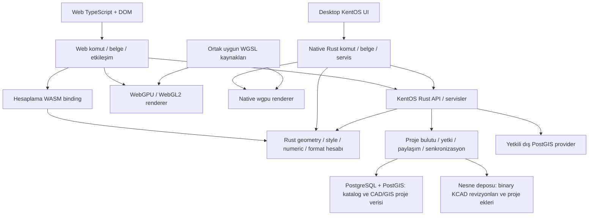

# KentOS CAD / GIS / 3D — Mimari ve ürün yol haritası

Tarih: 25 Eylül 2026. İncelenen kaynaklar: bu depo (`4399477`) ve `/home/cihad/Projects/kentos-rc` (`dc2e8df`). Bu belge kod incelemesine ve aşağıda bağlantıları verilen birincil teknik kaynaklara dayanır. İnceleme sırasında uygulama veya benchmark çalıştırılmadı; mevcut ölçüm raporları yeni ölçüm gibi sunulmaz. Bu çalışma yalnızca yol haritasıdır; UI taşıması veya aşağıdaki özelliklerin uygulanması yapılmış sayılmaz.

Hedef: aynı Rust hesaplama kütüphanelerini kullanan, uyumlu veri ve servis sözleşmelerine sahip ayrı web ve masaüstü uygulamalarıyla profesyonel CAD/GIS düzenleme, Python otomasyonu ve eksiksiz AI erişimi sunan; kişi ve kurumların projelerini bulutta saklayan, senkronize eden ve yetkiye göre erişilebilir/paylaşılabilir kılan; yol, mimari, arazi ve 3D dijital ikiz projelerine genişleyebilen KentOS.

**Son kapsam kararı:** KentOS sunucusunun ana görevi kişisel ve kurumsal proje bulutudur: 18 uygulaması, imar planı, ifraz/tevhit ve diğer CAD/GIS projelerini saklama, senkronizasyon, sürümleme, yetkili erişim ve paylaşım. Şimdiki kapsamda Martin görevi üstlenmeyecek; tile/harita yayın sunucusu ancak ileride ayrı bir ürün kararıyla değerlendirilebilir. Ne Martin entegrasyonu ne de Martin eşdeğeri geliştirmek proje bulutunun önkoşuludur. GIS projeleri PostGIS ile çalışabilir; CAD projeleri de düzenlenebilir CAD anlamı korunarak PostGIS üzerinde saklanabilir.

**Kesin web sınırı:** Web ayrı TypeScript/DOM uygulamasıdır. Desktop/Iced uygulaması web'e export edilmeyecek, uygulamanın tamamı WASM'a çevrilmeyecek. Web kendi komut/etkileşim/belge orkestrasyonunu ve WebGPU/WebGL renderer'larını korur. Ortak yürütülebilir KentOS kodu hesaplama kütüphaneleridir; veri/komut şemaları uyum için paylaşılır, uygun WGSL shader kaynakları ayrıca ortak kullanılabilir. Ortak Rust application veya wgpu renderer'ı web'e derleme hedefi yoktur.

**Kesin dosya sınırı:** `.kcad` yalnız proje kaydetme/yükleme için sürümlü binary/byte dosyasıdır. Dosyaya veritabanı, SQL, kalıcı sorgu/arama indeksi veya doğrudan vector tile sunma görevi verilmeyecek. İlk mesajdaki aranabilir/tile kaynaklı container düşüncesi, kullanıcının bu sadeleştirmesiyle kapsamdan çıkmıştır. Büyük veri sorguları PostGIS/provider, bulut proje kataloğu ve erişim kuralları KentOS server sorumluluğudur; yerel belge açıldıktan sonraki geçici pick/snap indeksleri bu karardan etkilenmez.

## 0. Belgenin kullanımı ve öncelikler

- `[ ]`: henüz teslim edilmemiş iş. Kodda temeli bulunan işler de eksik kabul koşulları nedeniyle açık tutulur.
- `P0`: veri doğruluğu, ortak sözleşme ve mimari bağımlılıklar. İlk ürün dilimlerinin önkoşulu.
- `P1`: kullanılabilir desktop, binary dosya, kişisel/kurumsal proje bulutu, yetki/paylaşım, CAD/GIS PostGIS kaydı ve Python/AI'ın ilk üretim kapsamı.
- `P2`: profesyonel CAD/GIS derinliği, yaygın dış formatlar, operasyon ve büyük veri.
- `P3`: yol/altyapı, mimari/BIM ve 3D şehir tasarımının ileri kapsamı. Temel veri modeli bunları engellemeyecek; hepsi ilk sürüme sıkıştırılmayacak.
- Bölüm sonlarındaki kabul koşulları sağlanmadan ilgili iş grubu tamamlandı sayılmaz. Kütüphane eklemek, ekran göstermek veya test fixture'ını yeniden üretmek tek başına kabul değildir.
- Önerilen yollar, şemalar ve API örnekleri hedef tasarımdır; mevcut API diye kullanılmamalıdır. Yeni crate, bağımsız sorumluluğu ve ilk gerçek tüketicisi oluştuğunda açılır.
- Kullanıcının kesin hedefleri ile teknik öneriler ayrıdır: ayrı web uygulaması, Rust hesaplama paylaşımı, uyumlu sözleşmeler, KentOS UI, saf wgpu desktop viewport, Python, AI, yalnız kayıt/yükleme yapan binary `.kcad`, kişisel/kurumsal proje bulutu ve hem CAD hem GIS için PostGIS desteği kesindir. Martin benzeri rol kesin teslim değildir. Binary encoding seçimi, crate ayrıntıları ve aşama içi seçenekler bu incelemenin önerisidir; prototip ve ADR ile kesinleştirilir.

### 0.1 Kapsamın izlenmesi

| Kullanıcı hedefi | Yol haritasındaki karşılığı |
|---|---|
| Rust ile devam, ortak hesaplama | §2–4: Rust hesaplama kütüphaneleri, uyumlu ayrı uygulamalar |
| Desktop ve web aynı kullanım kalitesi | §5–8: komut oturumu, dinamik giriş, KentOS UI, wgpu |
| Python embed ve Python kütüphaneleri | §14: CPython/PyO3, Pyodide, ortak SDK |
| Tam AI surface | §15: katalog, sorgu, önizleme, çalıştırma, MCP, kapsam testleri |
| `kentos-rc` bu depoya ve KentOS UI ad alanına | §6: dosya/modül bazında taşıma ve ayrıştırma |
| Ayarlardan tüm grafik/performance seçenekleri | §7–8: tipli settings, yeteneklere göre AA, bellek ve kalite |
| Binary ve açık `.kcad`; yalnız kayıt/yükleme | §9: belgelenmiş byte formatı, sürümleme ve dış okuyucu; DB/tile görevi yok |
| Cloud'a aynı formatta kayıt/senkronizasyon | §10: komut senkronizasyonu ve kalıcı `.kcad` revizyonları |
| CAD ve GIS projelerini PostGIS'e kaydetme ve doğrudan çalışma | §11: CAD anlamını koruyan saklama, kaynak otoritesi, provider ve metadata dosyası |
| Kişi/kurum projelerini saklama, erişim ve paylaşım | §10–12: proje kataloğu, senkronizasyon, sürümleme, üyelik ve proje yetkileri |
| İleride olası Martin benzeri rol | §12.5: ayrı karara bağlı gelecek seçeneği; mevcut teslimlerin bağımlılığı değil |
| 3D şehir, yol, harita ve mimari | §16–19: CAD/GIS, civil, BIM, dijital ikiz ve yayın |
| Uzun ömürlü yüksek performans | §13, §20–23: worker, test, işletim ve teslim kapıları |

## 1. Koddan doğrulanan mevcut durum

| Alan | Mevcut kanıt | Mimari sonucu / açık iş |
|---|---|---|
| Workspace | `Cargo.toml`, `rust-toolchain.toml`, `pnpm-workspace.yaml` | Rust 1.96.0 / edition 2024; ortak, WASM ve server ayrımı kurulmuş. Tümü yeniden başlatılmayacak. |
| Rust hesaplama | `crates/shared/geometry-core/src/`, `style-core/src/`, `svg-core/src/` | Geometri, stil/ifade ve SVG hesabı zaten önemli ölçüde Rust'ta. Var olan algoritmalar taşınacak UI içinde yeniden yazılmayacak. |
| Sıcak yollar | `geometry-core/src/store/{mod,rtree,pick,snap,draw,pack}.rs`, `apps/web/src/wasm/pack.ts` | Paketli veri, R-tree, snap/pick ve toplu çizim hesabı var. GPU ve belge katmanı bu birikimi kullanmalı. |
| Ortak sözleşmeler | `crates/shared/contracts/src/`, `apps/web/src/contracts/generated/` | Rust'tan TS tipleri üretiliyor. Tip üretimi, bütün platformların aynı iş kuralını çalıştırdığı anlamına henüz gelmiyor. |
| Belge ve undo | `apps/web/src/model/document.ts`, `document.test.ts`, ADR 0003 | Web belge yaşam döngüsü ve undo/redo TS'te kalır. Native karşılığı `crates/native/domain` (ADR 0020); ikisi `fixtures/document-ops/v1`'i geçiyor. |
| Komutlar | `apps/web/src/core/commands.ts`, `app/commands.ts`, `tools/ToolManager.ts` | UI registry `run(args?: unknown): void` kullanıyor. Tipli, async, headless ve sürümlü ürün komutları ayrıca kurulmalı. |
| Dinamik giriş | `ui/shell/CursorInput.ts`, `ui/bottom/CommandLine.ts`, `tools/pathTool.ts` | İmleç yanında otomatik giriş ve aktif araca metin gönderme var. Desktop kabul senaryosu için referans davranış. |
| Dosya | `model/snapshot.ts`, `app/fileIO.ts`, `contracts/src/document.rs` | `.kcad` v2 (binary, ADR 0025) yazılır; v1 `kentos.document` JSON okunur; MIME `application/octet-stream`. |
| Web renderer | `render/webgl2/`, `render/webgpu/`, `render/quality.ts` | WebGPU/WebGL2 bağımsız web renderer'ları korunur; kalite ayarları genişletilir. Uygun WGSL kaynakları native ile paylaşılabilir. |
| Ayarlar | `app/state.ts`, `model/projectSettings.ts`, `ui/settings/` | Kullanıcı ve proje ayarları ayrılmış; web kalıcılığı çoğunlukla localStorage. Ortak şema/validasyon ve desktop adapter eksik. |
| Sunucu | `apps/api/`, `crates/server/application/`, `crates/server/postgres/` | Axum/Tokio/SQLx, kimlik/tenant, proje ve PostGIS kodu var. “Backend yok” yazan eski belge girişleri güncel değil. |
| Kalıcı değişiklik | `application/src/changes.rs`, `contracts/src/{command,cloud}.rs` | `project.changes` v1; expected version, idempotency, audit/outbox ve proje satır kilidi var. Genel ürün command bus'ı henüz değil. |
| Büyük commit sınırı | `application/src/changes.rs::MAX_CHANGES` | Bir komutta 5.000 nesne sınırı var. Büyük CAD işlemini gelişigüzel parçalamak atomik undo/commit anlamını bozabilir; staging tasarımı gerekli. |
| CAD/PostGIS ilişkisi | `application/src/cad.rs`, `postgres/migrations/0001_foundation.sql` | Basit geometride `geom`, parametrik CAD'de `cad_definition` kaynak; GIS izdüşümü türetiliyor. Bu ayrım korunmalı. |
| Cloud | `apps/web/src/app/cloud/`, `ui/cloud/`, API WS testleri | Dayanıklı taslak, tekrar bağlanma/çakışma altyapısı var. Binary `.kcad` cloud checkpoint ve çoklu cihaz dosya akışı ayrıca gerekli. |
| İşleme | `apps/web/src/processing/`, `contracts/src/job.rs` | Araç/iş tanımı ve browser worker var. Kalıcı server worker'ın çalıştığı yalnız bu tiplerden çıkarılamaz. |
| Kimlik/öznitelik | `contracts/src/entity.rs`, `cloud.rs` | Yerel `u32` entity ID, cloud UUID; öznitelikler v1'de `BTreeMap<String,String>`. Global ID ve tipli şema göçü gerekli. |
| CRS | `apps/web/src/geo/crs.ts`, `contracts/tests/crs.rs` | CRS kataloğu var; web dosyasındaki başlangıç noktası seçimi tam reprojection motoru değildir. |
| Sayısal politika | `contracts/src/numeric.rs`, `geometry-core/src/{numeric,predicates,jsmath}.rs` | Decimal/hisse/yuvarlama ve deterministik hesap temeli korunacak. GPU float32, domain hassasiyeti yerine geçmeyecek. |
| UI kütüphanesi | `kentos-rc/Cargo.toml`, `src/widget/`, `src/theme/`, `examples/showcase/` | Iced 0.14.0, docking/ribbon/tablolar/girdiler gibi geniş bir temel var. Showcase üretim desktop uygulaması sayılmaz. |
| UI çizim alanı | `kentos-rc/src/spatial/model_space/render.rs`, `view_cube.rs` | Model alanı Iced Canvas; ViewCube özel wgpu pipeline kullanıyor. Ana viewport için ayrı render bağlantısı gerekli. |
| UI veri modeli | `kentos-rc/src/spatial/{feature,projection}.rs`, `src/attribute/value.rs` | WGS84/LonLat + Mercator ve Iced renkleriyle bağlı ikinci model var; CAD domain'i olarak doğrudan alınamaz. |
| UI GPU sürümü | `kentos-rc/Cargo.lock` | İncelenen kilitte `wgpu 27.0.1`. İnternetteki güncel wgpu API'si farklı olabilir; tek uyumlu sürüm kümesi seçilmeli. |
| Performans kanıtı | `docs/perf/`, ADR 0005 | Ölçüm altyapısı var. ADR hedefleri taslak; raporların GPU/donanım bağlamı ve bilinen headless sınırlamaları korunmalı. |
| Yeni ürün yüzeyleri | Workspace üyeleri ve incelenen giriş noktaları | Bu depoda üretim desktop, embed Python ve tam AI/MCP henüz görünmüyor; hedef olarak izlenecek. Mevcut cloud temeli, §12'nin ayrıntılı yetki/paylaşım kabulüyle ayrıca doğrulanmalı. |

### 1.1 İlk bakım işleri — P0

- [x] `BASE-01` `CLAUDE.md`, `docs/DEVIR.md`, ADR 0001/0005/0008/0009 ve bu belge arasında mevcut durum / hedef / eski karar ayrımını güncelle. Tarihsel ADR'yi silmek yerine yeni kararla hangisinin değiştiğini kaydet. — **25 Eylül:** kararlar [ADR 0010](docs/adr/0010-platform-boundaries.md), [0011](docs/adr/0011-kcad-binary-snapshot.md), [0012](docs/adr/0012-server-scope-project-cloud.md)'de. ADR 0001, 0002, 0005, 0006, 0008 ve 0009'da değişen maddeler işaretlendi, tarihsel metin korundu. `docs/DEVIR.md`'nin başına hangi bölümün geçerli kaldığı yazıldı.
- [x] `BASE-02` Özellikle eski Martin/yayın önceliğini kişisel/kurumsal proje bulutu kararıyla ilişkilendir; Martin rolünün mevcut teslimden çıkarıldığını kaydet. Olası Tauri/Electron önerisi, JSON `.kcad` ve “backend henüz yok” notlarını da yeni yönle ilişkilendir. Native Iced + wgpu bu yol haritasının desktop temelidir. — **25 Eylül:** Martin, tile hedefleri ve “backend yok” notları → ADR 0012; Tauri/Electron notu (eski CLAUDE.md §24.4) → ADR 0010; JSON `.kcad` → ADR 0011.
- [x] `BASE-03` İncelemede görülen izlenmeyen `.claude/`, `scripts/e2e/`, `scripts/showcase/`, `src/` içeriğinin sahipliğini ve kullanımını belirle; taşımada bunları otomatik silme veya yeni kaynak kabul etme. — **25 Eylül:** [başlangıç kaydı](docs/baseline/2026-09-25.md) §“Çalışma ağacındaki izlenmeyen içerik”. `.claude/worktrees/` üç alt ajan worktree'sidir (işleri main'de ya da `origin/wip/formats-dxf`'te); kökteki `src/`, `scripts/e2e/out`, `scripts/showcase/out` monorepo taşınmasından önceki çıktılardır. Sahibin kararıyla 25 Eylül'de silindiler: worktree'ler, yerel dalları ve eski çıktılar.
- [x] `BASE-04` Web komutları, araçlar, ayarlar, dosya alanları, processing işlemleri ve ekranlar için makinece okunabilir özellik envanteri çıkar; `implemented/partial/pending`, platform ve kabul senaryosu alanlarını ekle. — **25 Eylül:** [docs/inventory](docs/inventory/README.md). `pnpm inventory` üretir, `pnpm inventory:check` farkı yakalar.
  - Kaynak: çalışan uygulamanın kayıtları, kaynak taraması ve elle notlar.
  - Kapsam: 163 komut (18 bekleyen), 58 araç, 4 işlem aracı, 1 model, 5 çalışma modu, 63 ayar, 6 tarayıcı deposu, `.kcad` v1'in 34 sözleşmesi ve 174 alanı, 48 pencere/panel.
  - Her öğede durum, web/masaüstü sütunu ve test başvuruları var; komutlarda menü, şerit ve kısayol yerleri de var. Arayüzde yeri görünmeyen 2 komut bulundu.
- [x] `BASE-05` Mevcut native/WASM fixture'ları, web e2e ve UI showcase görüntülerini başlangıç referansı olarak dondur; ölçüm yapılan commit ve ortamı kaydet. — **25 Eylül:** [başlangıç kaydı](docs/baseline/2026-09-25.md) (`27f771d`, i5-11300H, Chrome 154).
  - Geçenler: `pnpm test` 747, Rust 347 (DB zorunlu kipte), e2e 155/155, görsel 25/25, bulut 22/22.
  - Fixture karmaları ve 35 kentos-rc vitrin görüntüsünün karmaları kayıtlı (7 görüntü depoda). Açılış ölçümü soğuk 797 ms, ılık 278 ms.
  - Bulgular: `cargo fmt --check` düşüyor; kentos-rc testleri paralel koşuda kararsız (SIGSEGV).
- [x] `BASE-06` Yeni bağımlılıkları sürüm, bakım, lisans, hedef platform, WASM derlenebilirliği ve gerçek kullanım gerekçesiyle ADR'ye bağla. Bu belgeyi yazmak bağımlılık kurulumunun yapıldığı anlamına gelmez. — **25 Eylül:** [bağımlılık kaydı](docs/deps/README.md) kuralı yazar ve bugünkü 17 Rust bağımlılığını ADR'leriyle eşler. Web'de runtime bağımlılığı yok. Geçişli 284 paketin lisansları tarandı, copyleft yok. Adaylar kurulmadı.

## 2. Hedef mimari ve uygulama sınırları

Hesaplama tek Rust kaynağından gelir; web bu kütüphaneleri dar WASM bağlayıcılarıyla, desktop/server native olarak çağırır. Web application, belge, command session, settings kalıcılığı ve render yaşam döngüsü TypeScript'te kalır. Desktop/server tarafında uygun Rust domain ve servis kodu paylaşılabilir; bu paylaşım web'e uygulama runtime'ı taşımaz. Platform uyumu sürümlü sözleşme, ortak fixture ve davranış testleriyle kurulur. Rust merkezli mimari, CPython/PROJ/PostGIS altyapılarını yeniden yazma şartı değildir.



Buradaki oklar çalışma akışını gösterir. Native application port arayüzlerini kullanır; depolama adapter'larını uygulama bileşimi seçer. Web çevrimdışı çizimde server gerektirmez; cloud/provider/paylaşım işlemleri için API kullanır. Desktop ayrıca yetkili dış PostGIS'e doğrudan bağlanabilir. Python ve AI, bulunduğu host'un uyumlu komut girişine bağlanır. Web renderer'a Rust wgpu Device/Queue veya Iced aktarılmaz. Domain verisi GPU kaynaklarını tutmaz. Dosya projesini bulutta tutmak bütün geometrilerini PostGIS tablolarına dönüştürmeyi gerektirmez; dosya ve canlı veritabanı modlarının otoritesi §10'da ayrılır.

### 2.1 Önerilen depo düzeni

```text
apps/
  web/                         mevcut DOM/TypeScript kabuğu ve browser adapter'ları
  desktop/                     native Iced + kentos_ui + wgpu uygulaması
  api/                         kentosd: HTTP, WS, proje bulutu, auth ve MCP bileşimi
  worker/                      kalıcı ağır işler; gerekirse önce kentosd worker modu
  cli/                         headless ürün komutları; yönetim CLI'siyle açık sınır
  ui-showcase/                 kentos-rc vitrininin yeni yeri
crates/
  shared/
    contracts/                 sürümlü dış veri sözleşmeleri; mevcut
    geometry-core/             mevcut sayısal/geometrik çekirdek
    style-core/                mevcut ifade ve stil hesabı
    svg-core/                  mevcut SVG hesabı
    formats/                   mevcut DXF/koordinat vb. import/export
  native/
    domain/                    desktop/server Rust domain; web karşılığı TS
    application/               native command/use case/port; web'e derlenmez
    interaction/               native tool session; web kendi TS session'ını korur
    settings/                  native ayar servisi; ortak şemanın Rust uygulaması
  ui/                          package kentos-ui, Rust kentos_ui; Iced bileşenleri
  render/wgpu/                 yalnız native wgpu renderer ve kaynak yönetimi
  storage/kcad/                binary dosya I/O, migration ve snapshot; DB değil
  providers/postgis/           desktop doğrudan PG bağlantısı; ortak capability sınırı
  server/
    application/               mevcut sunucu use case'leri; aşamalı ayrıştırılır
    postgres/                  mevcut DB, migration, RLS adapter'ı
    projects/                  katalog, sahiplik ve paylaşım; önce application modülü olabilir
    jobs/                      lease, fencing, kalıcı kuyruk
  wasm/                        sadece ortak hesaplama/codec kütüphanelerinin bağlayıcıları
  bindings/python/             PyO3 native binding; UI ve server bağımlılığı yok
  scripting/                   interpreter host, izinler, yaşam döngüsü
  automation/                  komut şemalarından MCP/CLI/SDK adapter'ları
python/kentos/                 kullanıcıya sunulan Python paketi
shaders/wgsl/                  paylaşılabilir WGSL; web GL için ayrı GLSL yolu
fixtures/                      platformlar arası sürümlü örnekler
docs/adr/                      kararlar ve geçiş gerekçeleri
docs/specs/                    KCAD, komut, settings, cloud/yetki ve SDK sözleşmeleri
```

Bu bir hedef haritadır; ilk adımda boş crate ağacı kurulmayacak. Native `domain`, `application`, `interaction`, `settings` gerektiğinde modül olarak başlayabilir. Mevcut `crates/server/application` paket adı `kentos-application` olduğundan yeni native servis ayrımında isim çakışması çözülmeli; mevcut paketi sırf isim için taşımak yerine ayrılan sorumluluklar ve bağımlı yollar birlikte değerlendirilir. Web'in karşılıkları `apps/web/src/` altında kalır.

### 2.2 Uygulama kuralları — P0

| Sınır | İzin verilen sorumluluk | Sınırı ihlal eden örnek |
|---|---|---|
| Domain / hesaplama | Kesin model, geometri, kurallar, saf dönüşüm | Iced `Color`, DOM, SQLx transaction, GPU buffer, global clock |
| Native application / web application | Aynı sözleşmeye uyan ayrı komut orkestrasyonu, plan ve undo | Geometri/hesap algoritmasını TS'te tekrar yazmak |
| Desktop | Pencere/input, native dosya, OS keychain, CPython host, wgpu surface | Web'in davranışını ayrı geometri algoritmasıyla yeniden üretmek |
| Web | TS/DOM/a11y, komut ve belge, WebGPU/WebGL, hesaplama WASM, offline depolama | Iced export, Rust application/render WASM, gizli PG parolası |
| Server | Auth/tenant, proje saklama/katalog, yetki/paylaşım, sync, durable commit, jobs, kota | İstemcinin actor/permission iddiasına güvenmek; sırf görüntüleme/paylaşım için tile servisini zorunlu kılmak |
| UI kütüphanesi | Widget, tema, ikon, layout, sunum modeli | Veritabanına yazmak, çizim belgesinin sahibi olmak |
| Renderer | Kaynak yönetimi, LOD, draw/pick pass, görünüm cache'i | Kalıcı koordinatı yuvarlamak, seçimi veri deposuna sessizce yazmak |
| Python / AI | Tipli komut ve sorgu adapter'ı, workflow | Repository/SQL/DOM üzerinden kuralları atlamak |

- [x] `ARCH-01` Derleme bağımlılığını adapter → application → domain/hesaplama yönünde tut; Cargo ve statik denetimle Iced/SQLx/PyO3/WASM runtime bağımlılıklarının saf çekirdeğe sızmasını engelle. Port arayüzlerini iç katman, implementation'larını dış adapter sahiplenir. — **25 Eylül:** `scripts/arch/deps.mjs` (`pnpm rust:test` sonunda, `pnpm arch:deps`).
  - Denetim her crate'i derlendiği hedefte `cargo tree` ile gezer. Grup yönünü ve geçişli çalışma zamanı sızıntısını yolunu göstererek yakalar.
  - Kurallar ve port sahipliği [ADR 0010](docs/adr/0010-platform-boundaries.md)'da.
  - Yeni UI/renderer/native yolu, kuralı yazılmadan denetimden geçmez.
- [ ] `ARCH-02` `DocumentRepository`, `DataProvider`, `AssetStore`, `SettingsStore`, `JobExecutor`, `EventSink`, `Clock`, `IdGenerator` gibi gerçekten ihtiyaç duyulan portları belirle; her portun transaction ve async anlamını yaz.
- [ ] `ARCH-03` Native async runtime ile web JS/Worker yaşam döngüsünü ayrı tasarla. Hesaplama WASM binding'leri dar ve toplu olsun; native runtime veya application trait ağacını browser'a taşıma.
- [ ] `ARCH-04` Her uygulamanın açık belgesi için tek mutation sahibi seç; web'de TS, desktop'ta native belge servisi. Render, autosave, Python ve UI'a revision'lı snapshot/değişiklik akışı ver; hesap/render cache'lerini ikinci otoriter belgeye dönüştürme. — **26 Eylül, kısmen (masaüstü):** native belge değişen nesneleri günlükle verir (`Document::changes_since`, web'in `touched`'ı); geometri deposu onu izler, ikinci otorite değildir, yuvayla cevaplar ([ADR 0029](docs/adr/0029-desktop-selection-and-snap.md)). Çizim alanı sahneyi hâlâ sürüm değişince baştan kurar (`REN-08`).
- [ ] `ARCH-05` Dış protokol, domain tipi ve GPU paketini ayrı sürümle; biri değişince bütün dosya formatı veya HTTP protokolü zorunlu olarak değişmesin.
- [ ] `ARCH-06` `Capabilities` sözleşmesi kur: offline/online, read/write, transaction, curve, Z/M, Python paketleri, GPU özellikleri ve provider yetenekleri açıkça sorgulanabilsin.
- [x] `ARCH-07` Kullanıcı mesajı ile sabit hata kodunu ayır; hata `code`, alan yolu, kaynak/revision, retry bilgisi ve açıklama taşısın. UI, Python ve AI aynı hatayı farklı sunabilsin. — **26 Eylül, kısmen:** ürün komutlarının hatası `CommandError { code, message, path, revision }` ([ADR 0022](docs/adr/0022-first-product-command.md)). **26 Eylül:** sunucunun `ApiError`'u da `path`, `revision`, `retryable`, `retryAfter` taşıyor (ADR 0013 notu); alanı bilinen doğrulamalar yolunu söylüyor (ad, açıklama, etiketler, paylaşım, arama, katalog parametreleri, nesne değişiklikleri); web istemcisi yeniden denemeyi bunlardan karar veriyor. Python ve AI yüzeyi geldiğinde aynı alanları kullanacak.
- [ ] `ARCH-08` Feature flag/modül manifestlerini ve lazy-load sınırlarını tanımla; ilk 2D açılış Python, BIM, terrain veya 3D asset yüklemek zorunda kalmasın.

Kabul: aynı basit düzenleme, ortak fixture ile native uygulamada, TS web uygulamasında ve server'da uyumlu sonuç/hata üretir. Hesaplamanın native↔WASM eşdeğerliği ayrıca sınanır. Web bundle'ına native application, Iced veya Rust renderer girmez.

## 3. Ortak domain, belge ve sayısal doğruluk — P0

### 3.1 Belgenin tek anlamı

- [ ] `DOM-01` `Project`, `Document`, `Layer`, `Entity`, `Dataset`, `SourceBinding`, `Style`, `Layout`, `Asset`, `Revision`, `SelectionRef` sınırlarını yaz. Katman, veri kaynağı ve görünüm aynı şey sayılmasın.
- [ ] `DOM-02` `apps/web/src/model/document.ts` transaction/savepoint/revision/undo davranışını ortak fixture'larla belgele; native belge karşılığını bu sözleşmeyle geliştir. TS belge sahibi korunur; Rust facade'a dönüştürülmez. — **25 Eylül, kısmen:** [ADR 0020](docs/adr/0020-native-document-model.md). 26 Eylül: katman ekleme ve benzersiz ad (`addLayer`, `uniqueLayerName`, `tree`; [ADR 0048](docs/adr/0048-desktop-file-exchange.md)), çizimin adı ve proje ayarları (`setName`, `setSettings`, `project.json`; [ADR 0049](docs/adr/0049-desktop-new-project-and-settings.md)) fixture'larda; iki koşucu geçer. Yeni projenin çizimi web'in kaydettiği `fixtures/project/v1/new-project.json` ile karşılaştırılır. Açık: dışarıdan değişiklik, stil kitaplığı.
  - `fixtures/document-ops/v1`: 45 senaryo, biçimi `fixtures/document-ops/README.md`'de. Web (`model/documentOps.test.ts`) ve native belge (`crates/native/domain/tests/fixtures.rs`) hepsini geçiyor.
  - Kapsam: ekleme, değiştirme ve silme ile toplu karşılıkları, başarısız işlem, iç içe kayıt noktası, grup ve iptali, geri al ve yinele, 200 adım sınırı, kirli bayrağı, sürüm, kayıt sürerken yapılan değişiklik, katman görünürlüğü, kilidi, adı ve stili, katman ekleme ve benzersiz ad, çizimin adı ve proje ayarları.
  - Kalanlar: `applyExternal`/`forgetHistoryOf`, stil kitaplığı değişikliği, belge olayları. Sunucu aynı fixture'ı henüz koşmuyor (§2 kabulü). Web'in ADR 0003'e aykırı dört davranışı ve taramanın ada kaybı 25 Eylül'de düzeltildi, fixture'a girdi; geri gelen nesne artık eski yerine döner, değiştirmeyen düzenleme düzenleme sayılmaz (ADR 0020).
- [ ] `DOM-03` Kalıcı global UUID ile runtime slot/index ve eski yerel `u32` kimliği ayır. Yerel dosya, cloud, PostGIS, Python ve provider identify aynı kalıcı kimliğe bağlansın. — **25 Eylül:** karar [ADR 0014](docs/adr/0014-persistent-entity-identity.md) (UUIDv7 kalıcı kimlik, `u32` çalışma yuvası); uygulama dilimleri ADR'de. Dilim 1 uygulandı: web belgesinde her nesnenin kalıcı `uid`'i var (UUIDv7, `core/uuid.ts`), `uid → yuva` dizini (`byUid`, `slotOf`, `uidOf`) ve `replace` eklendi. Buda, Kır, köşe ekleme ve Alan böl'de ilk parça nesnenin kendisidir. Ortak fixture `fixtures/document-ops/v1/identity.json`. Dilim 3 (bulut) ve dilim 4 (sözleşme, v2) açık. **26 Eylül:** dilim 3 (bulut) uygulandı: nesnenin `uid`'i sunucudaki `feature.id`'dir; izleyicinin ayrı eşlemesi ve v4 üretimi kalktı; açılış sunucunun kimliğini `uid` yapar; `applyExternal` gelen kimliği alır, geçmişi kalıcı kimliğe göre de temizler; cihaz taslağı biçim 2 ([ADR 0026](docs/adr/0026-cloud-sync-persistent-ids.md)). Dilim 4 (`.kcad` v2) sürüyor. Dilim 4 (26 Eylül): sözleşmede `EntityId`/`ProjectId`; v2 dosyada 16 baytlık kimlik, iki platformda kaydet/aç boyunca korunur (ADR 0025).
- [ ] `DOM-04` Eski `.kcad` yerel ID'leri için bir defalık deterministik göç haritası ve import namespace'i tasarla; aynı eski dosyanın yeniden açılması/retry yeni nesne çoğaltmasın. — **25 Eylül:** karar ADR 0014: kanonik v1 metninin sha256'sından UUIDv5 ad alanı; aynı dosya hep aynı kimlikleri verir. Uygulandı: `kentos_contracts::v1_uids` (kanonik v1 → sha256 → UUIDv5, `KENTOS_V1_IMPORT = 4a5259a1-97f7-4742-88ce-b747287025ed`). Bağımsız Python referansı `fixtures/document/v1/identity`'de. Web açılışta kimlikleri biçim worker'ından alır (`FORMATS_VERSION` 4), masaüstü `v1_entity_uids`'ten. Aynı dosya her açılışta aynı kimlikleri alır; buluta iki kez yüklenen aynı dosya aynı kimliklerle iki proje olur (26 Eylül, ADR 0026; `tests/persistent_ids.rs`, `pnpm e2e:cloud`). v1 kimlik yazmaz: düzenlenip v1 olarak kaydedilen dosya yeni kimlik alır (`FILE-05`). v2 göçün kaynağını ve projenin türetilen kimliğini yazar; v2 olarak kaydedilen dosya kimliklerini korur (ADR 0025).
- [ ] `DOM-05` `contracts::Entity`, geometry-core `Shape/Entity.rest`, TS `Entity` ve kentos-rc `Feature` arasındaki rolü belgeleyip açık dönüştürücüler kur; sıcak yol tipini bütün domain ile zorla birleştirme.
- [ ] `DOM-06` Kalıcı şema değişiminde bilinmeyen alan/extension round-trip politikasını tanımla. Tanınmayan kritik geometri salt okunur veya açık hata; sessiz düşürme yok. — 26 Eylül, kısmen: v2 bilinmeyen alan/türü açık hatayla reddeder; web v1'den gelen bilinmeyen alanları v2'ye yazmaz ve söyler.
- [ ] `DOM-07` `ChangeSet` içinde create/update/delete yanında schema/layer/style/settings/reference değişikliklerini ve inverse bilgisini kapsa; dependency invalidation sonuçlarını aynı revision'a bağla.
- [ ] `DOM-08` Çoklu belge, belge sekmeleri, xref/linked dataset ve document lifecycle tasarla; belge kapanınca GPU, Worker, sorgu, abonelik ve geçici script kaynakları bırakılsın.

### 3.2 Tipli öznitelik ve şema

- [ ] `DOM-09` Text, boolean, signed integer, kesin decimal, float, date, time, timezone'lu timestamp, enum/domain, UUID/reference, null ve gerekirse structured value türlerini tanımla.
- [ ] `DOM-10` `String → typed value` geçişini açık migration olarak yap; parse edilemeyen kaynağı raporla, boşa veya sıfıra çevirmeden koru. Şema revision'ı dosya/cloud/AI çıktısında bulunsun.
- [ ] `DOM-11` Alan adı ile sabit `FieldId`'yi ayır; rename ilişkiyi kırmasın. Zorunluluk, default, aralık, unique, coded values, birim, ilişki ve hesaplanan alan sözleşmesini kur.
- [ ] `DOM-12` 64-bit integer ve revision'ları JS/JSON'da decimal string ya da açık binary integer olarak taşı. `kentos-rc::Value::compare` içindeki integer → f64 yolunu aynen taşımadan büyük tamsayı sıralamasını düzelt. — 26 Eylül: ürün komutlarında belge sürümü ondalık metindir, yalnız eşitlikle karşılaştırılır ([ADR 0022](docs/adr/0022-first-product-command.md)).
- [ ] `DOM-13` UI query builder, ifade dili, server filtreleri ve AI sorgularını tipli bir sorgu AST'sine bağla; SQL'e çevrilemeyen işlemleri capability/hata olarak bildir.
- [ ] `DOM-14` Türkçe arama/sıralama, `I/İ/ı/i`, decimal ayırıcı, null sırası ve case-fold kurallarını ortak fixture'larla tanımla; locale görüntüleme biçimi veri depolama biçimine dönüşmesin.

### 3.3 Hassasiyet, CRS ve geometri

- [ ] `NUM-01` Domain koordinatını `f64`, mülkiyet/hisse/nihai yuvarlama değerlerini mevcut decimal/rational sözleşmeleriyle koru. `NaN/Inf/-0` için hesaplama, dış protokol ve kalıcı dosya politikalarını ayrı yaz. Dosya politikası: NaN/±∞ yasak, −0 korunur (ADR 0025).
- [ ] `NUM-02` Mevcut libm/robust predicate ve bağımsız referans testlerini koru; GPU hesaplarını kadastral nihai değerlerin otoritesi yapma. Kalan sağlam karar dilimleri (yay kesişimleri, ortak sınır kararları, incircle) `docs/DEVIR.md` §3 madde 3'te tarif edilmiştir.
- [ ] `NUM-03` Eksen sırasını açıklaştır: iç model `x=east, y=north`, arayüzdeki geleneksel `Y,X`, EPSG eksen sırası ve LonLat birbirine adapter ile dönsün.
- [ ] `NUM-04` Proje CRS, kaynak CRS, render CRS, yatay/düşey datum, coordinate epoch, Z/M ve birimi ayrı alanlarla modelle; `srid` tek başına bütün jeodezik bilgiyi taşımaz.
- [ ] `NUM-05` Native/server PROJ/PostGIS dönüşüm yolu ile WASM'da desteklenen dönüşümleri aynı servis sözleşmesinde sun; tarayıcıya her native bağımlılığın derlenebileceğini varsayma.
- [ ] `NUM-06` Dönüşüm işlemi, grid dosyaları ve hash'leri, engine sürümü, kullanım alanı ve doğruluk bilgisini kaydet. Eksik grid veya düşük doğrulukta sessiz alternatif seçmek yerine açık durum döndür.
- [ ] `NUM-07` ED50/TUREF/WGS84, TM/UTM, coğrafi↔yerel, yükseklik ve epoch senaryolarını bağımsız kontrol noktalarıyla doğrula; dosya açarken CRS tahminiyle koordinat değiştirme. GeoJSON/Shapefile içe aktarması dosyanın dediği sistemi gösterir; projeninkinden başkaysa kapalıdır, dönüştürmez ([ADR 0046](docs/adr/0046-geojson-and-shapefile.md)). TM projeksiyonu önerisi ADR 0046'da.
- [ ] `NUM-08` Snap toleransı (ekran px), geometrik tolerans (model birimi), CAD→GIS örnekleme toleransı ve çizim tessellation hatasını farklı ayarlar yap.
- [ ] `NUM-09` 2D, 2.5D ve 3D geometrileri birbirinden ayır; mevcut isteğe bağlı nokta Z'sini tam 3D model varmış gibi yorumlama. Curve, spline, surface ve solid extension'ları için sürümlü alan bırak.
- [ ] `NUM-10` Topoloji için ortak edge/node kimliği, yön, delik, çoklu geometri, komşuluk ve geçersiz geometri raporunu kur; “onar” işlemi ayrı undo/preview komutu olsun.

PROJ işlemin kullanılabilir grid ve doğruluğa göre seçilmesini destekler; bu yüzden engine sürümü ve dönüşüm verisi platform uyumunun parçasıdır. Her dış kütüphane çıktısına bit düzeyinde eşitlik sözü verilmez: saf KentOS işlemlerinde deterministik fixture, reprojection/harici kernel'de belgelenmiş sayısal tolerans kullanılır. [PROJ işlem seçimi](https://proj.org/en/stable/operations/operations_computation.html), [PROJ doğruluk ve grid seçenekleri](https://proj.org/en/stable/development/reference/functions.html).

Kabul: büyük koordinat, Türkçe alan adı, delikli/yaylı alan, büyük integer, decimal/hisse, bilinmeyen extension ve CRS fixture'ları desktop↔web↔server round-trip'inde semantik kayıp üretmez.

## 4. Tek command sistemi ve transaction semantiği — P0

UI düğmesi, komut satırı, Python çağrısı, HTTP, CLI ve AI aynı sürümlü komut sözleşmesinin girişleridir. Web'de handler/orkestrasyon TS, native'de Rust olur; hesaplama ortak Rust kütüphanesine gider. “Araç seç”, “kamerayı kaydır” gibi yerel etkileşimler ile “polygon oluştur”, “parsel böl”, “proje paylaş” gibi kalıcı komutlar katalogda kapsam bilgisi taşır; hepsi server commit'i gerektirmez.

### 4.1 Komut tanımı ve yürütme

- [x] `CMD-01` Ortak `CommandDescriptor` sözleşmesini oluştur: sabit ID, sürüm, açıklama/alias, tipli input/output, etki sınıfı, platform/headless desteği, izin, undo desteği, önkoşul, maliyet sınıfı ve örnekler. Native ve web registry ayrı uygulanır. — **25 Eylül:** sözleşme `crates/shared/contracts/src/catalog.rs`'te: kimlik, sürüm, açıklama, alias, etki, host'lar, headless, önkoşul, izin, geri alma, maliyet, üretilen girdi/çıktı şeması, örnekler ([ADR 0013](docs/adr/0013-product-command-contract.md)). Web ve native kayıtları ilk ürün komutuyla gelir (`CMD-04..07`).
- [x] `CMD-02` Domain komut ID'lerini kullanıcı dili ve tuş kısayolundan ayır; `cad.polygon.create`, `gis.feature.query`, `project.save`, `project.share` gibi adları sürümle. Bunlar önerilen isimlerdir. — **25 Eylül:** ad biçimi `alan.nesne.eylem` + sürüm tamsayısı (ADR 0013); katalog testi küçük harf ASCII ve benzersizliği denetler.
- [ ] `CMD-03` Rust kaynaklarından TS tipleri, JSON Schema, Python type stub, CLI help ve AI tool şemalarını üret; semantik handler ile üretilen metadata arasındaki uyumu CI'da denetle.
  - **25 Eylül, kısmen:** TS tipleri ts-rs ile, JSON Schema `schemars` ile üretiliyor. Katalog `commandCatalog.json` farkta testi düşürüyor; sunucunun komut listesi katalogla eşit (`application/tests/catalog.rs`).
  - **26 Eylül:** web ve masaüstü kayıtları da katalogla eşit: `apps/web/src/product/registry.test.ts` (`WEB_COMMANDS`), `crates/native/application/tests/catalog.rs` (`DESKTOP_COMMANDS`) ([ADR 0022](docs/adr/0022-first-product-command.md)).
  - Kalanlar: Python stub, CLI yardımı, AI araç şeması; hata kodlarının ve plan şemasının katalogda listelenmesi.
- [ ] `CMD-04` `discover → validate → preview/plan → execute → progress/result` akışını kur. Preview veri yazmaz; execute, beklenen revision ve planın girdilerine bağlı çalışır. — **26 Eylül, kısmen:** ilk ürün komutu `cad.polygon.create` v1 web'de (`apps/web/src/product`) ve masaüstünde (`crates/native/application`) aynı akışla çalışıyor ([ADR 0022](docs/adr/0022-first-product-command.md)): validate ve plan hiçbir şey yazmaz (sürüm, kirli bayrağı, geçmiş dahil); execute yeniden denetler, `expectedRevision` tutmazsa `conflict` döner, tek geri alma adımı yazar. Kapalı alan aracı iki platformda bu komuttan yazıyor. Ortak durumlar `fixtures/commands/v1` (23 durum), iki koşucu geçiyor. Açık: iş (job) komutlarında ilerleme; plan özeti `CMD-09`. 26 Eylül: `cad.line.create` ve `cad.polyline.create` v1 de aynı akışla ([ADR 0027](docs/adr/0027-line-and-polyline-commands.md)); çizgi ve çoklu çizgi araçları iki platformda bu komutlardan yazıyor; ortak durumlar 66 (23 + 20 + 23). 26 Eylül: `cad.entities.delete` v1 de aynı akışla ([ADR 0029](docs/adr/0029-desktop-selection-and-snap.md)); Sil aracı iki platformda bu komuttan siler, kilitli katmandakiler web'in kuralıyla kalır; ortak durumlar 89 (23 + 20 + 23 + 23). 26 Eylül: `cad.point.create`, `cad.circle.create` ve `cad.arc.create` v1 de aynı akışla ([ADR 0032](docs/adr/0032-desktop-drawing-tools.md)); nokta, Kot noktası, daire ve yay araçları bu komutlardan, dikdörtgen, döndürülmüş dikdörtgen ve düzgün çokgen `cad.polygon.create`'ten yazar; yeni kod `invalid_radius`; ortak durumlar 158 (23 + 20 + 23 + 23 + 23 + 23 + 23). 26 Eylül: `cad.entities.transform` v1 de aynı akışla ([ADR 0037](docs/adr/0037-desktop-modify-tools.md)): taşı, kopyala, döndür, ölçekle ve aynala araçları iki platformda seçimi kalıcı kimliklerle bu komuta verir; yerinde ya da kopya, adım aracın adı; yeni kodlar `invalid_factor`, `invalid_axis`; ortak durumlar 187 (23 + 20 + 23 + 23 + 23 + 23 + 23 + 29). 26 Eylül: `cad.entities.edit` v1 de aynı akışla ([ADR 0047](docs/adr/0047-desktop-edit-tools.md)): değişiklikler `update`, `replace`, `add`, `remove`; yeni kodlar `no_changes`, `repeated_entity`; ortak durumlar 213 (23 + 20 + 23 + 23 + 23 + 23 + 23 + 29 + 26). 26 Eylül: `cad.entities.array` v1 de aynı akışla ([ADR 0047](docs/adr/0047-desktop-edit-tools.md), 2. kısım): Dizi ve Kutupsal dizi; `cad.entities.transform`'a `align`, `cad.entities.edit`'e ölçü ve tarama; yeni kodlar `invalid_align`, `invalid_count`, `invalid_spacing`, `invalid_fill`; ortak durumlar 249 (23 + 20 + 23 + 23 + 23 + 23 + 23 + 38 + 28 + 25).
- [x] `CMD-05` Sonucu `completed`, `queued(job_id)`, `needs_input`, `conflict`, `cancelled`, `failed` gibi açık durumlarla taşı; başarılı/başarısız boolean kritik bilgiyi kaybetmesin. — **26 Eylül:** `CommandResult<T>` (`contracts/src/command.rs`): durum etiketle taşınır (`completed`, `queued(jobId)`, `needs_input`, `conflict`, `cancelled`, `failed`); hata `CommandError { code, message, path, revision }`, uyarı `CommandWarning` ([ADR 0022](docs/adr/0022-first-product-command.md)). Sunucunun `ApiError`'unun bu biçime geçmesi `ARCH-07`'dedir.
- [ ] `CMD-06` Yerel kullanım için tenant zorunluluğu olmayan `ExecutionContext` kur; cloud'da actor ve yetki doğrulanmış oturumdan gelsin. Mevcut `CommandEnvelope` wire adapter olarak göç etsin. — **26 Eylül, kısmen:** yerel `ExecutionContext` yalnız açık belgedir, tenant ve aktör yok (web `product/command.ts`, masaüstü `native/application/src/context.rs`; [ADR 0022](docs/adr/0022-first-product-command.md)). Açık: bulut host'unda aktör ve yetkinin oturumdan eklenmesi; `CommandEnvelope`'un bu bağlama tel adaptörü olarak bağlanması.
- [x] `CMD-07` Command input'ta selection/layer/camera gibi örtük UI durumunu gerektiğinde somutlaştır; aynı Python/AI çağrısı başka aktif seçim yüzünden farklı nesneleri düzenlemesin. — **26 Eylül:** kural [ADR 0022](docs/adr/0022-first-product-command.md)'de: `cad.polygon.create` hedef katmanı (`layerId`) ve rengi girdide açıkça alır, komut arayüz durumunu okumaz; araç onları etkin katmandan ve güncel renkten doldurur. Her yeni ürün komutu aynı kurala uyar. 26 Eylül: `cad.entities.delete` v1 seçimi girdide kalıcı kimlik listesi (`uids`) olarak alır; Sil aracı ve Delete iki platformda seçimi ya da tıklanan nesneyi bu listeye yazar ([ADR 0029](docs/adr/0029-desktop-selection-and-snap.md)). 26 Eylül: `cad.point.create`, `cad.circle.create`, `cad.arc.create` de katmanı ve rengi girdide alır; Kot noktası aracı kendi katmanını (`kot`) verir ([ADR 0032](docs/adr/0032-desktop-drawing-tools.md)). 26 Eylül: `cad.entities.transform` v1 seçimi kalıcı kimlik listesi (`uids`), dönüşümü tipli (`move`, `rotate`, `scale`, `mirror`) alır; matrisi ortak çekirdek kurar ([ADR 0037](docs/adr/0037-desktop-modify-tools.md)). 26 Eylül: `cad.entities.edit` v1 nesneleri kalıcı kimlikle, geometriyi açık değer olarak alır; seçim ve görünüm okunmaz ([ADR 0047](docs/adr/0047-desktop-edit-tools.md)). 26 Eylül: `cad.entities.array` v1 seçimi kalıcı kimliklerle, yerleşimi tipli (`grid`, `polar`) alır; dönmeyen kopyaların ortasını komut kendisi ölçer ([ADR 0047](docs/adr/0047-desktop-edit-tools.md)).
- [ ] `CMD-08` Komut adı, schema revision, algoritma sürümü, numeric policy, source revision ve gerekiyorsa random seed'i replay kaydına ekle.
- [ ] `CMD-09` Önizleme değiştiğinde yeni plan hash'i/revision'ı üret; onay gerektiren işlemlerde onay sadece incelenen plana uygulansın. Normal düzenleme akışını gereksiz onaylarla yavaşlatma.
- [ ] `CMD-10` Komut kayıt ömrünü modül ömrüne bağla; alias çakışması, iki kez kayıt ve bilinmeyen komut hatalarını deterministik yap.

### 4.2 Atomiklik ve geri alma

- [x] `TX-01` Mevcut ADR 0003 rollback/savepoint anlamını native belgeye aktar; iptal veya hata sonrasında veri, dirty flag ve undo geçmişi tutarlı kalsın. — **25 Eylül:** `crates/native/domain` (`kentos-domain`, [ADR 0020](docs/adr/0020-native-document-model.md)). Hep ya da hiç işlem, iç içe kayıt noktası, grup ve iptali, 200 adımlık geçmiş; verilen yuva yeniden verilmez. Başarısız işlem ve iptal edilen grup veriyi, kirli bayrağını, sürümü ve geçmişi değiştirmez; katman stili de değiştirmez (web'de değiştiriyor). Ortak fixture'lar ve `crates/native/domain/tests/document.rs` sınıyor.
- [ ] `TX-02` Beklenen sürüm kontrolünü sadece yazılan nesnelere değil sonucu etkileyen okuma kümesine de gerektiğinde uygula; seçim sorgusunun/şemanın arada değişmesi algılansın.
- [ ] `TX-03` Yerel undo ile çok kullanıcılı undo'yu ayır. Cloud undo, yeni yetki ve version kontrolünden geçen inverse komut olsun; başka kullanıcının değişikliğini snapshot ile ezmesin.
- [ ] `TX-04` `project.changes` için var olan idempotency ve istek hash kontrolünü koru; aynı anahtar + farklı input reddi, commit sonrası kayıp ACK ve yeniden başlama senaryolarını bütün girişlerde çalıştır.
- [ ] `TX-05` 5.000 üzeri nesne için bounded-memory staging + son atomik commit veya açık kısmi işlem sözleşmesi kur. Ağ paketlerine bölme ile kullanıcı transaction'ını birbirine karıştırma.
- [ ] `TX-06` Büyük undo verisini sıkıştırılmış disk/OPFS günlüğüne taşıyabilen bir bütçe uygula; undo geçmişi sessizce eksilmesin, saklama politikası görünür olsun.
- [ ] `TX-07` Uzun hesapta revision'lı snapshot kullan; sonucu uygulamadan önce yeniden doğrula. Interactive preview, server işi veya Python çalışırken DB transaction'ını açık bekletme.
- [ ] `TX-08` İptal noktası, son geri dönülebilir aşama ve commit sonrası iptal cevabını tanımla; tamamlanmış işi “iptal edildi” diye raporlama.

Kabul: aynı kayıtlı komut UI, Python ve AI'dan aynı değişikliği üretir; hatalı batch hiçbir kısmi yazma bırakmaz; retry tek commit üretir; farklı kullanıcı düzenlemesi undo ile kaybolmaz.

## 5. Web ile desktop etkileşim eşdeğerliği — P0/P1

Temel kabul senaryosu: kullanıcı polygon aracını seçer, çizim alanında nokta verir; klavyeden sayı/koordinat yazınca imleç yanındaki parametre alanı açılır ve ilk karakter kaybolmadan girişe katılır. Desktop bunu aynı alışkanlıklarla karşılar. DOM ile Iced widget ağacının aynı olması gerekmez; davranış sözleşmesi aynı olmalıdır.

- [ ] `UX-01` `ToolSession` davranış sözleşmesini tanımla: başlangıç, nokta/nesne/mesafe/açı/seçenek bekleme, önizleme, commit, iptal, askıya alma ve geri dönme. Web'in TS session'ı korunur; desktop Rust karşılığı bu sözleşmeyle geliştirilir. — **25 Eylül, kısmen:** durumlar, geçişler ve izlerin okuduğu gözlenebilir durum [ADR 0018](docs/adr/0018-tool-session-and-input.md)'de; web `Tool.pointCount` veriyor. Masaüstü karşılığı `crates/native/interaction` (`kentos-interaction`, [ADR 0021](docs/adr/0021-native-tool-session.md)): durumlar, veri olarak istem (web'in metnini tam yazar), kapalı alan aracı; izlerin gözlenebilir durumunu aynı adlarla veriyor. Açık: askıya alma ve geri dönme (nokta hesaplayıcı, `UX-07`); kapalı alan, çizgi ve çoklu çizgi dışındaki araçlar. 26 Eylül: çizgi ve çoklu çizgi masaüstünde de ([ADR 0027](docs/adr/0027-line-and-polyline-commands.md)); `line-chain` ve `polyline-arc` izleri iki platformda üç varyantta geçiyor. 26 Eylül: seçim ve Sil araçları masaüstünde de; komut yokken fare seçim aracınındır ([ADR 0029](docs/adr/0029-desktop-selection-and-snap.md)). 26 Eylül: nokta, daire (Çap, 2N, 3N, TTY, TTT), yay (bütün yöntemler, Devam), dikdörtgen (köşe yuvarlama, pah, döndürme, boyutlar), döndürülmüş dikdörtgen ve düzgün çokgen masaüstünde de; araçların oturum belleği (`Memory`, web'in statik alanları); `point-series`, `circle-methods`, `arc-variants`, `rect-options` izleri iki platformda üç varyantta geçiyor ([ADR 0032](docs/adr/0032-desktop-drawing-tools.md)). 26 Eylül: taşı, kopyala, döndür, ölçekle ve aynala masaüstünde de, web'in `SelectionFirstTool`'u gibi (seçim yoksa önce seçtirir); `move-copy`, `rotate-scale` ve `mirror` izleri iki platformda üç varyantta geçiyor ([ADR 0037](docs/adr/0037-desktop-modify-tools.md)). 26 Eylül: ötele, buda, uzat, köşe yuvarla, pah, kır, birleştir, patlat, uzat-kısalt, köşe ekle/sil masaüstünde de; Esc aracın içinde bir adım geri gider; dört yeni iz iki platformda üç varyantta geçiyor ([ADR 0047](docs/adr/0047-desktop-edit-tools.md)). 26 Eylül: esnet, dizi, kutupsal dizi ve hizala masaüstünde de; `stretch-align` ve `arrays` izleri iki platformda üç varyantta geçiyor ([ADR 0047](docs/adr/0047-desktop-edit-tools.md), 2. kısım).
- [ ] `UX-02` Prompt'u metinden parse edilen düğmelere bağımlı bırakma; `PromptSpec` içinde alan türü, seçenek ID'leri, default, birim, validation ve yardım olsun. Web geçici adapter ile mevcut prompt'u desteklesin. — **26 Eylül, kısmen (masaüstü):** istem seçeneği şimdiki değerini veri olarak taşır (`PromptOption.value`: Döndür (D): 30°), adım değer taşıyabilir; metin web'inkidir ([ADR 0032](docs/adr/0032-desktop-drawing-tools.md)). Tipli `PromptSpec` açık. 26 Eylül: komut şeridi masaüstünde de (`apps/desktop/src/command_bar.rs`, DESIGN.md §7.4.1): çizimin üstünde aracın adı, adımı ve değerli seçenek düğmeleri; şeride tıklama alttaki çizime geçmez, çizimde başlayan sürükleme şeridin üstünde biter. İki platformda sahibin istediği tercihle açılır (`drafting.commandBar`), varsayılanı kapalıdır (sahibin gözlemi: alttaki komut satırı aynı seçenekleri daha derli toplu gösteriyor); kapalıyken web'de nokta hesabı ve tek seferlik kenet de komut satırındadır.
- [ ] `UX-03` Klavye önceliğini yaz: açık modal/metin editörü → IME composition → aktif araç parametresi → komut satırı → global shortcut. UI odağına göre yazı çalınmasın. — **25 Eylül, kısmen:** öncelik sırası ADR 0018'de. IME testi ve iletişim kutusu ayrıntıları açık. Seçenek ya da kısayol olmayan harf iki platformda da komut satırını açar (ADR 0018 6. adım; web `pnpm e2e`). İzi `command-name` (26 Eylül, [ADR 0027](docs/adr/0027-line-and-polyline-commands.md)): native oynatıcı uygulamanın odak işlemlerini ve komut satırının öneri listesini izliyor; iz iki platformda üç varyantta geçiyor.
- [ ] `UX-04` Yazmaya başlayınca dinamik giriş aç, ilk karakteri tam bir kez aktar; `-`, `+`, `@`, ondalık ve göreli/polar girişi destekle. Sadece fiziksel tuş koduna değil text/IME olaylarına dayan. — **25 Eylül, kısmen:** web'de komut çalışırken `-` ve `+` da değer başlatıyor; önce görünümü değiştiriyordu, `-4` yazınca nokta ters yöne gidiyordu. İlk karakterin tam bir kez girdiğini `polygon-accept` ve `polygon-signs` izleri denetliyor (`pnpm e2e:interaction`). İzler US klavye, Türkçe Q ve 2× ekran varyantlarında oynuyor. Türkçe Q'da iki hata düzeltildi: AltGr ile gelen `@` kayboluyor ve köşe koordinat başlangıcına konuyordu; Shift+4 ile gelen `+` yakınlaştırmıyordu. IME ve Türkçe F açık. Masaüstü de geçiyor (ADR 0021): değer alanı uygulamanın durumudur, karakter olayın metninden gelir, AltGr (Ctrl+Alt) ile gelen simge metindir; dört iz üç varyantta native oynatıcıda geçiyor.
- [ ] `UX-05` `Y,X`, `@dY,dX`, `@mesafe<açı`, uzunluk birimi, derece/grad, ifade ve Türkçe ondalık ayırıcısının gramerini belirle; virgülün koordinat/ondalık çakışmasına açık çözüm üret. — **25 Eylül, kısmen:** bugünkü dilbilgisi ortak Rust'ta (`crates/shared/geometry-core/src/tools/point_text.rs`); web'in okuyucusuyla `fixtures/point-input/v1/cases.json` (68 durum) bağlıyor. Birim, grad, ifade ve ondalık virgül kararı açık.
- [ ] `UX-06` Enter, Esc, Tab/Shift+Tab, Backspace, sağ tık, çift tık, son komutu tekrarla, undo last point ve polygon kapatma anlamını platformlar arasında fixture'la doğrula. — **25 Eylül, kısmen:** anlamlar ADR 0018'de, `polygon-keys` ve `polygon-close` izlerinde; web geçiyor. Sahibin kararları uygulandı: ilk köşeye dönmek alanı kapatır, Boşluk Enter'dır, komut çalışırken Ctrl+Z en yeni adımı geri alır, değer için tek alan kalır. Tab artık değeri silmiyor. Masaüstü de geçiyor (ADR 0021): `polygon-keys` ve `polygon-close` native oynatıcıda üç varyantta. Kalan: Shift+Tab (iki alan gelirse, `UX-08`). 26 Eylül: çizgi ve çoklu çizgide de (`line-chain`, `polyline-arc`: Geri, Kapat, Ctrl+Z sırası, sağ tık). Masaüstünde komut satırında Esc, öneri listesi açıkken de yazılanı siliyor (ADR 0018'e uyum, KentOS UI `escape_clears`; ADR 0027).
- [ ] `UX-07` Sayı yazılırken pan/zoom, snap, ortho, polar tracking ve geçici nokta hesaplayıcı bağlamını koru. `ToolManager.nest/unnest` davranışını kaybetme. — **26 Eylül, kısmen:** kenet masaüstünde de ([ADR 0029](docs/adr/0029-desktop-selection-and-snap.md)): türler ve açıklık tipli ayarlardan (`snap.*`, `drafting.snapAperture`), F3 (`drafting.snap`); basışta ve bırakışta yeniden hesaplanır; kenetlenen nokta orto ve kutupsal izlemeyle kaymaz; gizli katman kenetlenmez, kilitli kenetlenir. `snap-polygon` izi iki platformda üç varyantta geçiyor. Açık: sayı yazılırken bağlamın korunmasının izle denetlenmesi, geçici nokta hesaplayıcı (`nest/unnest`), tek seferlik kenet, nesne izleme. 26 Eylül: kenet nokta, daire, yay, dikdörtgen, döndürülmüş dikdörtgen ve düzgün çokgen araçlarında da; teğet seçiminde web gibi kapalı ([ADR 0032](docs/adr/0032-desktop-drawing-tools.md)). 26 Eylül: değiştirme araçlarında temel nokta, merkez ve eksen kenetlenir; orto ve kutupsal izleme bağlama noktasından ([ADR 0037](docs/adr/0037-desktop-modify-tools.md)).
- [ ] `UX-08` Dinamik giriş konumunu viewport/DPI/ekran kenarına göre sınırla; imleci, ölçü etiketini veya seçilen nesneyi gereksiz örtmesin.
- [ ] `UX-09` Seçim yönü, crossing/window, çoklu seçim, katman kilidi/görünürlüğü, grips ve hover önceliğini mevcut web ile karşılaştır; toleranslar settings'ten gelsin. — **26 Eylül, kısmen:** masaüstü seçim aracı web'in `SelectTool` kurallarıyla ([ADR 0029](docs/adr/0029-desktop-selection-and-snap.md)): tıklama `drafting.pickAperture` içinde (önce nokta ve kenar, sonra en küçük alan), Shift ile ekleme/çıkarma, soldan sağa pencere, sağdan sola kesişim (görünüş ve sorgu tek kural), Esc, üzerine gelme; gizli katman seçilmez, kilitli seçilir; Ctrl'ün anlamı yok (web'de de). Vurgu wgpu sahne parçası: 100 bin seçili nesnede bir kez 42 ms, karede CPU yok; Iced canvas'ında kare başına 109 ms olurdu. `select-delete` izi iki platformda üç varyantta geçiyor. Açık: tutamaçlar, seçim çizgisinin kesikli olması (varsayılan: `REN-11` wgpu hattına kesik çizgiyi getirene kadar düz), çift tıkla yazı düzenleme, basılı sağ tık menüsü, nesne bilgi kartı, bağlamsal Seçim sekmesi. 26 Eylül: değiştirme araçlarının seçim aşaması web'inki: tıklama ekler ya da çıkarır, kutu ekler; kilitli katmandaki nesne ne değişir ne kopyalanır ([ADR 0037](docs/adr/0037-desktop-modify-tools.md)).
- [ ] `UX-10` Komut satırı geçmişi, alias arama, seçenek tamamlama, copy/paste, açıklanabilir hata ve script çağrısı için aynı katalogu kullan. — **26 Eylül, kısmen:** masaüstü komut satırının öneri sırası bileşenin kendisinden (`kentos_ui::widget::command_line::suggested`); iz oynatıcısı onu modelliyor, model testi gerçek bileşene bağlı. Metin alanında geçen akorlar envanterin `shortcutsInInput`'undan ([ADR 0027](docs/adr/0027-line-and-polyline-commands.md)). Komut çalışırken masaüstü de web gibi komut önermez, yazılan araca gider; yalnız çalışan komutun seçeneklerini önerir. Açık: bilinmeyen komut adında web yazıyı seçili bırakır, masaüstü satırı boşaltır; kısa adı olmayan 48 komut masaüstü önerilerinde kimliğiyle görünür (ör. `cloud.conflicts`, sütuna sığmaz), web başlığını gösterir — KentOS UI komut satırı kısa adsız komutu başlığıyla göstermeli.
- [ ] `UX-11` Ribbon/menu/context menu, kısayol, command palette ve toolbar etkinlik durumlarını aynı komut capability'sinden üret; çalışmayan özellikler açık `pending` kalsın.
- [ ] `UX-12` Klavye ile tam kullanım, odak halkası, metin seçimi, yüksek kontrast, ekran okuyucu etiketleri, Türkçe fontlar ve IME testlerini desktop/web eşdeğerlik listesine ekle.

Kabul izi: `polygon başlat → tıkla → 12 yaz → alan açıldı ve "12" göründü → Enter → sonraki nokta → kapat → tek undo → redo → kaydet/aç`. Buna focus başka metin kutusundayken, yüksek DPI'da, Türkçe klavyede ve IME açıkken varyantlar eklenir. Bu iz Web e2e ile native interaction fixture'ının ortak referansıdır. — **25 Eylül:** iz `fixtures/interaction/v1/polygon-accept.json` (biçim `fixtures/interaction/README.md`). Web gerçek tarayıcıda US klavye, Türkçe Q ve 2× ekran varyantlarında geçiyor (`pnpm e2e:interaction`). Odak başka alandayken yazma `polygon-keys`'te. IME varyantı açık. Masaüstü aynı dosyayı değiştirmeden, pencere açmadan üç varyantta geçiyor (`cargo test -p kentos-desktop traces`, ADR 0021).

## 6. `kentos-rc` → KentOS UI taşıması — P0/P1

Öneri: UI'yı aynı monorepo içinde `crates/ui` path dependency olarak sahiplenmek. Yalnız bu ürün için geliştirilen bileşenlerde bu düzen domain değişikliği, UI adaptasyonu ve testleri aynı revision'da tutar. Git submodule ayrı sürüm/checkout ve CI koordinasyonu getirir; bu proje için ilk tercih değildir. Ayrı dağıtım ihtiyacı doğarsa karar yeniden ele alınır.

### 6.1 Dosya bazında taşıma kararı

| `kentos-rc` kaynağı | Hedef / işlem |
|---|---|
| `src/theme`, `src/style`, `src/icon`, `src/label.rs` | `crates/ui`: tema, token, ikon ve metin bileşenleri korunur |
| `src/widget/*` | `crates/ui`: ribbon/dock/table/inspector/input gibi bileşenler taşınır; ortak tipli view model adapter'ları eklenir |
| `src/attribute/{value,field,query,time,...}` | Alan anlamı ortak domain/query'ye alınır; widget editor/sunumu UI'da kalır; sayı/locale algoritmaları mevcut çekirdekle karşılaştırılır |
| `src/spatial/feature.rs` | Ana domain olarak taşınmaz; geçici showcase adapter'ı veya kaldırılacak demo modeli olur |
| `src/spatial/projection.rs`, `measure.rs`, `query.rs` | Ortak geometri/CRS/snap servisleriyle değiştirilir; LonLat/Mercator demo varsayımları CAD'e yayılmaz |
| `src/spatial/draft.rs`, `tool.rs`, `selection.rs` | Native `interaction` ve uyumlu selection sözleşmesine eşlenir; showcase ve native üretim arasında mükerrer motor bırakılmaz; web TS ayrı kalır |
| `src/spatial/model_space/` | Üretim viewport'u yeni wgpu renderer'a bağlanır; canvas demo ancak açıkça demo olarak kalabilir |
| `src/spatial/view_cube.rs` | Özel wgpu entegrasyon örneği olarak korunur; ortak kamera/orientation sözleşmesine bağlanır |
| `src/snapshot.rs` | UI görsel regresyon aracı; platform destek matrisi ve GPU/CPU çizim yolu açıklanır |
| `examples/showcase/` | `apps/ui-showcase/`; üretim desktop'ın veri/komut motoru olarak kullanılmaz |
| `examples/showcase/src/settings.rs` | Ortak settings'e bir defalık migration adapter'ı; ayrı kalıcı ayar sistemi sürdürülmez |
| `assets/fonts/` ve lisanslar | Repo içinde korunur; uygulama font kayıt/asset yönetimine bağlanır |

### 6.2 Uygulama adımları

- [x] `UI-01` Kaynak repo commit'ini, dosya listesini, lisansları ve mevcut test/görüntü sonuçlarını taşıma kaydına al; kendi geçmişini koruyan import/subtree yöntemi veya açık provenance kaydı kullan. — **25 Eylül:** `git subtree` ile 38 commit'lik geçmişiyle alındı (`100f6e3`). Taşıma kaydı [ADR 0016](docs/adr/0016-kentos-ui-import.md); lisanslar, testler ve 35 görüntünün karması baseline'da.
- [x] `UI-02` Önce yeni dizine import et; eski `/home/cihad/Projects/kentos-rc` çalışma ağacını doğrulama öncesinde silme. Son sahiplik/arsivleme kararı ayrı açık işlem olsun. — **25 Eylül:** eski çalışma kopyası diskte duruyor; arşivleme ya da silme sahibin kararıdır.
- [x] `UI-03` Package adını `kentos-ui`, crate yolunu `kentos_ui` yap; import, doc örneği, manifest, test ve showcase komutlarını birlikte güncelle. İstenirse facade crate üzerinden `kentos::ui` re-export sağla; domain'in UI'a bağımlılığı oluşmasın. — **25 Eylül:** `crates/ui` (`kentos-ui`/`kentos_ui`), `apps/ui-showcase` (`kentos-ui-showcase`). Görüntüler yalnız crate yolu etiketlerinde değişti.
- [x] `UI-04` Taşınan nested `[workspace]` ve ikinci `Cargo.lock`'ı kök workspace'e uyumlandır; root default-members/build komutları ile sadece web/server çalışanın gereksiz desktop paketlerini derlemesini önle. — **25 Eylül:** tek `[workspace]` ve tek `Cargo.lock`. UI crate'leri `default-members` dışında; `pnpm rust:test:desktop`, `make test-desktop`.
- [ ] `UI-05` Iced, iced_wgpu, wgpu, naga, winit ve wasm-bindgen sürüm uyumunu kilit dosyasında doğrula. Ayrı wgpu major sürümlerinden gelen Device/Texture tiplerini birbirine geçirmek mümkünmüş gibi tasarlama. — **25 Eylül, kısmen:** Iced 0.14.0 ailesi `kentos-rc`'nin kilidindeki sürümlere sabitlendi; wgpu 27.0.1 tek sürüm. Native çizim alanının wgpu kullanımı (`REN-02`) bu sürüm kümesiyle tasarlanacak.
- [ ] `UI-06` `fonts`, `snapshot`, `spatial` feature'larını yeniden değerlendir. Domain çıkarıldıktan sonra `spatial` production viewport extension'ı mı, demo mu olduğunu açıkça ayır. — **25 Eylül:** henüz gözden geçirilmedi. `spatial` örnek modeli masaüstü alan modeli olarak kullanılmayacak (ADR 0016).
- [x] `UI-07` `include_bytes!`, font yolları, shader/ikon asset'leri ve paketleme kaynaklarının yeni konumunu doğrula; gömülü fontların OFL bildirimlerini koru. — **25 Eylül:** `include_bytes!` yolları kaynak dosyaya göreli olduğu için geçerli kaldı; OFL bildirimleri `crates/ui/assets/fonts`'ta.
- [ ] `UI-08` `DESIGN.md` ile Rust token'larını ortak isimlere bağla; web CSS ve Iced token üretimi için tek tasarım token kaynağı oluştur. Platform metin rasterizasyonunu zorla piksel eşit yapmaya çalışma.
- [ ] `UI-09` Katman ağacı, property inspector, query builder ve sanal tabloyu gerçek domain/query API'siyle besle; 100 bin satır örneği gerçek pagination/filter/sort davranışıyla sınansın.
- [ ] `UI-10` Showcase içinde CAD'e özgü demo hesaplarının üretim yoluna girmediğini test et; `kentos_rc::spatial` import'ları için aşamalı kaldırma listesi çıkar.
- [ ] `UI-11` İlk desktop shell'i mevcut web menü/komut envanterinden kur: proje aç/kaydet, ribbon, layer tree, properties, status, command input, settings ve cloud durumu. — **25 Eylül, kısmen:** `apps/desktop` ([ADR 0017](docs/adr/0017-desktop-shell.md)).
  - Web'in bütün komutları ve şerit düzeni envanterden geliyor.
  - Çalışanlar: aç/kaydet/farklı kaydet (`.kcad` v2 yazar, v1 ve v2 okur, `rfd`), katman ağacı, özellikler, komut satırı, durum çubuğu, geri al ve yinele. Kaydedilmemiş değişiklik soruluyor.
  - Belge `kentos_domain::Document` (ADR 0020). Araçlar: kapalı alan (`tool.polygon`, ADR 0021), çizgi (`tool.line`) ve çoklu çizgi (`tool.polyline`, ADR 0027): tıklanan ve yazılan noktalar, değer alanı, önizleme, ürün komutundan tek geri alma adımı. Katman stili menüsü yok. Seç (`tool.select`) ve Sil (`tool.erase`), kenet (F3), Tümünü seç, Seçimi kaldır, Seçimi ters çevir; özellikler paneli ve durum çubuğu seçimi söyler (ADR 0029). Nokta (`tool.point`), daire (`tool.circle`), yay (`tool.arc`), dikdörtgen (`tool.rectangle`), döndürülmüş dikdörtgen (`tool.rectangle3`), düzgün çokgen (`tool.regularPolygon`) (ADR 0032); şeritte Daire ▾ ve Yay ▾ yöntem menüleri.
  - Değiştirme araçları: taşı (`tool.move`), kopyala (`tool.copy`), döndür (`tool.rotate`), ölçekle (`tool.scale`), aynala (`tool.mirror`; [ADR 0037](docs/adr/0037-desktop-modify-tools.md)); ötele, buda, uzat, köşe yuvarla, pah, kır, birleştir, patlat, uzat-kısalt, köşe ekle/sil; esnet, dizi, kutupsal dizi, hizala ([ADR 0047](docs/adr/0047-desktop-edit-tools.md), 1. ve 2. kısım).
  - Dosya işleri: DXF ve koordinat listesi al/ver ([ADR 0048](docs/adr/0048-desktop-file-exchange.md)); GeoJSON al/ver, Shapefile al (dosyaları ya da `.zip` arşivi; [ADR 0053](docs/adr/0053-desktop-geojson-shapefile-and-zip.md)); yeni proje ve proje ayarları ([ADR 0049](docs/adr/0049-desktop-new-project-and-settings.md)); şeridin KentOS düğmesinden uygulama menüsü, Başlangıç ekranı ve son dosyalar ([ADR 0050](docs/adr/0050-desktop-app-menu-start-and-recent-files.md)). Bulut arayüzü [ADR 0041](docs/adr/0041-desktop-cloud-interface.md)'de.
  - Şerit pencereye sığar (paneller web'in kuralıyla küçülür, 1100 px'te kaydırma yok; seyrek araçlar başlıktaki ▾ altında; pencere açıcılar) ve Görünüm sekmesinde dört tema, vurgu rengi, çizim zemini, yazı tipleri ve yazı boyutu seçilir ([ADR 0051](docs/adr/0051-desktop-ribbon-fit-and-appearance.md)). Komutların ikonları web'inkiler (186 ikon envanterden, KentOS UI SVG alt kümesini çizer); ipucu 450 ms bekler, tıklamada ve düğmenin menüsü açıkken kapanır ([ADR 0054](docs/adr/0054-desktop-draws-the-web-icons.md)).
  - Taşınan komut 76/167 (26 Eylül; `apps/desktop/ported.json`, envanterde masaüstü sütunu).
  - Çizim alanı KentOS'un wgpu hattıyla çiziyor (ADR 0019): çizgi, yol, kapalı alan, daire, yay, elips, eğri, tarama, nokta. Kaydırma, imleçte yakınlaştırma ve tümünü gösterme var; durum çubuğunda Y/X ve ekran ölçeği görünüyor.
  - Çalışma modu şeridi süzer, durum çubuğunda mod ve menüsü ([ADR 0052](docs/adr/0052-desktop-work-modes.md)).
  - Kalanlar: çizim alanında yazı, ölçü ve öbür çizim araçları (elips, eğri, halka, yardımcı çizgi …); alan araçları.
- [ ] `UI-12` Linux Wayland/X11, Windows ve macOS için pencere, DPI, IME, clipboard, dosya association ve erişilebilirlik matrisi oluştur; ilk geliştirme platformunu diğerlerinin mimari yasağına dönüştürme.

Iced özel `shader` widget'ı wgpu pipeline entegrasyonu sunuyor; ViewCube kodu bunun depoda zaten kullanıldığını gösteriyor. Ana viewport için ortak Device/Queue ile özel render pass/texture kompozisyonu ilk prototiptir. Iced entegrasyonu kare zamanını veya surface kontrolünü kısıtlarsa ölçümle gerekçelenen özel compositor seçeneği değerlendirilir. [Iced shader API](https://docs.rs/iced/latest/iced/widget/shader/index.html).

Kabul: yeni `apps/ui-showcase` ve `apps/desktop` kök workspace'ten derlenir; UI eski repo yoluna ihtiyaç duymaz; gerçek polygon akışı ortak komutla çalışır; desktop ana CAD sahnesi Iced Canvas yerine KentOS wgpu pipeline'ında çizilir.

## 7. Settings sistemi: tüm davranışların denetlenebilir olması — P0/P1

Tek settings sözleşmesi, her platformda kendi servisi ve kalıcılık adapter'ıyla uygulanır. Web TS servisi korunur; native settings runtime'ı WASM'a taşınmaz. Kullanıcı tercihi, proje kuralı, cihaz kapasitesi ve kurumun zorunlu politikası farklı şeylerdir.

| Kapsam | Örnek | Kalıcılık / paylaşım |
|---|---|---|
| Varsayılan | İlk snap aperture, varsayılan tema | Uygulama sürümüyle gelen şema |
| Kurum politikası | Dış paylaşım/indirme izinleri, retention, zorunlu numeric policy | Server; kilitli değerler kullanıcı tercihiyle geçersiz kılınmaz |
| Kullanıcı | Kısayol, dil, tema, komut alias'ı | Yerel profil; isteğe bağlı hesap senkronizasyonu |
| Cihaz | GPU backend, MSAA, VRAM bütçesi, pencere yerleşimi | Yalnız ilgili cihaz; dosya açınca başka cihazdan zorlanmaz |
| Proje | CRS, birim, çizim fontu, ölçek, doğruluk, stiller | `.kcad` ve cloud proje revision'ı |
| Görünüm/oturum | Kamera, geçici görünürlük, debug overlay | Oturum veya açıkça kaydedilen named view |

- [ ] `SET-01` Her ayara sabit anahtar, tür, default, aralık/enum, birim, scope, sürüm, açıklama, hassas veri bayrağı ve `live/recreate/restart` uygulama biçimi ver. — **26 Eylül, kısmen:** `crates/shared/contracts/src/settings` ([ADR 0023](docs/adr/0023-typed-settings.md)): 41 ayar; anahtar, tür, varsayılan, aralık/seçenek, birim, kapsam, `hosts`, sürüm, Türkçe metin, hassas bayrağı, `live/recreate/restart`; gruplar, hazır ayarlar, hata ve neden iletileri. Web `settingsSchema.json`'u okur, masaüstü `settings_schema()`'yı çağırır. Web teması henüz `kentos.ui.v1`'de (`SET-06/09`).
- [x] `SET-02` Çakışma çözümünü şemada tanımla: varsayılan → kullanıcı → cihaz/oturum override; proje ayarları kendi scope'unda, kurum kilitleri üst kısıt olarak çalışsın. Tek düz merge ile CRS veya yetki bozulmasın. — **26 Eylül:** varsayılan → kullanıcı → cihaz → oturum; proje ayarı yalnız projeden; kurum politikası (kilit, sınır, izinli değer) açık bir giriş, sunucu henüz göndermiyor; cihaz kısıtı en son. Ortak durumlar `fixtures/settings/v1` (99), web ve Rust aynı kodu verir.
- [x] `SET-03` `requested` ve `effective` değerleri ayır; örneğin kullanıcı 8× MSAA isterken donanım 4× destekliyorsa etkin değer ve neden görünür olsun. Tercih sessizce kaybolmasın. — **26 Eylül:** `requested`/`effective`/neden; iki pencere “İstenen 8×, kullanılan 4×” der; istenen saklanır.
- [x] `SET-04` Web `localStorage` ayarları ve native showcase `ayarlar` dosyası için bir defalık migration, bozuk dosya recovery, yedek, reset ve dışa/içe aktarma uygula. — **26 Eylül:** web `kentos.prefs.v1` → `kentos.settings.v1` bir kez (eski anahtar yedek), bozuk kayıt `…backup`'a; masaüstü `~/.config/kentos-cad/ayarlar.json` (aynı belge), vitrinin `ayarlar`'ından tema bir kez, yedek dosya, atomik yazma; sıfırlama, dışa/içe aktarma. `kentos.ui.v1` (yerleşim, web teması) taşınmadı; `kentos.processing.v1`/`kentos.styles.v1` ayar değil veridir.
- [x] `SET-05` Grafik seçeneklerini presetten bağımsız değiştirilebilir yap; “hızlı/dengeli/kaliteli/özel” presetleri yalnız ayar grubunu doldursun. — **26 Eylül:** Hızlı/Dengeli/Kaliteli yalnız `graphics.msaa` ve `graphics.hiDpi`'yi doldurur; “Özel”; kaydı değiştirmez.
- [ ] `SET-06` CAD ayarlarını kapsa: snap türleri/aperture, pick toleransı, ortho/polar, tracking, birim ve giriş biçimi, imleç, selection, otomatik kayıt, undo bütçesi, import doğruluk politikası. — **26 Eylül, kısmen:** kenet türleri (`snap.*`), kenet ve seçim yarıçapı (`drafting.snapAperture`, `drafting.pickAperture`) ve Kenetleme (`drafting.snap`, F3) masaüstünde de uygulanıyor; masaüstü ayar penceresinde “Kenetleme” bölümü ([ADR 0029](docs/adr/0029-desktop-selection-and-snap.md)). Açık: tracking, birim ve giriş biçimi, imleç, seçim tercihleri, otomatik kayıt, undo bütçesi, import doğruluk politikası. 26 Eylül: komut şeridi tercihi (`drafting.commandBar`, varsayılan kapalı) web ve masaüstü ayar pencerelerinde.
- [ ] `SET-07` Performans ayarlarını kapsa: CPU işçi sayısı, browser worker bütçesi, geometry/texture cache, upload limiti, disk cache, server query timeout ve cloud aktarım/job kotaları. Kullanıcı yalnız yetkili olduğu scope'u değiştirebilsin.
- [ ] `SET-08` Python paket kaynakları, interpreter seçimi, script izinleri ve AI model/endpoint tercihlerini settings'e bağla; parola/token değerlerini dosyaya veya normal settings export'una yazma.
- [ ] `SET-09` Ayarlar penceresinde arama, reset-to-default, inherited/locked işaretleri, etki açıklaması ve anlık önizleme sun. Grafik değişikliği başarısızsa son çalışan yapılandırmaya dön.
- [ ] `SET-10` Her kalıcı ayarı UI, komut ve Python/AI erişimi açısından envantere kat; gizli yönetim ayarları için de açıklanmış yetkili API olsun.

Kabul: yanlış tür/sınır dışı ayar tüm host'larda aynı hata kodunu verir; proje başka cihazda açıldığında CRS/font korunur, uygun olmayan GPU ayarı zorlanmaz; eski profil yeni sürümde güvenle yükselir.

## 8. Render mimarisi, CAD kalitesi ve GPU performansı — P0/P1/P3

### 8.1 İki ayrı renderer, paylaşılabilir shader

Desktop: Rust + saf wgpu çizim pipeline'ı. Web: mevcut TypeScript WebGPU ve WebGL2 backend'leri. Ortak hesaplama; tessellation, stil yerleşimi, bbox, pick/snap adayları gibi işlerdir. WebGPU ile native wgpu için uygun WGSL metinleri paylaşılabilir; render graph, device/surface, buffer sahipliği ve frame scheduler her platformun kendisindedir. Wgpu'nun browser desteği olması, bu projede web renderer'ının Rust'a taşınacağı anlamına gelmez. [Wgpu hedefleri](https://wgpu.rs/doc/wgpu/).

- [x] `REN-01` Native `RenderDevice`, `Viewport`, `Camera`, `SceneCache`, `RenderSettings` ve `FrameStats` sorumluluklarını tanımla; Iced UI mesaj akışıyla milyonlarca entity'yi her kare yeniden üretme. — **25 Eylül:** `crates/render/wgpu` (`kentos-render-wgpu`, Iced bilmez): `Camera`, `scene` (`Drawing` üzerinden sabit parça ve eğri parçası), `Renderer` (boru hatları, görünüm başına uniform, sahne önbelleği), `RenderSettings`, `FrameStats`. Iced bağlantısı `apps/desktop/src/viewport.rs`'te. Sahne yalnız revizyon, tema ya da eğri bandı değişince kurulur ([ADR 0019](docs/adr/0019-native-wgpu-viewport.md)).
- [x] `REN-02` Iced ile CAD renderer aynı uyumlu wgpu Device/Queue'yu paylaşsın; framebuffer/texture kompozisyonu, scissor, DPI, depth ve viewport resize sahipliğini açıkça belirle. GPU→CPU→GPU kopya döngüsü kurma. — **25 Eylül:** Iced'in shader widget'ı üzerinden: aygıt, kuyruk ve render pass Iced'in; kopya ve geri okuma yok. Viewport ve scissor Iced'in, DPI her karede gelir; derinlik yok, çizgiler shader'da yumuşatılır. **26 Eylül:** MSAA ve HiDPI kapalı için alan kendi hedefine çizer, resmi Iced'in karesine basar ([ADR 0023](docs/adr/0023-typed-settings.md)). Sahiplik ADR 0019'da.
- [ ] `REN-03` `apps/web/src/render/{webgpu,webgl2}` yollarını koru ve bağımsız geliştirme/test hedefi yap; browser WebGPU yoksa mevcut WebGL2 dönüşü çalışsın.
- [ ] `REN-04` Paylaşılacak WGSL için `shaders/wgsl/` ve sürümlü binding/vertex/uniform layout sözleşmesi kur. Rust struct alignment ile TS buffer offset'lerini schema/fixture üzerinden doğrula. — **25 Eylül, kısmen:** `shaders/wgsl/cad2d.layout.json` (v1). Rust yapıları, wgpu düzenleri ve naga yerleşimi JSON'la test ediliyor; tarayıcı denetimi tamponları JSON ofsetleriyle yazıyor. Web'in TS renderer'ı henüz kullanmıyor (`REN-03/06`).
- [x] `REN-05` WGSL modüllerini ortak matematik/çizim parçası ve platform pipeline girişleri olarak ayır. Rust Naga validasyonu ve gerçek browser WebGPU compile testi ikisi de geçsin. — **25 Eylül:** `common/` + `cad2d/`. naga denetimi `crates/render/wgpu/tests/wgsl_contract.rs`'te; tarayıcı denetimi `node scripts/wgsl/browser-check.mjs` (Chrome WebGPU: derleme, boru hatları, çizim).
- [ ] `REN-06` WebGL2 GLSL yolunu ayrı sürdür; WGSL'yi otomatik GLSL'ye çevirmenin her shader'da çalışacağını varsayma. Aynı görsel sahne ve sayısal paket fixture'larıyla eşdeğerliği denetle.
- [x] `REN-07` Domain `f64` koordinatlardan kamera/yerel origin'e göre GPU `f32` üret; orijin değişiminde jitter, çizgi dikişi, snap ve picking tutarlılığını büyük TM koordinatlarında ölç. — **25 Eylül:** float64 farkın float32 yüksek/düşük parçaları; 128 m'den uzun parçalar bölünür. TM koordinatında: shader adımları < 0,001 px; 0,01 mm kaydırmada titreme yok; gerçek GPU'da 0,002 px, tarayıcıda 0,01 px; 700× görüntüde köşe 0,001 px. Yakalama ve seçim `REN-13`'te.
- [ ] `REN-08` GPU buffer sahipliği ve partial update tasarla: stable slot/generation, dirty range, chunk bazlı rebuild, instancing ve atlas. Bir entity değişimi bütün projeyi upload etmesin.
- [ ] `REN-09` Çizgi/curve, dolgu/hatch, stil/simge, metin/ölçü, selection ve interaction overlay pass'lerini ayrı bütçele; static sahne ile her hareket eden imleç overlay'inin invalidation'ı ayrışsın. — **26 Eylül, kısmen (masaüstü):** seçim ve üzerine gelme ayrı önbellekli wgpu sahne parçalarıdır, yalnız gösterdikleri değişince kurulur; kenet işareti ve seçim kutusu Iced canvas'ındadır, imleç hareketinde yalnız onlar değişir ([ADR 0029](docs/adr/0029-desktop-selection-and-snap.md)). Pass başına bütçe yok.
- [ ] `REN-10` Frustum/bbox culling, ekrandaki hata ile tessellation, LOD ve background build kullan; düşük kalite kalıcı geometriyi değiştirmesin. — **25 Eylül, kısmen:** eğri ayrıntısı yakınlık bandına göre ve bir bütçeyle (ADR 0019); kırpma ve LOD yok. 26 Eylül: 200 000 parselin açılışında en uzun donma çizicinin ilk karesi (~0,7 s, ADR 0030).
- [ ] `REN-11` CAD kalın çizgisini native line rasterizer garantilerine bırakma: join/cap, miter limiti, dash phase, gerçek yay, pattern origin ve alpha davranışını pipeline'da tanımla.
- [ ] `REN-12` Stil/etiket hesabında mevcut style-core'u kullan; metin shaping, font fallback, Türkçe glyph, atlas eviction, hinting ve küçük yazı okunaklılığını platform bazında doğrula.
- [ ] `REN-13` Snap/pick'in kesin kararını CPU `f64` geometriyle sürdür. GPU ID picking varsa ayrı single-sample integer pass ve gecikmeli readback kullan; hover için GPU senkron bekleme ekleme. — **26 Eylül:** masaüstü de kenet ve seçimi ortak Rust deposundan (CPU `f64`) alır; depo belgenin günlüğüyle izlenir ([ADR 0029](docs/adr/0029-desktop-selection-and-snap.md)). 100 bin nesnede kenet sorgusu ortalama 6–23 µs. GPU ID picking yok. Büyük TM koordinatında kenet/seçim tutarlılığı ölçümü (REN-07'nin devri) açık.
- [ ] `REN-14` Adapter/device loss, minimize/restore, resize storm, DPI/monitor değişimi ve suspend/resume recovery uygula; cihaz kaybı belgeyi veya undo'yu kaybettirmesin.
- [ ] `REN-15` Render-on-demand ve kontrollü animasyon döngüsü kur; boşta GPU/CPU tüketimi, foreground/background FPS ve güç profili settings üzerinden yönetilsin. — **25 Eylül, kısmen:** masaüstünde çizim yalnız bir şey değişince yapılır; ayarı yok.

### 8.2 Antialias ve kalite seçenekleri

MSAA tek başına her ince çizgi/metin problemini çözmez. Native destek format/adapter'a bağlı sorgulanmalıdır; web WebGPU'nun desteklediği örnek sayısı kümesi daha sınırlıdır. Preset, desteklenmeyen örnek sayısını pipeline'a geçirip crash üretmemelidir. [Wgpu texture format capabilities](https://docs.rs/wgpu/latest/wgpu/struct.TextureFormatFeatureFlags.html).

| Ayar grubu | Sunulacak kontrol | Uygulama kuralı |
|---|---|---|
| Kenar yumuşatma | Kapalı, analitik çizgi AA, MSAA, uygun birleşimler | Aktif yöntemler ve bellek etkisi görünür |
| MSAA | 1×/kapalı, 4×; native'de sorguyla desteklenen 2×/8×/16× | Renk ve depth formatının ortak destek kümesi; resolve uyumu |
| Web MSAA | Browser'ın doğruladığı örnek sayıları; WebGL context kısıtları | Native seçenek listesi web'e aynen kopyalanmaz |
| Supersampling | İsteğe bağlı viewport/export ölçeği | Piksel sayısı ve bellek artışı hesaplanır; üst limit |
| HiDPI/render scale | DPR/ölçek, düşük güç ve yüksek kalite | UI metni ile model sahnesi çözünürlüğü ayrı kontrol edilebilir |
| Eğri/dolgu | Ekran hatası px, tessellation ve LOD sınırı | Hesaplama/GIS dönüşüm toleransını değiştirmez |
| Metin | Atlas kalitesi, uygun SDF/MSDF/coverage yolu | Küçük CAD metnini bulanıklaştıran genel postprocess zorunlu olmaz |
| Postprocess | Gerekçeli FXAA/SMAA; 3D'de opsiyonel temporal AA | 2D CAD'de ghosting/konum kayması görsel kabulden geçmeli |
| Sunum | Vsync, desteklenen present mode, FPS limiti | Native/browser capability ayrı; idle render durur |
| 3D kalite | Shadow, SSAO, anisotropy, texture/mesh LOD, distance | P3; 2D açılışta kaynak ayırmaz |
| Bütçeler | Geometry cache, GPU texture/buffer, upload/frame | Bütçe aşımında kontrollü düşürme ve raporlama |

- [x] `AA-01` Feature/limit sorgusu ve supported/effective kalite matrisini native ve web'de kur; örnek sayısına göre pipeline/cache anahtarını değiştir. — **26 Eylül:** WebGL2 bağlamın RGBA8 sayıları; WebGPU ve masaüstü 1 × 1 doku sondası (Iced aygıtında 1, 4); sayılar ayarlara cihaz kısıtı olur; WebGPU ve masaüstü boru hatları sayı başına saklanır.
- [x] `AA-02` Ayar değişince MSAA color/depth/resolve target'larını güvenle yeniden kur; eski kaynakları GPU işi bittiğinde bırak, pencereyi veya belgeyi yeniden açmayı şart koşma. — **26 Eylül:** hedefler aynı tuval/bağlam/aygıtta yeniden kurulur; eski WebGPU dokusu `onSubmittedWorkDone`'dan sonra, masaüstünde wgpu izlemesiyle bırakılır; kurulamayan sayı son çalışana döner ve bildirilir. Masaüstünde MSAA/HiDPI kapalıyken alan kendi hedefine çizip Iced karesine basar.
- [ ] `AA-03` Analitik çizgi AA, MSAA ve alpha blending birleşiminde çift yumuşama/koyu kenar oluşmadığını kontrol et; renk uzayı, sRGB ve premultiplied alpha sözleşmesi yaz.
- [ ] `AA-04` Çok ince çizgi, üst üste çizgi, delikli hatch, kesik çizgi, daire/yay, döndürülmüş yazı ve beyaz/siyah zemin için yakın/uzak zoom görüntü seti kur.
- [ ] `AA-05` 4K/HiDPI + yüksek MSAA'da render target belleğini yaratmadan önce hesapla; yetersiz bellek durumunda son çalışan ayara geri dön.
- [ ] `AA-06` Export/print kalitesini interaktif kalite profilinden ayır; yüksek kaliteli pafta çıktısı için tiled supersampling veya vektör çıktı seç, tek dev texture sınırına takılma.

Kabul: web WebGPU ve WebGL2 çalışmayı sürdürür; native wgpu viewport aynı proje/stili doğru gösterir; shared WGSL her iki WebGPU yolunda doğrulanır; bütün kalite geçişleri belge kaybetmeden yapılır. “Hızlı” preset daha az hassas CAD kaydı üretmez.

## 9. `.kcad`: yalnız kayıt/yükleme için açık binary format — P0/P1

### 9.1 Format kararı

KCAD bir proje snapshot dosyasıdır. İçinde SQL tabloları, R-tree/FTS, veritabanı transaction motoru, WAL veya tile sunum düzeni olmayacak. Açık belge bellekte düzenlenir; kaydetmede belirli revision'ın byte temsili üretilir. Arama/seçim açık belge üzerinde; büyük CBS sorguları PostGIS üzerinde yapılır. Cloud dosya saklama/paylaşımı için binary revizyon ve katalog yeterlidir; dosyaya DB ya da tile servisi görevi eklenmez.

Önerilen başlangıç: **KCAD magic/header + format sürümü + CBOR ile kodlanmış proje snapshot'ı + bütünlük bilgisi**. CBOR; byte string, integer, float, map ve array taşıyabilen belgeli bir binary encoding'dir. Bu encoding tek başına KentOS şemasını tarif etmez; entity alanları, tür kodları ve uyumluluk kuralları ayrıca yayımlanır. [CBOR, RFC 8949](https://www.rfc-editor.org/rfc/rfc8949.html).

Bu tercih prototip önerisidir; MessagePack veya başka açık binary encoding somut boyut/hız/uyumluluk ölçümüyle seçilebilir. Rust struct belleğinin doğrudan dump'ı ve yalnız belirli bir serializer sürümünün anlayabildiği tanımsız format kullanılmaz. JSON metnini UTF-8 byte'a çevirmek eski v1'e göre gerçek binary encoding hedefini tek başına karşılamaz.

### 9.2 Dosya sözleşmesi

- [x] `FILE-01` `docs/specs/kcad-v2.md` oluştur: magic byte dizisi, header boyu, major/minor sürüm, byte order, payload encoding/compression ID'si, uzunluklar ve bütünlük kontrolü. Kesin byte yerleşimini implementation öncesi fixture ile sabitle. — **26 Eylül:** `docs/specs/kcad-v2.md`; bayt düzeni `fixtures/kcad/v2` ile sabit ([ADR 0025](docs/adr/0025-kcad-v2-encoding.md)).
- [x] `FILE-02` Header ve payload sürümünü ayır; minimum reader/writer ve zorunlu extension listesi belirt. Bilinmeyen zorunlu özellikte açık hata veya salt okunur açılış uygula. — **26 Eylül:** kap 2.0 ile belge şeması 2 ayrı; `minReaderMinor` başlıkta; en az yazıcı alanı gerekmedi (okuyucu katı); bilinmeyen zorunlu uzantı açık hata, salt okunur açılış değil (ADR 0025).
- [x] `FILE-03` Uzantıdan bağımsız sniff yap: eski JSON `kentos.document` v1, yeni KCAD binary, bozuk/yabancı dosya. “Dosya uzantısı doğru” tek doğrulama olmasın. — **26 Eylül:** `kentos_kcad::sniff`, web'de `io/kcad.ts` `sniffDrawing`: kcad, kcad-damaged, json, empty, foreign; aynı `expected.json`.
- [ ] `FILE-04` Snapshot kapsamını yaz: proje ID/revision/ad, ayarlar/CRS, layer tree, entity/öznitelik, schema, stiller, semboller, layout, named view, source binding ve asset referansları. — **26 Eylül, kısmen:** v1'in taşıdığı her şey, nesne kimlikleri, proje kimliği, göç kaynağı. Açık: şema, layout, named view, source binding, asset referansı, proje revizyonu.
- [x] `FILE-05` Kalıcı UUID, eski yerel ID eşlemesi, entity type/version ve extension'ların serialization kurallarını tanımla; runtime slot, GPU buffer ve browser state dosyaya girmez. — **25 Eylül:** v2 kimliklerle birlikte göçün kaynağını da yazar: biçim, sürüm, `sourceSha256` (ADR 0014). — **26 Eylül:** nesne başına 16 baytlık `uid`, dosyada benzersiz; yuva yazılmaz (okuyucu 1…n verir); nesne tek anahtarlı harita, tür sürümü şema sürümüyle; bilinmeyen tür/alan açık hata; `migratedFrom {format, version, sourceSha256}`.
- [x] `FILE-06` Koordinatları kayıpsız binary64, integer'ları uygun integer/string temsiliyle, decimal ve hisseyi mevcut kesin sözleşmeyle kaydet. Encoding'in “küçük float” optimizasyonu hassasiyet kaybetmesin; `NaN/Inf/-0` politikasını açıkça belirt. — **26 Eylül:** float her zaman binary64; NaN/±∞ yasak; −0 korunur; tam sayı en kısa; kesin ondalık/hisse kuralı spesifikasyonda (şemada henüz alan yok).
- [x] `FILE-07` CBOR profili seçilirse kabul edilen tag/anahtar türleri, duplicate key reddi, map ordering, depth/length sınırı ve sayı temsili yayımlansın; “deterministic” iddiası kullanılan profile göre tanımlansın. — **26 Eylül:** KentOS CBOR profili 1 (spesifikasyon §5), sahibin kararıyla kendi profilimiz, yeni bağımlılık yok.
- [ ] `FILE-08` Yay, bulge, delik, spline, ölçü, hatch, block/xref ve ileride surface/solid tanımlarını koru; yalnız ekranda çizilen üçgen/segmentleri kaydetme. — **26 Eylül, kısmen:** yay, bulge, delik, elips, spline, ölçü, tarama tanım olarak korunur; blok, xref, yüzey, katı modelde yok.
- [ ] `FILE-09` Küçük asset'leri binary blob olarak göm; büyük raster/mesh/point cloud için açık embedded/external politikası ve “taşınabilir paket olarak kaydet” seçeneği sun. Göreli yol/URI taşınması ve eksik asset raporunu tanımla.
- [ ] `FILE-10` İlk sürümde tek snapshot ve isteğe bağlı compression yeterli olsun. Büyük dosya gerektirirse sıralı, uzunluğu belli entity/asset bloklarıyla streaming ekle; chunk kullanımı dosyaya sorgu indeksi veya DB rolü kazandırmasın.
- [ ] `FILE-11` Compression codec/version ve decompressed size limitini yaz; başlangıçta yaygın ve hedef platformlarda desteklenen codec seçimini ölç. Sıkıştırma algoritması format şemasının yerine geçmesin.
- [x] `FILE-12` Checksum/hash'i veri bozulmasını algılamak için kullan; kimlik doğrulama/imza ile karıştırma. Dosya formatına eklenecek imza veya şifreleme ileride ayrı extension olsun. — **26 Eylül:** SHA-256 dosya sonunda, başlık ve yükü kapsar; imza değildir.
- [ ] `FILE-13` Dosya association ve MIME bilgisini desktop/web indirmede tutarlı yap; özel MIME henüz kayıtlı değilse bunu kayıtlı standart diye sunma, gerektiğinde `application/octet-stream` kullan. — **26 Eylül, kısmen:** web kaydet/indir/aç `application/octet-stream`; masaüstü dosya ilişkilendirmesi açık.

### 9.3 Kayıt, yükleme ve eski dosya geçişi

- [x] `FILE-14` Native ve web I/O akışlarını ayrı uygula: native dosya sistemi, web File System Access/Blob/stream. Bağımsız encode/decode hesap modülü mevcut format kütüphanelerine eklenebilir; native uygulama runtime'ı browser'a taşınmaz. — **26 Eylül:** native dosya sistemi (`apps/desktop/src/document.rs`), web FSA/Blob; ortak kodek `crates/shared/kcad`.
- [x] `FILE-15` Web'de ağır encode/decode ve compression'ı Worker'da çalıştır; ana thread'e tek dev string ve tekrar tekrar bütün-belge clone yükleme. Transferable byte buffer kullanımı ve ownership açık olsun. — **26 Eylül:** web'de kodlama, çözme ve doğrulama biçim işçisinde; bayt tamponları aktarılır. **26 Eylül ([ADR 0030](docs/adr/0030-kcad-v2-performance-and-recovery.md)):** sınır tipli dizilerdir (nesne başına tür, kimlik, u32, f64, UTF-16 metin; nesneler dışı JSON baş); tamponlar aktarılır; işçi baytları gönderilen sütunlarla ve başla bit bit karşılaştırır. 200 000 parsel (96,6 MB): kayıt 14,4 → 2,2 s, en uzun donma 1,2 → 0,36 s. Sıkıştırma yok (`FILE-10/11`).
- [x] `FILE-16` Native kayıt: revision snapshot → geçici hedef dosya → tam yazma/bütünlük kontrolü → gerekli flush → platforma uygun atomik replace. Önceki sağlam dosya başarısız kayıtla kaybolmasın. — **26 Eylül:** `encode_verified` → aynı dizinde yeni geçici dosya → fsync → geri okuma → rename → dizin fsync; hata önceki dosyayı korur.
- [x] `FILE-17` Browser kayıt: kullanıcı seçtiği dosyaya write/close başarısı ile download fallback'ini ayır; yalnız gerçek yazma onayında kayıt tamamlandı say. Mevcut dirty-state doğruluğunu koru. — **26 Eylül:** seçilen dosyaya yazma ile indirme ayrı; yalnız gerçek yazma kaydeder (v2 ile değişmedi).
- [x] `FILE-18` Kayıt sırasında yeni değişiklik oluşursa yalnız snapshot'ın revision'ı temizlenir; sonraki değişiklikler dirty kalır. Cancel, disk dolu, izin iptali ve tarayıcı kapanması senaryolarını sınayarak recovery sun. — **26 Eylül ([ADR 0030](docs/adr/0030-kcad-v2-performance-and-recovery.md)):** kayıt sürerken değişiklik kirli kalır. Web: izin kodlamadan önce yeniden istenir, dosya yalnız `close()` başarıyla değişir, hatada yazıcı iptal edilir; izin reddi/geri alınması, disk dolu, dosya yok, başka programda, sekme kapanması ya da gizlenmesi (kaydın baytları kurtarma kopyası olur) sınandı. Masaüstü: kayıt kendi iş parçacığında, panel ve Durdur ile; her adımda disk hatası, geri okunan baytları değiştiren disk ve yer değiştirmeden önce durdurma sınandı. Kalan: web kaydının paneli ve durdurması (`FILE-25`).
- [x] `FILE-19` Yerel recovery/auto-save çalışma kopyasını nihai `.kcad` formatından ayır. Browser mevcut IndexedDB taslağını kullanabilir; bu, `.kcad` içine veritabanı yerleştirmek değildir. — **26 Eylül ([ADR 0030](docs/adr/0030-kcad-v2-performance-and-recovery.md)):** kaydedilmemiş yerel çizimin KCAD v2 kopyası `.kcad` dosyasından ayrı: web IndexedDB `kentos.recovery/copies` (bulut taslaklarından ayrı; bulut projesine kopya yazılmaz), masaüstü `$XDG_DATA_HOME/kentos-cad/kurtarma`. Değişiklikten 3 s sonra, en geç 30 s'de bir; kayıt ya da bilerek bırakma siler; açılışta sahibi çalışmayan kopyalar sorulur (Geri yükle / Sonra / Sil); geri yüklenen kopya dosyasız ve kaydedilmemiş açılır. Kopyalar geri yüklenene ya da silinene kadar kalır (varsayılan).
- [x] `FILE-20` Açılışı iptal edilebilir/aşamalı yap; önce proje bilgisi, sonra entity grupları ve görünüm kurulur. Tam yükleme bitmeden hangi komutların çalışabildiğini açıkça belirle; yarım dosyayı geçerli proje diye commit etme. — **26 Eylül ([ADR 0030](docs/adr/0030-kcad-v2-performance-and-recovery.md)):** web ve masaüstünde aşamalı, durdurulabilir açılış (proje nesnelerden önce; ilerleme; Vazgeç/Esc); açılış sürerken komut çalışmaz; belge yalnız bütün dosya okunup denetlenince tek adımda değişir; durdurulan, geride kalan ya da sürerken çizimi değişen açılış hiçbir şeyi değiştirmez (bulut projesinin kendi değişiklikleri durdurmaz; projeden yalnız açılış kesinleşince çıkılır); tarayıcı 256 MB üstünü okumadan reddeder.
- [x] `FILE-21` Eski JSON v1 için read-only compatibility reader ve yeni binary'ye save-as göçü yap. Orijinali göç doğrulanmadan ezme; eski sürüme export gerekiyorsa kayıp raporu ver. — **26 Eylül:** v1 salt okunur uyumluluk okuyucusu; Kaydet v1'in üzerine kendiliğinden yazmaz, v2'nin yerini sorar; baytlar yazılmadan doğrulanır; v1 dışa aktarımı yok.
- [x] `FILE-22` Untrusted dosyada boyut/depth/array/decompression sınırı, bozuk uzunluk, path traversal, eksik zorunlu alan ve bilinmeyen tür kontrolü yap; gömülü script'i açılışta çalıştırma. — **26 Eylül:** boy/derinlik/uzunluk sınırları, beyan edilen uzunluk kalan bayta göre, eksik alan, bilinmeyen tür; rastgele, kesilmiş, değiştirilmiş girdi testleri (dosyada yol ve betik yok).
- [x] `FILE-23` `inspect/validate/migrate` araçları, küçük bağımsız Python reader, byte-level fixture ve format dokümanı sun. Başka uygulamaların açabilmesi açık spec/örneklerle sağlanır; bütün CAD programlarının kendiliğinden desteklediği iddia edilmez. — **26 Eylül:** `kcad inspect|validate|sniff|migrate`, `tools/kcad/kcad.py`, `fixtures/kcad/v2`, spesifikasyon.
- [x] `FILE-24` 100 MB ve büyük proje kaydet/aç sürelerini, peak memory'yi ve compression maliyetini ölç; formatı geleceğin veritabanı veya tile sistemi olmak için büyütme. — **26 Eylül ([ADR 0030](docs/adr/0030-kcad-v2-performance-and-recovery.md)):** 1–200 000 parsel (96,6 MB), web `pnpm perf:kcad`, masaüstü `perf::kcad`, önce/sonra: web kayıt 14,4 → 2,2 s, aç 10,9 → 3,7 s; masaüstü yazma 1,4 → 1,0 s (arayüz payı 176 → 18 ms), aç 0,63 s; `docs/perf/kcad-*-2026-09-26`. Sıkıştırma maliyeti kodekle (`FILE-10/11`) ölçülür.
- [ ] `FILE-25` Web kaydına masaüstündeki gibi ilerleme paneli ve Durdur; sayfadaki paketleme tek görevdir (200 000 parselde ~0,36 s donma): yazınca kopyalanan anlık görüntüyle dilimlere böl.
- [ ] `FILE-26` Kurtarma kopyasını bütün çizim yerine değişiklik günlüğüyle yaz (çok büyük çizimde her kopya işçide ~2 s, IndexedDB'de ~100 MB); masaüstünde kayıt sürerken de kopya yaz.
- [ ] `FILE-27` Masaüstünde akarak yazma ve doğrulama (kaydın bellek artışı dosyanın ~6,6 katı; doğrulamanın çözmesi özeti yeniden hesaplar, ~0,37 s).

Kabul: desktop'ta kaydedilen binary `.kcad` web'de açılır, düzenlenir ve server/desktop'ta kayıpsız okunur. Eski JSON dosyalar açılır. Dosya snapshot'tır; SQL/sorgu/tile API'si yoktur. Kamuya açık spec ve örnek reader ile dosyanın türü ve içeriği KentOS dışından anlaşılır. — **26 Eylül:** masaüstü → web → masaüstü → web zinciri `fixtures/kcad/v2/exchange` ile iki platformun kendi kaydet/aç yolunda sınanıyor; sunucu okuyucusu açık.

## 10. Cloud kayıt, senkronizasyon ve çevrimdışı çalışma — P0/P1

Cloud'da kullanıcıya sunulan kayıt/yükleme dosyası da aynı binary `.kcad` olacak. Server kişisel ve kurumsal projelerin katalog, sahiplik, erişim, paylaşım ve senkronizasyonunu yönetir; proje türü veya saklama modu bu ortak hizmetleri değiştirmez. Sunucunun mevcut PostGIS transaction/event altyapısı canlı CAD/GIS düzenleme ve çoklu kullanıcı koordinasyonu için geliştirilir; bu durum dosyayı veritabanına dönüştürmez. Her tamamlanmış dosya kayıt revizyonunun nesne deposunda doğrulanmış `.kcad` karşılığı bulunur. “Komut sunucuda commit edildi”, “dosya snapshot'ı üretildi” ve “cihazda indirildi” ayrı durumlardır. Her canlı DB commit'inde tam dosya üretmek şart değildir; snapshot/checkpoint sıklığı ve beklenen gecikmesi açık politikadır.

### 10.1 Kaynak otoritesi

| Proje modu | Düzenlenebilir verinin otoritesi | `.kcad` içeriği |
|---|---|---|
| Yerel bağımsız çizim | Açık belge; son dayanıklı kayıt dosyası | Geometri, öznitelik, stil ve proje snapshot'ı |
| Cloud dosya revizyonu | Sunucuda tamamlanmış immutable dosya revision'ı | Aynı tam binary snapshot; ETag/revision kontrollü yeni kayıt |
| Yönetilen PostGIS CAD/GIS projesi | PG transaction/revision akışı; geometri ve gerekli CAD kaynak tanımları | Tutarlı revision'ın tam binary snapshot'ı; seçilirse açıkça referanslı metadata-only kayıt |
| Doğrudan dış PostGIS projesi | Dış DB'deki yetkili CAD/GIS kaynakları; desteklenen provider şeması | Proje metadata'sı, bağlantı referansı, şema/stil/layout; esas geometriler yok |

Bu modlar arasında sessiz geçiş yapılmaz. “Veriyi projeye göm”, “PostGIS'e aktar”, “referanslı kaydet” ve “cloud ortak düzenlemeye aç” açık komutlardır. Aynı geometri aynı anda iki bağımsız yazılabilir otoriteye sahip olmaz. Kişisel/kurumsal sahiplik ve 18 uygulaması/imar/ifraz gibi proje türleri bu modlardan bağımsızdır. Dosya modunda katalog/ACL/manifest PostgreSQL'de, binary içerik nesne deposunda tutulabilir; cloud'a yüklemek tek başına entity tablolarına import veya CAD→GIS dönüşümü tetiklemez.

- [ ] `SYNC-01` Mevcut web cloud tracker/drafts/sync/socket davranışını belgeleyip koru; native client ayrı adapter ile aynı protokolü uygulasın. Web sync kodunu Rust'a taşıma şartı koyma. — **26 Eylül, kısmen (kütüphane):** `crates/native/cloud` (`kentos-cloud`), kendi tokio çalışma zamanıyla: yerel hesapla giriş (oturum yalnız bellekte, `x-kentos-client: desktop`, http yalnız bu bilgisayara), katalog, iki tür projeyi açma (`ProjectInfo.storage`), dosya projesine revizyon ve çakışması, çizimden yeni proje (dosya ya da içe aktarım; reddedilen çizim proje bırakmaz), veritabanı projesine değişiklik (web'in izleyici kuralları, tek komut, aynı anahtarla yeniden deneme, çakışma ve “benimkini koru”). Yanıtı kaybolan yükleme için `GET …/uploads/{yükleme}`. Gerçek sunucu ve veritabanıyla 6 test ([ADR 0040](docs/adr/0040-desktop-cloud-client.md)). Başkalarının değişiklikleri: olaylar sorarak izlenir (`GET …/events`), nesneler dışarıdan değişiklik olarak gelir (`Document::apply_external`: geri al adımı yok, dokunulan nesnelerin geri alması düşer), burada değişen nesne çakışma olur, “sunucudakini al” var; gerçek sunucuyla iki düzenleyici testi. Cihaz taslağı: gönderilmemiş iş ve yoldaki komut web'in biçiminde (2) diske kalıcı yazılır, yeni açılışta geri konur; okunamayan taslak kenara alınır. Çevrimdışı (sahibin kararı: masaüstü internetsiz çalışır, web çevrimiçi kalır): bulut projesinin yerel kopyası (sunucunun son bilinen hâli, adım günlüğüyle çökmeye dayanıklı), bağlantısız açılış, yeniden bağlanınca kopyanın imlecinden olaylar ve taslağın gönderimi; bilinen sürüm çakışma sayılmaz; gerçek sunucuyla çevrimdışı senaryo testi ([ADR 0043](docs/adr/0043-desktop-offline-replica.md)). — **26 Eylül (masaüstü arayüzü, [ADR 0041](docs/adr/0041-desktop-cloud-interface.md)):** giriş penceresi (sunucu adresi `cloud.server` tercihi), katalog ve “Bu cihazdaki projeler”, çevrimiçi ya da yerel kopyadan açma, dosya projesinin revizyonu ve çakışma penceresi (bağlantısız kayıt kopyada bekler), veritabanı projesinin kendiliğinden kaydı (1 s / 5 s, cihaz taslağı, kopyanın sırası), bekleyerek sorma, çakışma penceresi, buluta yükleme, bağlantı durumu; 41 birim testi ve gerçek sunucu koşusu (`apps/desktop/scripts/cloud-live.sh`; web istemcisinin değişikliği ~0,3 s'de gelir). Açık: masaüstünde WebSocket, yetki izleme, masaüstünde OpenID; katalogda paylaşım, ad değiştirme, arşiv, çöp kutusu, sık kullanılanlar, bilgiler ve geçmiş.
- [ ] `SYNC-02` Dosya revizyonu kaydını `capture → encode → upload temporary object → verify bytes/hash → finalize manifest/CAS → acknowledge` akışıyla tasarla. — **26 Eylül, sunucu:** dosya olarak saklanan proje (`storage: file`, değişmez). Yükleme açılır (boyut, SHA-256), baytlar akışla geçici nesneye yazılır, boyut, özet ve KCAD v2 okunabilirliği doğrulanır; `project.file.commit` v1 kilit altında yetkiyi yeniden sorar, `expectedVersions["@file"]`'ı karşılaştırır, nesneyi son anahtarına taşır, revizyonu, olayı (`project.file`) ve denetim kaydını tek işlemde yazar ([ADR 0031](docs/adr/0031-cloud-file-projects.md)). Açık: web ve masaüstünde yakalama, kodlama ve yükleme (`SYNC-04`). **26 Eylül (web):** Kaydet dosyayı yazar ve doğrular, SHA-256 tarayıcıda hesaplanır; yükleme → PUT → commit; kopan ya da yanıtı kaybolan gönderim aynı yüklemeyle, yanıtı kaybolan baytlar önce sorularak güvenle yeniden gider ([ADR 0038](docs/adr/0038-web-file-projects-and-history.md)). Masaüstü kütüphanesi de aynı akışla ([ADR 0040](docs/adr/0040-desktop-cloud-client.md)); masaüstü arayüzü açık.
- [ ] `SYNC-03` S3/uyumlu object store ile PG arasında dağıtık atomik transaction varmış gibi davranma; pending/finalized durumları, idempotent finalize, recovery job ve yetim obje temizliği kur. — **26 Eylül, kısmen:** ilk depo sunucunun bir klasörü (`KENTOS_BLOB_DIR`). Yükleme satırı bekleyen, revizyon satırı tamamlanmış durumdur; kayıt idempotent. Sonucu bilinmeyen kayıtta nesne son anahtarında kalır; aynı yükleme yeniden kaydedilir, kaydedilmeyen nesneyi projenin sonraki kaydı siler. Saatlik temizlik: 24 saatte kaydedilmeyen yükleme, 48 saatten eski yükleme dosyası, kalıcı silinen projenin nesneleri ([ADR 0031](docs/adr/0031-cloud-file-projects.md)). Açık: S3 uyumlu depo (yeni bağımlılık, onayla).
- [ ] `SYNC-04` Cloud autosave için komut ACK ile `.kcad` snapshot durumunu UI'da ayır. Yeni kaydın dosyası dayanıklı hale gelmeden “dosya cloud'a kaydedildi” deme; snapshot gecikmesi/hatası görünür olsun. — **26 Eylül, kısmen (web):** dosya projesinde aşamalar ayrı gösterilir (kodlanıyor, yükleniyor %N, doğrulanıyor, kaydedildi · rN); `FileCommitted`'dan önce “kaydedildi” denmez ([ADR 0038](docs/adr/0038-web-file-projects-and-history.md)). Açık: masaüstü.
- [ ] `SYNC-05` Mevcut PG projesinden snapshot üretirken revision tutarlılığını koru; metadata/geometri farklı revision'lardan karışmasın. Serialization/upload boyunca proje write lock'u tutmayan snapshot stratejisini seç. — **26 Eylül, kısmen:** veritabanı projesinin görüntüsü tek bir `REPEATABLE READ, READ ONLY` işlemde okunur (`Db::snapshot`): ayarlar, katmanlar, stiller ve nesneler aynı veri revizyonundandır; kilit alınmaz, o sırada kaydeden beklemez. Aynı anın olay imleci dosyayla verilir (`GET …/snapshot`, [ADR 0033](docs/adr/0033-database-project-snapshot.md)). Açık: görüntünün nesne deposuna kontrol noktası olarak kaydı ve sıklık politikası (`SYNC-11`).
- [ ] `SYNC-06` Basit dosya senkronizasyonunda expected revision/ETag ile optimistic concurrency kur; iki cihazın binary dosyalarını byte düzeyinde birleştirme. Çakışmada iki revision'ı koru ve semantik birleştirme/ayrı kopya sun. — **26 Eylül, sunucu:** eski revizyona dayanan kayıt `conflict`'tir (`@file`, beklenen ve gerçek revizyon); hiçbir şey yazılmaz, yükleme durur ve en yeni revizyona dayanarak kaydedilebilir. İndirmede `ETag` SHA-256'dır ([ADR 0031](docs/adr/0031-cloud-file-projects.md)). Açık: istemcide çakışma seçenekleri (yeniden uygula, ayrı kopya). **26 Eylül (web):** çakışma sorusu: ayrı kopya ya da yerel dosya, son revizyonu aç, vazgeç; başkasının revizyonu duyurulur, kendiliğinden yüklenmez ([ADR 0038](docs/adr/0038-web-file-projects-and-history.md)). Açık: yeniden uygulama, masaüstü.
- [ ] `SYNC-07` Cloud editlerinde mevcut expected version/idempotency protokolünü kullan; offline queue'yu kalıcılaştırmadan “güvende” durumu gösterme. User/tenant/project anahtarlamasını koru. — **26 Eylül:** nesneler kalıcı kimlikle gönderilir. Oluşturulan nesnenin sürümü commit'in veri revizyonudur: silinip geri gelen kimlik eski sürümlerinin üstünden başlar, eski sürüme dayanan değişiklik çakışmadır (şema değişmedi). Kayıp yanıtta aynı komut bir kez yazılır ([ADR 0026](docs/adr/0026-cloud-sync-persistent-ids.md)).
- [ ] `SYNC-08` Gönderilmeyen değişiklikler için retry/backoff, reconnect, resume cursor, retention dışı tam resync ve duplicate/out-of-order event davranışını native/web'de aynı senaryolarla sınayarak doğrula. — **26 Eylül (web):** ACK kaybı ve yeniden deneme gerçek sunucuyla e2e'de sınandı; yükleme adımları aynı anahtarla yinelenir. **Native (26 Eylül, kısmen):** yanıtı kaybolan komut aynı anahtarla aynen gider, bekleme 1 s'den 30 s'ye iki katına çıkar; yanıtı kaybolan yükleme durumu sorulmadan yeniden gönderilmez ([ADR 0040](docs/adr/0040-desktop-cloud-client.md)). Native olaylar sorarak izlenir: imleç sürer, saklanmayan ya da ileride kalan imleç `resync_required` ile yeniden açtırır (sunucu hatası düzeltildi: HTTP yolu ileride kalan imlece boş sayfa veriyordu). Masaüstü olayları uzun sorguyla izler: `GET …/events?wait=` projenin bir sonraki commit'ini bekler, commit gelir gelmez döner ([ADR 0044](docs/adr/0044-events-long-poll.md)); yeniden bağlanma her istekte kendiliğindendir. Native WebSocket gerekmedi.
- [ ] `SYNC-09` Remote değişiklik gelince aktif tool preview, local undo, selection ve entity sürümlerini uzlaştır; local hesap sonucunu yeni remote geometri üstüne kontrolsüz uygulama. — **26 Eylül (masaüstü belgesi ve eşitleme):** dışarıdan değişiklik açık düzenleme sırasında reddedilir (eşitleme bekler), dokunduğu nesnelerin geri al ve yinele adımları düşer, nesne sürümleri gelenle güncellenir, burada değişen nesne ezilmez ([ADR 0040](docs/adr/0040-desktop-cloud-client.md)). Masaüstünde seçim dışarıdan silinen nesneyi bırakır; çizim ve depo `generation()` ile izler ([ADR 0041](docs/adr/0041-desktop-cloud-interface.md)). Açık: çalışan aracın önizlemesinin uzlaşması.
- [ ] `SYNC-10` Büyük binary dosyalarda streaming upload/download, multipart/resume, checksum, kota, süre sınırı ve iptal kur; byte parçaları taşıma detayıdır, dosya içi tile/DB sistemi değildir. — **26 Eylül, kısmen:** yükleme ve indirme akışla, SHA-256 denetimli; yükleme en çok 256 MiB ve on dakika. Doğrulama dosyayı bütün okur, aynı anda en çok iki dosya ([ADR 0031](docs/adr/0031-cloud-file-projects.md)). **26 Eylül:** kaldığı yerden süren parçalı yükleme (`PUT …?offset=`, en çok 32 MiB'lık parçalar, yükleme satırı kilidi altında sıra denetimi, son parçada bütün dosyanın özeti ve KCAD doğrulaması; `receivedBytes`); masaüstü 8 MiB üstünü parçalarla gönderir, kopunca sunucunun aldığı yerden sürer ([ADR 0045](docs/adr/0045-resumable-uploads.md)). Revizyon indirmesi kopunca `Range` ile sürer (206); açılışın adımları geçici hatada yeniden denenir. **26 Eylül (web):** web de 8 MiB üstünü 8 MiB'lık parçalarla gönderir; kopunca ya da sıra dışı reddedilince yüklemeyi sorar, sunucunun aldığı yerden sürer; revizyon ve kontrol noktası indirmesi `Range` ile sürer, veritabanı görüntüsü baştan istenir ([ADR 0045](docs/adr/0045-resumable-uploads.md) “Web”). Açık: yeniden başlatma sonrası aynı yüklemeye devam, kota, akışla doğrulama (256 MiB üstü).
- [ ] `SYNC-11` Proje geçmişi, named checkpoint, revision karşılaştırma, restore-as-new ve branch/senaryo akışını tasarla; restore başkasının güncel işini sessizce ezmesin. — **26 Eylül, kısmen (sunucu):** adlandırılmış kontrol noktası: veritabanı projesinde tek anlık görüntü nesne deposunda, dosya projesinde adlandırılmış revizyon; oluştur, listele, indir, sil (`project.checkpoint.create/delete` v1, [ADR 0034](docs/adr/0034-project-checkpoints.md)). Yeni proje olarak geri yükleme (`project.checkpoint.restore` v1): dosya noktası revizyonu paylaşılarak, veritabanı kontrol noktası sunucuda içe aktarılarak; kaynak değişmez. Açık: karşılaştırma, dal/senaryo, arayüz. **26 Eylül (web):** Geçmiş sekmesi: kontrol noktası oluştur, indir, sil, yeni proje olarak geri yükle ve aç ([ADR 0038](docs/adr/0038-web-file-projects-and-history.md)). Açık: karşılaştırma, salt okunur açma, dal/senaryo.
- [ ] `SYNC-12` Proje silme/geri alma, üyelik iptali, logout ve cihaz değişiminde local taslak ile remote yetki durumunu ele al; kullanıcının taslağını silmeden erişim sınırını uygula. — **26 Eylül (masaüstü kütüphanesi):** taslak hesap ve projeye göre ayrı dosyadır; okunamayan ya da başka hesabın taslağı silinmez, kenara alınır; bitmiş (silinmiş, arşivlenmiş, erişimi kalkmış) projenin gönderilmemiş işi taslakta kalır; görüntüleyicinin düzenlemesi taslağa girmez ([ADR 0040](docs/adr/0040-desktop-cloud-client.md)). — **26 Eylül:** taslak biçim 2; eski taslaklar aynı kimliklere taşınır; okunamayan taslak silinmez (`#unreadable-`); çizime konamayan değişiklik taslakta kalır ve her açılışta uyarılır. Kurtarma arayüzü (katmana koy, dışa aktar, at) yok. Açık proje arşivlenince silinmedeki gibi: kayıt durur, değişiklikler cihaz taslağında kalır; arşivden çıkarılıp yeniden açılınca gönderilir; Farklı kaydet projeden ayrılır (ADR 0028).
- [ ] `SYNC-13` Şifre/token/signed URL'nin snapshot, log ve recovery dosyasına girmediğini denetle; dış veri bağlantılarında yalnız credential reference sakla. — **26 Eylül (masaüstü):** bulut oturumu yalnız bellekte; hata ayıklama çıktısı onu göstermez (`Token(gizli)`, testli), yönlendirme izlenmez, şifresiz http yalnız bu bilgisayara ([ADR 0040](docs/adr/0040-desktop-cloud-client.md)).
- [ ] `SYNC-14` Dosya formatı/komut protokolü minimum sürüm pazarlığını ekle; eski client daha yeni snapshot'ı veri kaybederek yeniden kaydetmesin. Dosya tarafı: `minReaderMinor` ve katı okuyucu (ADR 0025).
- [ ] `SYNC-15` Aç/yükle/kaydet/paylaş akışlarında proje sahibi, saklama modu, kaynak revision, en son dayanıklı snapshot ve etkin erişim durumunu birlikte göster; “cihazda”, “cloud'da” ve “DB'de” durumları yanıltıcı tek bir işarete sıkıştırılmasın. — **26 Eylül, kısmen (masaüstü):** durum çubuğu projeyi ve çalışma alanını, saklama biçimini (ipucu), revizyonu, kaydın durumunu ve bağlantıyı gösterir ([ADR 0041](docs/adr/0041-desktop-cloud-interface.md)).
- [ ] `SYNC-16` Sync isteğinde ve upload finalize/DB commit anında güncel proje yetkisini doğrula; yükleme başında izinli olmak sonlandırmada yeterli sayılmasın. Yetki iptalinde pending iş ve local taslak korunumu §12 politikasına uysun. — **26 Eylül, sunucu:** yüklemenin her adımı erişimi yeniden sorar; `project.file.commit` proje kilidi altında sorar. Yüklemeyi yalnız açan kişi gönderir ve kaydeder, başkası için yükleme yoktur (404) ([ADR 0031](docs/adr/0031-cloud-file-projects.md)). Açık: istemcide iptal sonrası bekleyen yüklemenin korunumu.

Kabul: yetkili kullanıcı desktop'ta offline düzenler, bağlantı gelince sunucuya aktarır; web aynı revision'ı açar. Sunucu restart veya ACK kaybı mükerrer entity oluşturmaz. Her “tamamlandı” dosya kaydı indirilebilir ve doğrulanabilir binary `.kcad` üretir; metadata-only kayıt bu modla açıkça işaretlenir. Paylaşım/yetki modeli hem dosya hem canlı PostGIS projelerinde korunur.

## 11. CAD ve GIS projelerini PostGIS'te saklama, aktarım ve doğrudan çalışma — P0/P1/P2

### 11.1 CAD ile GIS verisinin ilişkisi

PostGIS desteği yalnız CAD'den GIS'e export değildir: GIS projelerinin yanında düzenlenebilir CAD projeleri de PostgreSQL/PostGIS üzerinde saklanabilecek ve yeniden açılabilecektir. Mevcut `crates/server/application/src/cad.rs` kaynak ayrımı iyi bir başlangıçtır: desteklenen basit nesnelerde `geom`, analitik CAD nesnelerinde `cad_definition` otoriterdir. Hedefte daire/yay, ölçü, blok/instance, kısıt/ilişki gibi CAD tanımları ve proje katman/stil/layout bilgileri uygun sürümlü şemayla korunur; gerektiğinde üretilen GIS geometrisi mekânsal sorgu/görünüm için türetilmiş temsildir. Örnekleme toleransı, algoritma ve revision kaydedilir; türetilmiş polyline'ı tek kaynak yaparak CAD düzenlenebilirliği kaybedilmez.

CRS etiketi atamak dönüşüm yapmak değildir; gerçek dönüşüm `ST_Transform`/uygun CRS engine üzerinden yürür. [PostGIS ST_Transform](https://postgis.net/docs/ST_Transform.html).

- [ ] `PG-01` Provider sözleşmesini tanımla: catalog/schema discovery, query/filter/bbox, pagination, identify, capability, write transaction, version/conflict, cancellation ve source health.
- [ ] `PG-02` Uygulamanın yönettiği `kentos.*` şeması ile kurumun var olan external tablolarını ayır; bağlanırken dış şemayı otomatik değiştirip KentOS tablolarına dönüştürme.
- [ ] `PG-03` Desktop için TLS/sertifika doğrulamalı doğrudan PG provider; web için server aracılı provider uygula. Browser'a PG parola/connection string verme.
- [ ] `PG-04` Connection profile'da host/DB/schema/table/geometry/PK alanı, read/write mode ve credential reference kullan; dosyada parola, refresh token veya signed URL bulunmasın.
- [ ] `PG-05` Referanslı `.kcad` yalnız proje ayarı, source binding, layer mapping, schema referansı, stil/layout ve named view taşısın. Esas feature verisi ve offline cache varsayılan olarak dosyaya gömülmesin.
- [ ] `PG-06` Provider değişikliği, tablo rename, şema drift'i, eksik PK, unknown SRID, erişim iptali ve bağlantı kesilmesine açıklanabilir durum ver; eksik veriyi boş çizim diye kaydetme.
- [ ] `PG-07` Table/view/SQL function erişimini yetki ve allowlist ile sınırla; user/AI girdisini raw SQL identifier veya WHERE metni olarak birleştirme.
- [ ] `PG-08` Tipli field mapping, null, decimal, UUID, array/JSON, enum, date/time ve geometry dimension dönüşümlerini kayıp raporuyla uygula.
- [ ] `PG-09` `source_kind`, `cad_definition`, projection algorithm/version/tolerance ve geometry revision'ını birlikte tut; dış GIS edit'i CAD tanımını geçersizleştiriyorsa conflict/yeniden türetme kuralı olsun.
- [ ] `PG-10` Mevcut tabloya ID ve optimistic locking modeli seç; salt `xmin`'i uzun ömürlü global revision yerine kullanma. Revision altyapısı olmayan kaynağı varsayılan salt okunur veya açık sınırlı yazma modunda aç.
- [ ] `PG-11` Dış PG tablolarında değişiklik algılamayı seçeneklendir: izinli trigger/outbox, mantıksal yayın veya polling. `LISTEN/NOTIFY` tek başına dayanıklı değişiklik geçmişi sayılmasın.
- [ ] `PG-12` Bbox sorgu, keyset pagination, seçilmiş kolonlar ve GiST/uygun öznitelik indekslerini ölç; büyük tabloyu client'a bütünüyle indirmek provider'ın standart davranışı olmasın.

### 11.2 Aktarım ve veri yaşam döngüsü

- [ ] `PG-13` Import wizard: kaynak seç → CRS/birim → alan/tür/katman eşlemesi → preview/kayıp raporu → staged import → doğrulama → commit. Her adım command/Python/AI ile erişilebilir olsun.
- [ ] `PG-14` Büyük aktarımda COPY/staging kullan; geometri validity, row count, kimlik eşlemesi, checksum/alan toplamı ve hata satırlarını raporla; yarım import hedef projeyi kirletmesin. — **26 Eylül, kısmen:** `.kcad` içe aktarımı tek işlemdir (`project.import`, [ADR 0036](docs/adr/0036-project-import.md)): yarım kalan aktarım hedef projeyi kirletmez, alınamayan ilk nesne yerini söyleyerek bütün dosyayı reddeder; nesneler binerli toplu eklemeyle yazılır. Açık: `COPY`/staging, satır sayısı ve alan toplamı raporu, hata satırları.
- [ ] `PG-15` PostGIS → embedded `.kcad` için tutarlı snapshot export; `.kcad` → PostGIS için kontrollü schema/geometry import geliştir. Dosya exporter'ını tile engine yapma. — **26 Eylül, kısmen:** PostGIS → gömülü `.kcad`: `GET …/snapshot` veritabanı projesini tek revizyonda KCAD v2 olarak verir, ortak kodekle yazılıp geri okunur ([ADR 0033](docs/adr/0033-database-project-snapshot.md)). Ters yön kısmen: veritabanı kontrol noktası sunucuda yeni projeye içe aktarılır (toplu ekleme, kimlikler korunur; ADR 0034). **26 Eylül:** istemcinin yüklediği `.kcad` de sunucuda boş bir veritabanı projesine tek işlemde aktarılır (`project.import` v1, [ADR 0036](docs/adr/0036-project-import.md)): kimlikler, ayarlar, katmanlar ve stiller dosyadan gelir; alınamayan ilk nesne bütün dosyayı yerini söyleyerek reddeder. Açık: web/masaüstünün bu yolu kullanması, kayıp raporlu kısmi aktarım. **26 Eylül (web):** buluta veritabanı projesi olarak yükleme `project.import` ile tek işlemdir; reddedilen nesne adıyla seçilir, proje boş kalır ([ADR 0038](docs/adr/0038-web-file-projects-and-history.md)).
- [ ] `PG-16` CRS değiştirme, precision grid/snap, geometri onarma ve CAD→GIS dönüşümünü ayrı izlenebilir komutlar yap; açılışta veya sıradan kayıtta geometriyi sessiz değiştirme.
- [ ] `PG-17` Local cache/çevrimdışı çalışma istenirse ayrı çalışma deposu ve revision sözleşmesi kur; referanslı proje dosyasının anlamını gizlice tam-veri dosyasına çevirme.
- [ ] `PG-18` Query ve provider davranışını desktop, web gateway, server jobs ve Python üzerinden aynı fixture/kayıp raporuyla doğrula.
- [ ] `PG-19` Yönetilen CAD proje şemasını tamamla: proje/revision, katman, kalıcı entity ID, analitik CAD tanımı, geometri izdüşümü, öznitelik, stil, blok/ilişki, layout ve asset referansları. Migration/unknown-extension politikasını binary domain sözleşmesiyle eşle; bütün projeyi sorgulanamayan tek JSON alanına koymayı provider modeli yerine geçirme.
- [ ] `PG-20` “CAD projesini PostGIS'e kaydet” ile “GIS geometrisine dönüştür/export et” komutlarını ayır. İlkinde desteklenen CAD semantiği korunur; ikincisinde tolerans ve kayıp önizlemesi gerekir. Dış şema CAD tanımlarını taşıyamıyorsa yönetilen şema kurulumu için açık izin iste veya sınırlamayı bildir; sessiz flatten/DDL yapma. — **26 Eylül, kısmen:** “PostGIS'e aktar” açık komuttur (`project.convert` v1, [ADR 0039](docs/adr/0039-storage-conversion.md)): dosya projesinin en yeni revizyonundan yeni bir veritabanı projesi açar, analitik CAD tanımları `cad_definition` olarak korunur; ters yönde veritabanı projesinin tek anlık görüntüsü yeni dosya projesinin 1. revizyonu olur. Kaynak değişmez, iki yazılabilir otorite olmaz. Açık: yerinde dönüştürme, “GIS geometrisine dönüştür” (tolerans ve kayıp önizlemesi), arayüz. **26 Eylül (web):** katalogda “PostGIS'e aktar…” ve “Dosya projesine çevir…” ([ADR 0038](docs/adr/0038-web-file-projects-and-history.md)).
- [ ] `PG-21` CAD definition, türetilmiş geometry, relation ve revision değişimini atomik commit et; async türetim gerekirse pending/projection revision durumuyla eski geometriyi güncel kaynak gibi göstermeme kuralı koy. Undo/redo ve concurrent update bu otorite modeline uysun.
- [ ] `PG-22` Binary `.kcad` → yönetilen PostGIS → `.kcad` round-trip'ini yay/daire, blok/instance, ölçü, tipli öznitelik, stil/katman, CRS/birim ve desteklenen ilişki örnekleriyle sınayarak doğrula. CAD ve GIS projeleri desktop/native provider ile web/gateway üzerinden aynı kalıcı kimlik ve izinlerle açılıp düzenlensin. — **26 Eylül, kısmen:** `fixtures/kcad/v2/drawing.kcad` → yönetilen PostGIS → `.kcad` gidiş-dönüşü 13 nesne türünün hepsiyle, kilitli ve gizli katmanla, stillerle ve kalıcı kimliklerle sınandı; eksi sıfır sıfır olur, ±10⁹'u aşan değerli nesne alan yolu verilerek reddedilir ([ADR 0033](docs/adr/0033-database-project-snapshot.md)). Açık: blok/instance, tipli öznitelik, ilişki (modelde yok); masaüstü/native provider.

Kabul: CAD projesi PostGIS'e kaydedilip yeniden açıldığında desteklenen analitik CAD nesneleri, kimlikleri ve proje özellikleri korunur; GIS projesi de aynı provider/yetki sözleşmesiyle çalışır. Bir dış PostGIS katmanı desktop'ta doğrudan, web'de API aracılığıyla açılır; referanslı `.kcad` yalnız proje metadata'sını taşır; veri ve sırlar yanlışlıkla dosyaya gömülmez. Tam-veri export'u kullanıcı seçerse ayrı dosya üretir. Bulut proje paylaşımı alıcıya bağlantı parolası veya yetkisiz DB erişimi vermez.

## 12. Kişisel ve kurumsal proje bulutu, yetkilendirme ve paylaşım — P0/P1/P2

KentOS server'ın ana ürün sorumluluğu kullanıcıların ve kurumların çalışmalarını güvenle saklamak, cihazlar arasında senkronize etmek ve yetkili kişilere erişim/paylaşım sağlamaktır. 18 uygulaması, imar planı, ifraz/tevhit, genel CAD, GIS, yol ve mimari çalışmaları bu proje modelinin türleridir; her biri için ayrı bir depolama veya kullanıcı sistemi kurulmaz. Bir projeyi bulutta erişilebilir kılmak harita yayını veya MVT üretmek anlamına gelmez. Hesabı olmayan kullanıcı yerelde çalışabilir; cloud özellikleri kimlik ve yetkili bağlantı gerektirir.

### 12.1 Proje alanları, katalog ve yaşam döngüsü

| Kavram | Sorumluluk | Kesin sınır |
|---|---|---|
| Kişisel çalışma alanı | Kişinin kendi projeleri ve kendisine paylaşılan işler | Kurum üyeliği zorunlu değil |
| Kurumsal çalışma alanı | Kurum sahipliği, üyeler, gruplar, politika ve kota | Kuruma üye olmak bütün projelere erişim vermek değildir |
| Proje | Kalıcı kimlik, tür, sahip, metadata, sürümler ve erişim politikası | Proje türü ile saklama modu birbirinden bağımsız |
| Dosya tabanlı proje | Binary `.kcad` revizyonları ve proje ekleri | CAD/GIS verisini zorunlu olarak DB entity tablolarına açmaz |
| Yönetilen PostGIS projesi | CAD/GIS kaynağı, transaction ve ortak düzenleme | Snapshot dosyası ikinci bağımsız yazılabilir otorite değil |
| Dış PostGIS referans projesi | Yetkili kaynağa bağlantı ve KentOS proje ayarları | Kaynak parolası paylaşılmaz; proje paylaşımı DB yetkisi yaratmaz |

- [ ] `CLOUD-01` Kişisel ve kurumsal çalışma alanı sahipliğini, tenant sınırını, hesap/üyelik ilişkisini ve kalıcı proje kimliğini mevcut auth/tenant modeliyle eşle. Kişisel kullanıcıyı sahte bir kurum kurmaya zorlamadan izolasyonu koru. — **25 Eylül:** karar [ADR 0015](docs/adr/0015-project-ownership-and-access.md): otomatik kişisel alan (sahibin seçimi). **Uygulandı (sunucu, migration 0004):** kişisel alan `tenant.kind = personal`, ilk girişte açılır; proje sahibi `project.owner_user_id`; “Projelerim” `GET /v1/me/projects`. Web'de “Benimle paylaşılanlar” sekmesi var ([ADR 0024](docs/adr/0024-project-sharing-web.md)); kişinin kendi projeleri çalışma alanı listelerinde.
- [ ] `CLOUD-02` Proje türü/şablonunu saklama modundan ayır: genel CAD, GIS, 18 uygulaması, imar planı, ifraz/tevhit ve sonraki civil/BIM modülleri aynı katalogda yer alsın. Tür seçimi tek başına mevzuata uygunluk veya resmî onay iddiası oluşturmasın. — **26 Eylül:** uygulandı ([ADR 0028](docs/adr/0028-project-catalog.md)): tür katalog etiketidir (Genel CAD, CBS, 18 uygulaması, İmar planı, İfraz / tevhit, Yol, Mimari); mevzuata uygunluk, modül ya da saklama biçimi anlamı taşımaz; mevcut projeler Genel CAD. Masaüstü yok.
- [ ] `CLOUD-03` Proje metadata sözleşmesini belirle: ad/açıklama, sahip alan, tür, etiketler, CRS/birim, kapsam/bounds varsa, durum, oluşturucu, değişiklik zamanı ve geçerli revision. Özel kurumsal alanlar sürümlü şemayla eklenebilsin. — **26 Eylül:** uygulandı (ADR 0028, migration 0005): ad, açıklama, tür, etiketler, sahip alan, sahip ve oluşturan, CRS ve alan birimi, durum, değişiklik zamanı, revizyon, saklama biçimi; kapsam proje ayrıntısında (saklanan CBS geometrisinden; ölçü değil); `catalog_version` ile `@catalog` çakışma denetimi. Kurumun kendi alanları yalnız tasarım.
- [ ] `CLOUD-04` Web ve desktop için projelerim, kurum projeleri, benimle paylaşılanlar, son kullanılanlar, favoriler ve arşivlenmişler ekranlarını kur. Arama/sıralama/sayfalama server katalog metadata'sı üzerinde ve yetki filtresiyle çalışsın; `.kcad` içine kalıcı arama indeksi koyma. — **26 Eylül, kısmen:** web'de “Bulut projesi aç”ın “Benimle paylaşılanlar” sekmesi: `GET /v1/me/projects`'in paylaşımla gelenleri, sahibinin adı ve rolle ([ADR 0024](docs/adr/0024-project-sharing-web.md)). **26 Eylül (web):** “Bulut projeleri”: son kullanılanlar, favoriler, projelerim, kurum projeleri, benimle paylaşılanlar, arşivlenmişler, çöp kutusu; arama, tür süzgeci, sıralama ve anahtarla sayfalama sunucuda, satır güvenliğinden sonra (`GET /v1/me/catalog`); son kullanılanlar ve favoriler kişiye özel (ADR 0028). Masaüstü yok.
- [ ] `CLOUD-05` Oluştur, aç, yeniden adlandır, çoğalt, arşivle, çöp kutusuna taşı, geri yükle ve açık onaylı kalıcı sil komutlarını tanımla. Kopyanın yeni proje kimliği/ACL'si olsun; geçmişi ve dış kaynak bağlantısını kopyalama davranışı açıkça seçilsin. — **26 Eylül:** uygulandı (ADR 0028): katalogda `project.create`, `rename`, `metadata.update`, `duplicate` (yeni kimlik ve ACL; nesneler kalıcı kimlikleriyle, geçmiş ve paylaşım kopyalanmaz), `archive`/`unarchive`, `trash`/`restore`, `purge` (yalnız çöpten, adıyla onaylı), `favorite`; hepsi `access::project` ile ve denetimli. Çöp kutusu `KENTOS_TRASH_RETENTION_DAYS` (varsayılan 30 gün) sonra kalıcı siler. Dış kaynak bağlantısı henüz yok. 26 Eylül: dosya projesinin kopyası da dosya projesidir, kaynağın en yeni revizyonuyla başlar ([ADR 0031](docs/adr/0031-cloud-file-projects.md) eki, migration 0007).
- [ ] `CLOUD-06` Proje eklerini (rapor, pafta, çizelge, görsel ve kaynak dosya) revision/asset ilişkisiyle sakla; boyut/tür sınırı, hash, karantina/tarama ve yetkili indirme uygula. Yüklenen HTML/script içeriğini güvenilir uygulama kodu gibi sunma.
- [ ] `CLOUD-07` Sürüm geçmişi ve named checkpoint'i §10 ile tek modelde sun; önceki sürümü aç/karşılaştır/indir/restore-as-new akışları revision ve yetkiyi korusun. Dosya snapshot'ı hazırlanıyor/başarısız durumları katalogda görünür olsun. — **26 Eylül, kısmen (sunucu):** sürüm geçmişi ile kontrol noktası tek modelde: dosya projesinin revizyonları ve adlandırılmış kontrol noktaları, veritabanı projesinin kontrol noktası görüntüleri; liste `project.history`, indirme ayrıca `project.download` ister ([ADR 0034](docs/adr/0034-project-checkpoints.md)). Yeni proje olarak geri yükleme sunucuda var. Açık: karşılaştırma, katalogda görünüm. — **26 Eylül (web):** Geçmiş sekmesi kontrol noktalarını ve dosya revizyonlarını birlikte listeler; indirilen her şey SHA-256 ile denetlenir ([ADR 0038](docs/adr/0038-web-file-projects-and-history.md)). Açık: karşılaştırma, salt okunur açma.
- [ ] `CLOUD-08` Kişisel alandan kuruma veya kurumlar arasında proje devrini ayrı onaylı komut yap; eski/yeni sahip, erişim listesi, kota, dış kaynak erişimi ve audit etkisini önizle. Kişinin kurumdan ayrılması kuruma ait projeleri silmesin; son yetkili sahip için koruma koy.

### 12.2 Üyelik ve proje düzeyinde yetki — P0 temel / P1 teslim

- [ ] `CLOUD-09` Kurum üyeliği, gruplar ve proje grant/ACL modelini tanımla. Örnek görüntüleyici/düzenleyici/proje yöneticisi rollerini açık izin kümelerine eşle; kurum yöneticisinin proje erişim yetkisini varsaymak yerine politika olarak kaydet. — **25 Eylül:** karar ADR 0015: proje rolleri ve izin kümeleri, yönetici erişimi varsayılan açık bir kurum politikası. **Uygulandı (sunucu):** `project_grant` (viewer/commenter/editor/manager, bitiş zamanı); kurum politikaları `admins_access_all_projects`, `viewer_download` (varsayılan açık; `kentosd tenant policy`). Gruplar yok.
- [ ] `CLOUD-10` `project.list/view/edit/comment/download/share/manage/delete`, geçmişe erişim ve iş çalıştırma gibi izinleri ayrıştır; nihai adlar command/capability şemasında sabitlensin. Varsayılan kapalı erişim ve en az yetki uygula; açık reddetme varsa öncelik/kalıtım kuralını tanımla. — **25 Eylül:** izin adları ADR 0015'te; bugünkü adlar korunur, eksikler eklenir. **Uygulandı:** izin adları `ProjectPermission` sözleşmesinde; rol→izin tablosu `application/src/access.rs`. comment/download/history/jobs.run izinlerini isteyen uç henüz yok.
- [ ] `CLOUD-11` Yetkiyi her API/command, WS aboneliği, sorgu, asset/thumbnail, export, revision indirme, job sonucu, Python ve AI girişinde server'da değerlendir. Client UI'da düğme gizlemek güvenlik kontrolü değildir; tenant ID yanında proje erişimi de denetlensin. — **25 Eylül:** karar ADR 0015 (tek `ProjectAccess` işlevi); uygulanmadı. **Uygulandı (sunucu):** tek `access::project` (rol `kentos.project_role`; satır güvenliği de aynı işlevi kullanır); bütün proje HTTP yolları, ürün komutları, WS aboneliği; yazanlar proje kilidi altında yeniden sorar. Asset/export/revizyon/job/Python/AI uçları gelince aynı işlevden geçmeli.
- [ ] `CLOUD-12` Listeleme, arama sayıları, öneriler, hata mesajları ve son kullanılanlar yetkisiz projenin varlığını/başlığını sızdırmasın. Object ID tahmini, yatay/dikey yetki yükseltme ve başka tenant kaynağına bağlama için negatif testler ekle. — **25 Eylül:** karar ADR 0015 (404, süzgeç sonrası sayım, negatif takım); uygulanmadı. **Uygulandı:** 404 gövdesi ve sorguları proje olsa da olmasa da aynı; listeler satır güvenliğinden; negatif takım `crates/server/application/tests/access.rs` ve HTTP testleri. Arama/öneri/son kullanılanlar uçları yok. — **26 Eylül:** paylaşım penceresinin uçları (`…/access`, `…/access/candidates`) aynı 404'ü verir; kişi araması başka kuruma ve ortaklığı olmayan hesaba ulaşmaz (`tests/people.rs`, `http/people_tests.rs`). **26 Eylül:** katalog listeleri, sayıları ve araması satır güvenliğinden sonra; yaşam döngüsü komutlarının ve ayrıntının 404'ü var olmayan projeninkiyle aynı (ADR 0028).
- [ ] `CLOUD-13` İzin değişikliğini audit/outbox ile dağıt; aktif WS/oturum, cache, indirme ve henüz commit edilmemiş uzun işlere yeniden kontrol uygula. İptal sonrası yeni veri/commit engellensin; önceden indirilmiş dosyaları veya ekran görüntülerini geri alma garantisi verme. — **25 Eylül:** karar ADR 0015 (outbox olayı, abonelik yeniden denetimi); uygulanmadı. **Uygulandı (sunucu):** `project.share`/`project.access.revoke` denetim kaydı ve `project.access` olayı üretir; açık WS her teslimden önce erişimi sorar, kalkana `not_found` gider (`ws_tests.rs`). **26 Eylül:** web'de açık projede rol düşünce kayıt durur, değişiklikler cihaz taslağında bekler, yetki dönünce gönderilir; erişim kalkınca proje “Erişim kaldırıldı” der, çizim ve taslak kalır, bildirim yerel kopya önerir, sunucu sonraki kayıtları reddeder (`pnpm e2e:cloud`, [ADR 0024](docs/adr/0024-project-sharing-web.md)). Uzun işler yok.
- [ ] `CLOUD-14` Dış PostGIS gateway'de proje yetkisi ile kaynak kimliği/DB yetkisinin kesişimini uygula. Ortak servis hesabı kullanılıyorsa KentOS filtre/policy sınırları server'da zorunlu olsun; tenant/proje bağlamı pool reuse ile başka isteğe taşınmasın. Doğrudan DB bağlantısı için ayrıca DB rolleri gerekir. — **25 Eylül:** karar ADR 0015 (izin ∩ kaynak yetkisi, işlem ömürlü bağlam); uygulanmadı.
- [ ] `CLOUD-15` Yetki önizlemesi ve “bu kişi neden erişebiliyor?” açıklamasını yetkili yöneticilere sun; rol/politika değişiklikleri sürümlü ve audit edilebilir olsun. Etkin izin matrisi native/web/Python/AI'da aynı sonucu versin.

### 12.3 Paylaşım, davet ve birlikte çalışma

- [ ] `CLOUD-16` Kişiye/gruba proje paylaşma, rol değiştirme, daveti kabul etme/iptal etme ve erişimi geri alma komutlarını tasarla. Davet belirli kimlik/eposta ve süreyle bağlı olsun; token tekrar kullanımı veya başka hesapla kabul kontrol edilsin. — **26 Eylül, kısmen:** kişiye paylaşma, rol değiştirme ve erişimi geri alma web penceresinde; kişi projenin kurumunun (kişisel projede arayanın kurumlarının) etkin üyeleri arasında adıyla ya da e-postasıyla bulunur. Grup yok. **26 Eylül (sunucu, sahibin kararı):** bağlantıyla davet [ADR 0035](docs/adr/0035-project-invitations-and-guests.md): `project.invite` v1 (e-posta, en çok düzenleyici, 14 gün, en çok 90), `project.invitation.revoke` v1, `GET …/invitations`, `POST /v1/invitations/accept`. Belirteç tek kullanımlık, yalnız SHA-256'sı saklanır, yalnız ilk yanıtta döner. Kabul yalnız davetteki e-postanın doğrulanmış hesabıyla olur (OpenID `email_verified`, yerel hesapta yöneticinin girdiği e-posta); aynı e-postaya yeni davet eskisini geçersiz kılar. Açık: web arayüzü (davet, bekleyenler, kabul sayfası), e-posta gönderimi, grup. **26 Eylül (web, [ADR 0042](docs/adr/0042-web-invitations.md)):** paylaşım penceresinin “Davetler” sekmesi: e-postayla davet (en çok Düzenleyici, 1–90 gün), tek gösterimlik bağlantı ve kopyalama, bekleyenler ve “Geri al”; `?davet=` sayfası: belirteç adresten hemen alınır, yalnız sekmede tutulur, girişten sonra bir kez kabul, her sonucun kendi iletisi. Açık: e-posta gönderimi, grup, kabulden önce önizleme, masaüstü.
- [ ] `CLOUD-17` Kurum dışı misafirin yalnız paylaşılan projelere erişebilmesini sağla; davet tüm kurum üyeliğini veya diğer proje listesini açmasın. Dış paylaşımı kurum politikasıyla kapatılabilir/kısıtlanabilir yap. — **26 Eylül, sunucu:** kurum dışından daveti kabul eden misafir olur ([ADR 0035](docs/adr/0035-project-invitations-and-guests.md)): yalnız paylaşılan projeyi görür (“Projelerim” ve katalog), kurumun listesine, üyelerine ve öteki projelerine erişemez; rolü en çok düzenleyici. Kurum `tenant.allow_guests` ile misafiri kapatır (`kentosd tenant policy --guests off`); kapalıyken misafir paylaşımları işlemez, erişim listesinde `guestsOff` görünür. Açık: web arayüzü, misafir listesi ve rol sınırının politikayla daraltılması. **26 Eylül (web):** misafir erişim listesinde “Misafir (davetle)”, rolü davetle verilir (paylaşımla değişmez), erişimi “Kaldır”la kalkar ([ADR 0042](docs/adr/0042-web-invitations.md)). Açık: misafir listesi, politikayla rol sınırı.
- [ ] `CLOUD-18` Paylaşılan projenin güncel sürümünü izlemek ile sabit bir revision'ı incelemek ayrı seçimler olsun. Sabit inceleme bağlantısı yeni gizli değişiklikleri göstermesin; güncel bağlantının revision ve senkronizasyon durumu açık olsun.
- [ ] `CLOUD-19` İlk paylaşım dilimi kimliği doğrulanmış alıcılarla çalışsın. İleride anonim/link paylaşımı gerekiyorsa açık politika ve onayla, salt okunur, tahmin edilemez token, süre/iptal ve erişim kaydıyla ekle; proje oluşturmak otomatik public erişim vermesin. — **26 Eylül:** ilk dilim yalnız hesabı olan, oturum açmış alıcılarla; anonim bağlantı yok.
- [ ] `CLOUD-20` İndirme/export iznini UI/API'de uygularken görüntüleme iznini DRM gibi sunma: görüntülenen veri kopyalanabilir. Hassas paylaşımda orijinal yerine açıkça tanımlı sadeleştirilmiş/alanları çıkarılmış türetilmiş çıktı seçeneğini ayrı iş olarak değerlendir.
- [ ] `CLOUD-21` Paylaşım penceresinde alıcılar, etkin roller, dış kaynak erişim durumu ve dosya/live-DB modu görünsün; web ve desktop aynı kullanım sözleşmesini uygulasın. Önerilen `project.share`, `project.access.revoke`, `project.revision.restore` komutları Python/AI'a da aynı izinle açılsın. — **26 Eylül, kısmen (web):** alıcılar, etkin rol ve kaynağı (sahip, paylaşım ve bitişi, kurum politikası), erişemeyenin nedeni, saklama modu (`ProjectStorage`: yönetilen PostGIS ya da, 26 Eylül'den beri, dosya revizyonları; ADR 0031). Dış kaynak erişimi, masaüstü ve `project.revision.restore` yok.
- [ ] `CLOUD-22` Aynı projede eşzamanlı düzenlemenin conflict/expected revision/undo kurallarını §4 ve §10 ile birleştir. Presence/aktif kullanıcı bilgisi kalıcı commit yerine geçmesin; salt okunur kullanıcı edit event göndererek yazamasın.
- [ ] `CLOUD-23` Proje veya revision'a bağlı yorum, inceleme notu ve isteğe bağlı nesne referansı geliştir; silinmiş/yenilenmiş geometriye ait yorum sessizce başka nesneye bağlanmasın. Mention/bildirim yalnız yetkili alıcıya gitsin.

### 12.4 Kurumsal süreç, güvenilirlik ve kabul

- [ ] `CLOUD-24` Proje türüne göre taslak/incelemede/onaylı/arşiv gibi yapılandırılabilir durumları ve geçiş izinlerini tasarla. Uygulama içi onay ile hukuken geçerli imza/kurum onayını ayrı tut; resmî süreç entegrasyonu ayrıca doğrulanan kapsam olsun.
- [ ] `CLOUD-25` Oluşturma, erişim değişikliği, paylaşım, export/indirme, restore ve silme olaylarını actor/tenant/project/revision/request ID ile audit et. Token, parola, gereksiz hassas geometri ve kişisel veriyi log'a yazma; audit okuma yetkisi ve saklama politikası ayrı olsun. — **26 Eylül, kısmen:** oluşturma, ad/bilgi değişikliği, kopya, arşiv, çöpe taşıma, geri yükleme ve kalıcı silme aktör, proje, revizyon ve istek kimliğiyle denetimde (ADR 0028); export/indirme uçları yok.
- [ ] `CLOUD-26` Kullanıcı/kurum bazında storage, sürüm geçmişi, ek dosya, upload/download ve job kotalarını yönet. Kota aşımı önceki kayıtları bozmasın; tamamlanmamış upload'lar temizlensin, retention/purge açık ve test edilmiş olsun. — **26 Eylül, kısmen:** çöp kutusunun saklama ve kalıcı silme kuralı açık ve sınanmış (ADR 0028); kaydedilmeyen dosya yüklemeleri bir gün sonra silinir, kalıcı silinen projenin dosya revizyonları depodan gider (ADR 0031); kotalar yok.
- [ ] `CLOUD-27` Auth, catalog, proje içeriği/asset, sürümleme, paylaşım ve sync servis sınırlarını mevcut API içinde modüllerle kur. İlk sürümde gereksiz mikroservis veya tile crate'i açma; sözleşmeler gelecekte bağımsız dağıtıma izin versin.
- [ ] `CLOUD-28` Proje listeleme/arama, ilk açılış, büyük revision upload/download, görünür hale gelme ve yetki iptali yayılma süreleri için ölçülebilir bütçe tanımla. Çok sayıda proje/revision/üye ve yavaş bağlantıda bellek/kota/backpressure kabulünü sınayarak belirle.
- [ ] `CLOUD-29` Dosya ve yönetilen PostGIS modunda aynı kabul setini çalıştır: A kendi 18 uygulaması/imar/ifraz projesini kaydeder; B görüntüler, C düzenler; yetkisiz D erişemez. Desktop/web senkronizasyonu, sürüm geri alma, binary export, paylaşımı kaldırma ve başka tenant izolasyonu doğrulansın. — **26 Eylül, sunucu:** kabul seti iki saklama biçiminde aynı senaryoyla sınanıyor (`crates/server/application/tests/acceptance_projects.rs`): A 18 uygulaması projesini kaydeder ve kontrol noktası alır; B görür ve indirir, değiştiremez; C düzenler; paylaşılmayan üye D ve başka kurumdan E erişemez, listelerinde görmez; kontrol noktası yeni proje olarak geri gelir; binary dışa aktarma çizimi verir; B'nin paylaşımı kaldırılınca erişemez. Kasıtlı bozma: paylaşım kaldırma işlemeyince iki biçimde de düştü. Açık: masaüstü ve web istemcileriyle eşitleme, Python/AI yüzeyi.
- [ ] `CLOUD-30` DB ve object store backup/restore, kullanıcı/kurum ayrılması, abonelik/kota değişimi varsa, geçici kesinti ve iptal edilmiş erişimde local taslak davranışını operasyon runbook'una bağla. Kullanıcı kendi verisini yetkisi dahilinde açık binary formatta dışarı alabilsin.

Kabul: kişi veya kurum tile servisi kurmadan projesini KentOS bulutuna kaydeder, yetkili kullanıcı web/desktop'tan açar, paylaşır ve izin verilen düzenlemeler senkronize olur. Aynı erişim kuralları CAD/GIS, binary dosya ve yönetilen PostGIS modlarında geçerlidir. Dosya projesi için PostGIS'e geometri import'u gerekmez. Yetki iptali server erişimini keser; önceden alınmış offline kopyaları yok ettiği iddia edilmez.

### 12.5 Gelecekte olası harita/tile yayın rolü — mevcut teslim dışında

Martin benzeri rol ancak somut ihtiyaç ve ayrıca onaylanan kapsamla açılır. F0–F10 teslimleri için Martin eşdeğerliği veya 2D MVT/TileJSON yayın katmanı zorunlu değildir; §19'daki uzun vadeli 3D dağıtım ihtiyaçları kendi ürün diliminde ele alınır. Proje paylaşımı şimdi normal yetkili proje/feature/asset servisleriyle çalışır.

- [ ] `FUTURE-01` İhtiyaç doğarsa ayrı ADR ile harita yayınının kullanıcılarını, kaynaklarını, güvenlik modelini ve işletim bütçesini belirle; harici Martin entegrasyonu ile KentOS içi implementasyonu karşılaştır. Şimdiden eşdeğerlik veya teslim taahhüdü verme.
- [ ] `FUTURE-02` Bu kapsam açılırsa önce küçük bir PostGIS → MVT/TileJSON dikey dilimi tasarla; stil/sprite/glyph, PMTiles/MBTiles, composite source ve raster kapsamını ayrı ihtiyaçlarla seç. `.kcad` yine yalnız kayıt/yükleme dosyası olarak kalır.
- [ ] `FUTURE-03` Olası yayın çıktısında CAD kaynak doğruluğu, tolerans/CRS, tile buffer/sınırları, gerçek feature kimliği, alan gizliliği, auth-before-cache, revision invalidation ve yük izolasyonunu test et. Türetilmiş tile editable CAD/GIS kaynağının yerine geçmesin.
- [ ] `FUTURE-04` İleride yayın kapsamı onaylanırsa bağımsız istemci uyumu ve seçilen Martin sürümüyle karşılaştırmalı ölçüm yap; yalnız doğrulanan özellikler için uyum iddiası ver. O zamana kadar eski tile performans hedefleri aktif cloud kabul kapısı değildir.

Gelecek değerlendirme için araştırma kaynakları: Martin'in kaynak, endpoint ve mimari belgeleri; PostGIS MVT fonksiyonu; PMTiles arşiv yaklaşımı. Bunlar bugünkü server sorumluluğunu genişletmez. [Martin kaynakları](https://maplibre.org/martin/sources-tiles/), [Martin endpoint'leri](https://maplibre.org/martin/using/), [Martin mimarisi](https://maplibre.org/martin/architecture/), [PostGIS ST_AsMVT](https://postgis.net/docs/ST_AsMVT.html), [PMTiles](https://docs.protomaps.com/pmtiles/).

## 13. Processing, worker ve workflow altyapısı — P1/P2

- [ ] `JOB-01` Mevcut `processing/runner.ts`, tool metadata, parametreler ve model designer'ı uyumlu bir işlem sözleşmesine bağla; web orchestrator TS'te, hesaplama Rust'ta kalır.
- [ ] `JOB-02` İş tanımı giriş dataset/snapshot revision'ı, parametre şeması, seçim referansı, CRS/birim, algoritma ve numeric policy sürümü taşısın; server'a her işte bütün browser belgesini göndermek zorunlu olmasın.
- [ ] `JOB-03` Executor capability matrisi kur: web main thread kısa işler, web Worker hesaplama, native CPU pool, kalıcı server worker ve gerekirse GPU iş sınıfı. Aynı tool farklı executor'da aynı sonuç sözleşmesini üretmeli.
- [ ] `JOB-04` PostgreSQL kalıcı queue için queued/running/succeeded/failed/cancelled durumları, lease expiry, heartbeat, fencing token, retry/backoff ve idempotent sonuç commit'i uygula.
- [ ] `JOB-05` İş kabulünü `202/job_id` ile hızlı döndür; uzun CPU/GDAL/mesh/Python işini API event loop veya UI thread üzerinde çalıştırma.
- [ ] `JOB-06` Worker restart, ağ kopması, lease'i biten eski worker ve aynı işin iki kez alınması senaryolarında yalnız güncel fencing sahibi sonuç yayımlayabilsin.
- [ ] `JOB-07` İş iptalini yetkili command olarak uygula; socket kapanması işi kendiliğinden iptal etmesin. Progress ve log akışı bounded olsun; yavaş client işi durdurmasın.
- [ ] `JOB-08` Batch sonuçlarını staged artifact/changeset olarak üret; preview, validation, expected revision ve son commit birbirinden ayrılmalı. Kısmi çıktının kalıcılığı açık politika taşısın.
- [ ] `JOB-09` CPU/RAM/disk/GPU/time limitleri ile tenant başına concurrency ve fairness uygula; tek büyük terrain işi proje açma/paylaşım/sync API'sini veya interaktif düzenlemeyi kilitlemesin.
- [ ] `JOB-10` Workflow DAG için tipli giriş/çıkış, bağımlılık, cycle detection, dry-run, ara çıktı cache key'i, iptal/yeniden başlatma ve provenance kaydı ekle.
- [ ] `JOB-11` Mevcut style expression dilini form/label/filter/processing alanlarında aynı sözleşmeyle kullan; kullanıcı ifadesini genel JS/Python eval olarak çalıştırma.
- [ ] `JOB-12` Import/export, binary snapshot üretimi, proje eklerini işleme, reprojection ve topology repair işlemlerini aynı job gözlem/sonuç sistemiyle sun. Terrain, corridor ve 3D çıktı üretimini ilgili ileri modül açıldığında bu sisteme bağla; tile bake bugünkü worker kabulü değildir.

Kabul: çalışan job sırasında browser kapanır veya worker düşer; iş güvenli biçimde sürer/yeniden alınır, sonuç en fazla bir kez commit edilir. Aynı pure hesap fixture'ı web Worker ve native worker'da eşdeğer çıkar.

## 14. Embedded Python ve `kentos` Python kütüphaneleri — P1/P2

### 14.1 Çalışma modeli

Desktop uygulamasına CPython, PyO3 aracılığıyla embed edilir. Python kullanıcıya komut ve hesaplama SDK'sı sunar; ana CAD hesaplama algoritmaları Python'da yeniden yazılmaz. Native Python extension dağıtımı ile uygulama içine interpreter gömme ayrı build/packaging ihtiyaçlarıdır. PyO3 her iki kullanım biçimini destekler; static embedding ve C extension yükleme ayrıntıları ayrıca ele alınmalıdır. [PyO3 rehberi](https://pyo3.rs/main/), [PyO3 dağıtım/embedding](https://pyo3.rs/main/building-and-distribution.html).

| Host | Python yürütme | KentOS'a bağlantı |
|---|---|---|
| Desktop | Embed CPython; kontrollü thread/host yaşam döngüsü | Native command girişine ve Rust hesap kütüphanelerine binding |
| Harici Python | Kurulabilir `kentos` paketi | Yerel headless binding veya yetkili HTTP client |
| Web | Gerektiğinde yüklenen ayrı Pyodide Worker | JS/RPC üzerinden web TS komut servisi ve hesaplama facade'ı |
| Server otomasyonu | Sınırlandırılmış Python worker process/container | Yetkili command/job API'si; ana API process'ine script embed edilmez |

Web Python'u, desktop uygulamasının WASM export'u değildir. Pyodide kendi interpreter'ıdır; native PyO3 wheel dosyası tarayıcıya aynen yüklenmez. Emscripten/Pyodide belleği ile mevcut `wasm32-unknown-unknown` hesap modüllerinin belleğini ortakmış gibi kullanma. Web Worker UI'nın uzun Python hesabıyla bloke olmamasını sağlar; Python paketlerinin browser kısıtları ayrıca görünür olmalıdır. [Pyodide Worker](https://pyodide.org/en/stable/usage/webworker.html), [Pyodide uyumluluk sınırları](https://pyodide.org/en/stable/usage/wasm-constraints.html).

### 14.2 Native embedding ve dağıtım

- [ ] `PY-01` CPython/PyO3 sürüm matrisi, desteklenen OS/architecture, bundled interpreter konumu ve güncelleme politikasını seç. Kullanıcının sistem Python'unun tesadüfen uyumlu olmasına güvenme.
- [ ] `PY-02` App embedding crate'i ile harici extension/wheel build'ini ayır; `extension-module`, interpreter initialization ve linker flag'leri birbirine yanlış feature birleşimiyle taşınmasın.
- [ ] `PY-03` Interpreter startup/shutdown, module initialization, exception/traceback, stdout/stderr ve log yönlendirmesini tasarla; PyObject yaşam süresi kapanmış belge/runtime'ı kullanamasın.
- [ ] `PY-04` GIL ve Rust lock sırasını belirle; Python callback beklerken UI/document lock'u tutma. Uzun Rust hesabında interpreter lock'unu uygun API ile bırak; UI mutation'ı komut kuyruğunda yap.
- [ ] `PY-05` GUI console, script editor/run, dosyadan script, seçili kodu çalıştır, stop/restart, geçmiş, otomatik tamamlama ve `.pyi` destekli yardım ekle.
- [ ] `PY-06` Python ortamını proje/uygulama bağımlılıkları açısından yönet; package lock, kaynak allowlist, offline paket cache'i ve native wheel lisans/ABI uyumluluğunu denetle.
- [ ] `PY-07` Embed çalışma trusted yerel script modu olsun; güvenilmeyen script veya zorunlu sonlandırma ihtiyacında ayrı OS process host kullan. Restricted builtins, thread timeout veya GIL'i güvenlik sandbox'ı sayma.
- [ ] `PY-08` Script izinlerini dosya/ağ/komut/credential kapsamlarıyla bildir; proje açılışında gömülü script otomatik çalışmasın. İzinler proje verisinden gelen iddiayla yükselmesin.

### 14.3 SDK: komut sistemi üzerinden ürün erişimi

- [ ] `PY-09` `python/kentos` paketini tasarla: `commands`, `projects`, `sharing`, `layers`, `features`, `geometry`, `styles`, `settings`, `processing`, `jobs`, `io`; ileri aşamada `terrain`, `civil`, `bim`, `scenes`. Proje kataloğu, sürümler, paylaşım ve erişimi geri alma da normal yetki/command yolunu kullansın; olası `publish` paketi ancak ayrı gelecek kapsamı açılırsa eklenir.
- [ ] `PY-10` Her kalıcı SDK metodu aynı komut descriptor/input/output sözleşmesine bağlansın. `feature.attrs[...] = ...` gibi kontrolsüz canlı mutation yerine açık update/transaction API'si kullan.
- [ ] `PY-11` Tipli request/result, enum, hata sınıfı, `FeatureRef`, exact decimal ve async job handle üret; genel `execute(name, input)` kaçış yolu da katalogu doğrulasın.
- [ ] `PY-12` Native/web/remote için aynı mantıksal API kur; async temel yüzeyi destekle. Sync convenience native/headless'te olabilir; çalışan event loop'u gizlice bloke etmesin.
- [ ] `PY-13` Selection/camera/aktif layer gibi UI state'i isteğe bağlı explicit context yap; headless script'in hangi veriyi değiştireceği parametrelerinden anlaşılabilsin.
- [ ] `PY-14` Transaction context'i bir changeset hazırlayıp sonunda doğrulasın/commit etsin; `await` veya kullanıcı girişi boyunca açık DB transaction tutmasın. Bir script işlemi tek undo grubu olabilsin.
- [ ] `PY-15` Batch/iterator/pagination ve NumPy/Arrow benzeri toplu veri aktarımını kullanım gerektirince ekle; entity başına FFI/JSON çağrısıyla milyon nesne dolaşma. Zero-copy iddiasında lifetime ve mutability kanıtı olsun.
- [ ] `PY-16` Generated stub ve dokümantasyonu katalogdan üret; örnek projelerle SDK test et. Kayıtlı komutun Python wrapper'ı eksikse CI bunu raporlasın.
- [ ] `PY-17` Script sonucu/çıktı dosyaları, kullanılan girdiler/revision'lar ve SDK sürümünü provenance'a ekle; replay için gizli UI state veya rastgele seed bırakma.

### 14.4 Web Python ve paketler

- [ ] `PY-18` Pyodide yalnız scripting açıldığında yüklensin; 2D başlangıç bundle'ına interpreter/paketleri ekleme.
- [ ] `PY-19` Worker RPC'de request/job ID, cancellation, timeout, typed error ve transfer edilen veri bütçesini kullan; Python Worker'ın UI nesnelerini doğrudan çağırmasını gerektirme.
- [ ] `PY-20` Pure-Python `kentos` facade'ının native ve browser transport'unu ayır; desteklenmeyen native wheel/OS/socket çağrısı açık capability hatası versin.
- [ ] `PY-21` Kullanılabilir Python paketlerinin desktop/web/server matrisini yayımla; browser'a uygun olmayan işlem için kullanıcının seçtiği yetkili server job yolu sun, sessizce veri upload etme.
- [ ] `PY-22` Browser script interrupt desteğini hedef ortama göre doğrula; mümkün olmadığında worker sonlandır/restart ve staged changeset iptali ile belge tutarlılığını koru.

Kabul: aynı basit `polygon oluştur → ölç → katmana ata → kaydet` Python örneği desktop ve web adapter'ında aynı sonucu verir; hatalı script yarım değişiklik bırakmaz. Native olmayan web paketi açıklanabilir hata verir. Harici Python paketi GUI gerektirmeden belgelenmiş headless komutları çalıştırır.

## 15. Tam AI surface: sorgulanabilir, işlem yapabilir, sınanabilir — P0 tasarım / P1 teslim

“Tam” yüzey ölçülebilir bir kapsam hedefidir: her yayımlanmış ürün yeteneği katalogda bulunur; izinli veri okunur, parametreler keşfedilir, işlemler planlanır/çalıştırılır ve sonuç izlenir. AI'ın geometri doğruluğu veya yetki kararı dil modeline bırakılmaz. Model sağlayıcısı değişebilir; komut sistemi ve hesap motoru aynı kalır.

### 15.1 Yüzey kapsamı

| Yetenek | AI'a sunulacak sözleşme |
|---|---|
| Keşif | Command catalog/schema/examples, platform/provider capability, version |
| Proje bağlamı | Project/source/revision/CRS/units, aktif belge, seçim ve named view |
| Veri okuma | Layer/schema, filtre/bbox sorgusu, pagination, feature detail ve ilişkiler |
| Açıklama/doğrulama | Geometri ölçümü, topology/CRS sorunu, hesap provenance ve loss report |
| Planlama | Validate, dry-run, changeset summary, bbox/feature count ve maliyet tahmini |
| Değişiklik | Tipli execute, batch/transaction, conflict, undo ve tekrar deneme |
| Görsel bağlam | Yetkili viewport görüntüsü, screen↔world referansı ve object ID; görsel tek veri kaynağı olmaz |
| Dosya/cloud | Aç, save/save-as, snapshot status, senkronizasyon ve conflict çözüm seçenekleri |
| Proje bulutu/paylaşım | Yetkili proje kataloğu, saklama/sync durumu, sürüm geçmişi, davet/paylaşım, etkin izinler ve erişimi geri alma |
| Uzun işler | Submit/status/progress/log/result/cancel |
| Ayarlar | Şema, effective/requested, yetkili değişiklik, reset |
| Python/workflow | Script incele/çalıştır, kontrollü ortam, DAG ve sonucu takip |

- [ ] `AI-01` Command coverage manifest'ine UI/CLI/Python/AI/web/native/headless sütunları ekle. Yayımlanmış işlevin eksik giriş noktası veya açık gerekçeli `requires_ui` durumu görünür olsun. — **26 Eylül, ilk satır:** araç kataloğu aracın vardığı ürün komutunu söyler (`ToolDescriptor.productCommand`); envanterde `tools[polygon].productCommand = "cad.polygon.create"` ([ADR 0022](docs/adr/0022-first-product-command.md)).; `tools[line].productCommand = "cad.line.create"`, `tools[polyline].productCommand = "cad.polyline.create"` (ADR 0027).
- [ ] `AI-02` Keşif ve şemaları tek command katalogundan üret; tool adı, alan açıklaması, birim, CRS, örnek ve hata kodları modelin tahmin etmesine bırakılmasın.
- [ ] `AI-03` Uygulama içi AI için web TS/native command adapter'larını; dış agent için yetkili MCP/HTTP adapter'ını uygula. Model sağlayıcısının SDK tipleri domain'e girmesin.
- [ ] `AI-04` MCP tools/resources/prompts ayrımını kullan: actions komutlara, resources proje/spec/iş sonucuna, prompts kullanıcı iş akışına bağlansın. Uygulanan protokol sürümünü pinle ve negotiation yap.
- [ ] `AI-05` Query tool'ları allowlist'li AST, bbox, field projection, limit ve cursor kullansın; bütün şehir modelini veya bütün tabloyu varsayılan context'e doldurma.
- [ ] `AI-06` Tool result'larında revision, seçilen feature ID'leri, birim/CRS, computed-versus-source alanı, warnings ve gerekirse artifact bağlantısı dön; model yanlış ölçek/CRS varsayımıyla devam etmesin.
- [ ] `AI-07` Tahrip edici geniş değişiklik, yeni alıcıya/dış kuruma paylaşım, erişim genişletme ve veri aktarımı için scope'a bağlı preview/approval tasarla; alıcı/rol dahil onaylanmış plan/input/revision hash'i değişirse yeniden değerlendir. Basit izinli işlemlere sürekli modal ekleme.
- [ ] `AI-08` AI ve Python actor'u mevcut kullanıcı/servis kimliğinin sınırlarını devralsın; tenant/role/scope her server girişinde doğrulansın. MCP metadata'daki “readOnly” etiketi yetkilendirme yerine geçmesin.
- [ ] `AI-09` Proje notu, katman adı, web kaynağı ve script açıklamasını untrusted veri olarak işle; bunların içerdiği talimatlar tool izinlerini, endpoint'i veya paylaşım alıcısını/rolünü değiştiremesin.
- [ ] `AI-10` Model/provider'a gönderilecek geometri, öznitelik ve görüntü kapsamını ayarlanabilir yap; yerel/kurumsal endpoint seçimi, token/maliyet bütçesi ve sensitive-field filtresi sun.
- [ ] `AI-11` Tool execution audit'ine actor, command ID/version, input digest, revision, onay/izin kapsamı, sonuç ve undo referansını kaydet; sırları loglama.
- [ ] `AI-12` Plan ile execute arasında eski context algıla; stale revision, permission change, missing entity ve network retry durumlarını modelin anlayacağı structured error olarak dön.
- [ ] `AI-13` “Eksik parametre” çıktısını `needs_input` şemasıyla sun; seçim/CRS/hedef katman gibi kritik bilgiyi modelin uydurmasına izin verme. Varsayılan varsa kaynağını açık bildir.
- [ ] `AI-14` AI sohbetinden yapılan değişiklikler normal undo/history/progress'te görünsün; kullanıcı aynı komutun manuel karşılığına ve üretilen Python örneğine ulaşabilsin.
- [ ] `AI-15` UI'a bağlı kamera/dinamik giriş komutları için oturum attachment modeli oluştur; headless server'ın ekrana tıkladığını varsayma. Headless eşdeğeri olan işlem somut koordinat/ID ile çalışsın.
- [ ] `AI-16` Agent'tan verilen Python'u ayrı güven sınırıyla çalıştır; sıradan tool çağrısından daha geniş OS yetkisine otomatik yükseltme.
- [ ] `AI-17` Altın senaryolar kur: polygon çiz/alanını sor, katman filtrele, bozuk geometriyi raporla, 10 bin nesneye toplu işlem, CAD/GIS PostGIS kaydı, binary cloud kayıt, proje paylaş/erişimi geri al, job iptal et, undo ve yetkisiz isteği reddet. Arama ve geçmiş yanıtları da yetkisiz proje bilgisini sızdırmasın.
- [ ] `AI-18` Kapsam hedefi olarak bütün yayımlanmış uygun komutların keşfedilebilirliğini ve şema uyumunu otomatik ölç; modelin doğru iş planlama oranını ayrı eval ile raporla. “Kusursuz” iddiasını yalnız yüzey tamlığıyla karıştırma.

MCP tools yapılandırılmış giriş/çıkış ve çağrı yüzeyini standartlaştırır; proje/tenant/komut yetkisi KentOS tarafında uygulanmaya devam eder. Kullanılan MCP sürümüyle auth/transport uyumluluğu ayrıca test edilir. [MCP tools sözleşmesi](https://modelcontextprotocol.io/specification/2026-07-28/server/tools).

Kabul: UI'da çalışan her yayımlanmış veri işlemi AI katalogunda doğru şema/izin/sonuçla bulunur; aynı komut aynı sonucu verir. Yetkisiz tenant, prompt injection, stale revision ve iptal senaryoları veri kaybı veya yetki aşımı üretmez.

## 16. Profesyonel CAD/GIS ürün kapsamı — P1/P2

Bu bölümde bir aracın listelenmesi sıfırdan yazılması gerektiği anlamına gelmez. `BASE-04` envanteri önce mevcut web/Rust karşılığını bulur; görev, eksik platform/yüzey/kalite koşulunu tamamlamaktır.

### 16.1 CAD düzenleme ve pafta

- [ ] `CAD-01` Nokta, çizgi, polyline/polygon, circle/arc, ellipse, spline, xline/ray, text, dimension ve hatch türlerinde mevcut web davranışını native'de tamamla; parametre, preview, grips, undo, dosya ve scripting eşdeğerliği sağla.
- [ ] `CAD-02` Move/copy/rotate/scale/mirror, trim/extend, fillet/chamfer, offset, break/join/explode/stretch, vertex ve array araçlarının ortak hesaplama çağrılarını ve typed command parametrelerini tamamla. — **26 Eylül, kısmen:** Ötele, Buda, Uzat, Köşe yuvarla, Pah, Kır, Birleştir, Patlat, Uzat-kısalt, Köşe ekle/sil iki platformda `cad.entities.edit` v1'den yazıyor (geometri girdide; tek adım; kilitli nesne varsa hepsi reddedilir); kalan üç TypeScript hesabı (`offsetThroughDistance`, `cornerNear`, `nearHole`) çekirdekte ([ADR 0047](docs/adr/0047-desktop-edit-tools.md)). 26 Eylül, 2. kısım: Esnet `cad.entities.edit`'ten (ölçü ve tarama dahil), Dizi ve Kutupsal dizi yeni `cad.entities.array` v1'den, Hizala `cad.entities.transform`'un `align` dönüşümünden yazıyor; dizi yerleşimi ve hizalama çekirdekte, bağımsız referansıyla. Açık: işlem düzeyinde tipli komutlar.
- [ ] `CAD-03` Geometric constraint ve parametrik tasarım için mesafe/açı/paralellik/diklik/tanjant/eşitlik modelini kur; over/under-constrained durumları, çözüm toleransı ve rollback'i raporla.
- [ ] `CAD-04` Block/symbol definition, instance transform, nested block, attribute, xref, bağımlılık döngüsü ve eksik referans yönetimini tasarla; edit-once/update-many davranışını revision'la bağla.
- [ ] `CAD-05` UCS/workplane, named view, ortho/polar, relative coordinate, multiple viewport ve gelecekte 3D snap için koordinat dönüşüm zincirini açıklaştır.
- [ ] `CAD-06` Yazı/ölçü association'ı ve yeniden hesaplanmasını kur; entity değişince bağlı ölçü güncellensin, patlatma/export bilinçli ilişki kaybı olarak raporlansın.
- [ ] `CAD-07` Pafta/model space, ölçekli viewport, antet, legend, north arrow, scale bar, grid/coordinate listesi ve çok sayfalı print/export geliştir.
- [ ] `CAD-08` Çizgi kalınlığı, pattern, çizim fontu, fiziksel mm/ölçek, kâğıt renkleri, çıktı DPI ve PDF/SVG/DXF görünüş eşdeğerliğini test et; ekran kalite ayarı baskı verisini değiştirmesin.
- [ ] `CAD-09` Proje şablonları, standart katman/stil, komut makroları, kullanıcı workspace'i, özel toolbar/kısayol ve kurumsal dağıtım profilini settings/command üzerinden sun.
- [ ] `CAD-10` Katman kilidi/seçilebilirlik, filtre, toplu property edit, match properties, clipboard ve belge arası kopyada ID/style/CRS çakışmalarını yönet.

### 16.2 GIS, haritacılık ve kadastro

- [ ] `GIS-01` Layer/source catalog, bağlantı yönetimi, grup/alt katman, tipli attribute table, sanal satırlar, sıralama/filtre ve schema-aware form düzenleyicisini tamamla.
- [ ] `GIS-02` Mekânsal ve öznitelik sorgusu, join/relate, spatial join, aggregate/statistics, field calculation ve expression preview geliştir; büyük sorgu provider/server'a itilebilsin.
- [ ] `GIS-03` Buffer, intersect/union/difference, clip, dissolve, multipart/singlepart, validity/repair, simplify ve reprojection araçlarını geometri/topoloji kaybı raporlarıyla sun.
- [ ] `GIS-04` Ortak sınır topolojisi, overlap/gap/sliver, duplicate vertex/edge, self-intersection ve polygon hole doğrulamasını komut/önizleme/raporla bütünleştir.
- [ ] `GIS-05` Ölçme/survey işlemlerini geliştir: polar, kesişim, traverse, dönüşüm/dengelemeye uygun gözlem modeli, kontrol noktaları, residual ve doğruluk raporu.
- [ ] `GIS-06` Ifraz/tevhit, parsel numarası, kenar/alan cetveli, hisse dağıtımı ve kesin rounding politikalarını bağımsız referansla doğrula; geometrik alan ile kayıtlı/hukuki alanı farklı alanlar olarak tut.
- [ ] `GIS-07` Kadastro/imar çıktıları için kuralın kaynağı, yürürlük tarihi, numeric policy revision ve kurum onayı bilgisini kaydet; bu yol haritasını güncel mevzuat doğrulaması yerine kullanma.
- [ ] `GIS-08` Raster/ortofoto/DEM katmanları için georeferencing, CRS, nodata, band/style, overviews, tile cache ve seçilmiş bölge okuma desteği geliştir.
- [ ] `GIS-09` COG/GeoTIFF, point cloud ve büyük dataset'leri provider tabanlı tüket; düşük çözünürlük önizleme, tam kaynak analizi ve export birbirinden ayrı capability taşısın.
- [ ] `GIS-10` Harici OGC/standart servis bağlantıları için WMS/WMTS, WFS/OGC API Features ve Tiles öncelik sırası çıkar; auth, attribution, proxy ve coordinate-axis davranışını test et.
- [ ] `GIS-11` Ağ topolojisi, yön/maliyet, rota, en kısa yol, service area ve altyapı şebeke analizleri için typed graph/data modeli kur; tasarım yol aksıyla ağ yönlendirmesini aynı veri tipi sayma.
- [ ] `GIS-12` Zamansal katman, validity interval, revision karşılaştırması ve senaryo gösterimi ekle; güncel saha durumu ile tasarlanan alternatifleri ayrı sakla.
- [ ] `GIS-13` 18 uygulaması için kaynak parseller, düzenleme sınırı, hak sahipliği/hisse, hesap girdileri/sonuçları, dağıtım alternatifleri ve cetvel/rapor ilişkisini sürümlü proje şablonunda modelle. Hukuki formül ve kuralların güncel doğrulamasını uygulama fazında yetkin uzman/kurum kabulüne bağla; cloud saklama bu hesap modülünün tamamlanmasını beklemesin.
- [ ] `GIS-14` İmar planı ve ifraz/tevhit projelerinde plan/kaynak revision'ı, katman/lejand, geometrik/topolojik ilişkiler, proje ekleri, işlem durumu ve inceleme izini ortak proje modeline bağla. Binary ve PostGIS saklama seçenekleri proje türünün semantiğini değiştirmesin.

### 16.3 Formatlar ve gerçek birlikte çalışabilirlik

- [ ] `FMT-01` Mevcut DXF reader/writer'ı native/web/server üzerinden aynı fixtures ile kullan; geometry yanında layer/style/font/dimension/block kayıp raporlarını koru. — **26 Eylül, kısmen (masaüstü, [ADR 0048](docs/adr/0048-desktop-file-exchange.md)):** DXF ve koordinat listesi (NCN, TXT, CSV) masaüstünde de alınıp veriliyor: aynı ortak okuyucu ve yazıcılar (`kentos-formats`, kendi iş parçacığında), web'in pencereleri ve sözleri, koordinat sistemi sorulur ve dönüştürülmez, içe aktarım tek geri alma adımı, rapor gösterilir. Masaüstünde sonlu olmayan sayı taşıyan nesne içe aktarımı durdurur. Açık: sunucu tarafı, GeoJSON ve Shapefile'ın masaüstüne gelişi (ADR 0046'dan sonra).
- [ ] `FMT-02` DXF ölçü ve bloklarını gerçek AutoCAD/BricsCAD/Netcad/QGIS gibi hedef uygulamalarda açıp görsel/semantik kontrol planla; yalnız aynı reader ile round-trip doğruluğu yeterli sayılmasın.
- [ ] `FMT-03` GeoJSON, GeoPackage, Shapefile, CSV/XYZ ve kurum koordinat formatları için capability/kayıp matrisi çıkar; encoding, alan adı uzunluğu, tip kısıtları ve CRS farklarını görünür yap. — **26 Eylül, kısmen ([ADR 0046](docs/adr/0046-geojson-and-shapefile.md)):** GeoJSON okuma/yazma ve Shapefile okuma (web); kayıplar tür, sayı ve Türkçe nedenle raporlanır; kodlama (.cpg, dil sürücüsü, varsayılan 1254) ve bildirilen CRS (RFC 7946, `crs`, .prj) görünür. Açık: GeoPackage, Shapefile yazma, yazılı yetenek/kayıp matrisi, masaüstü.
- [ ] `FMT-04` Gerekli GDAL/PROJ/native codec'leri adapter veya server işine bağla; bütün C/C++ bağımlılığını browser'a taşımayı şart koşma. Web yerel desteklenmeyen formatı açık server conversion seçeneğiyle ele alsın.
- [ ] `FMT-05` DWG gibi formatların SDK/lisans/dağıtım kararını ayrı değerlendir; lisanslı dönüştürücü seçilmeden tam yerel DWG desteği sözü verme.
- [ ] `FMT-06` Her importer için boyut/karmaşıklık bütçesi, iptal, provenance, unknown-object preservation ve raporlanan kayıp politikası oluştur. — **26 Eylül, kısmen:** GeoJSON/Shapefile: iç içe 64 düzey, bir milyon nesne (kalan sayılır), uzunluklar dosyaya karşı denetlenir, pencere kapanınca işçi durur; kesik/bozuk girdi testi ([ADR 0046](docs/adr/0046-geojson-and-shapefile.md)). Açık: provenance, bilinmeyen nesnenin korunması.
- [ ] `FMT-07` Shapefile `.zip` içe aktarma: yalnız inflate eden `miniz_oxide` ve boyut, oran ve girdi sınırlı küçük bir ZIP dizini okuyucusu ([ADR 0046](docs/adr/0046-geojson-and-shapefile.md) soru 4). **Sahip 26 Eylül'de onayladı.** — **26 Eylül, ortak okuyucu ve masaüstü tamam** ([ADR 0053](docs/adr/0053-desktop-geojson-shapefile-and-zip.md)): `crates/shared/formats/src/zip.rs` (stored ve deflate; 1000 girdi, 512 MiB, oran 1000; Zip64, çok diskli ve şifreli arşiv nedeniyle reddedilir), `shp::zip_layers` ve `shp::read_zip` (katman arşivdeki yoluyla anılır), masaüstünün Shapefile penceresinde arşivdeki katmanın seçimi. Fixture'lar bağımsız betikten (`gis_reference.py`), içlerindeki düz dosyalarla aynı okunur. **Kalan:** web (biçim işçisine bağlayıcı ve pencerede `.zip`); sahiple yapılacak planda.
- [ ] `FMT-08` Çok katmanlı Shapefile içe aktarma, tek geri alma adımı (ADR 0046 soru 6; şimdilik içe aktarma başına bir katman).
- [ ] `FMT-09` Shapefile dışa aktarma: 10 karakterlik alan adı, tip ve kodlama kaybı raporuyla.

Kabul: profesyonel bir 2D proje iki arayüzde düzenlenir, pafta alınır ve seçilen dış uygulamalarla aktarım kayıpları ölçülür. Hesaplama, dosya, komut, Python ve AI erişimi envanterde birbirine bağlanır.

## 17. Arazi, yol ve altyapı projeleri — P2/P3

Bu modül çizilmiş bir polyline'ı yol tasarımı saymayacak. Aks, boykesit, enkesit ve koridorun kaynak parametreleri; türetilmiş mesh ve metrajdan ayrı tutulacak. IFC 4.3 altyapı kapsamı ve `IfcAlignment` uyumu için dış veri eşleme tasarımı yapılabilir. [IFC altyapı kapsamı](https://standards.buildingsmart.org/IFC/RELEASE/IFC4_3/HTML/content/scope.htm), [IfcAlignment](https://standards.buildingsmart.org/IFC/RELEASE/IFC4_3/HTML/lexical/IfcAlignment.htm).

- [ ] `CIVIL-01` Arazi/surface modeli kur: ölçülmüş noktalar, breakline, boundary/hole, TIN/DEM, kaynak doğruluğu, düşey datum ve revision.
- [ ] `CIVIL-02` Robust Delaunay/constrained triangulation, elevation query, contour, slope/aspect ve surface edit işlemlerini shared Rust hesap modülleri olarak geliştir; algoritma/parametre provenance'ı koru.
- [ ] `CIVIL-03` Point cloud import/classification bağlantısı, sampling, terrain build ve büyük veri tiling'ini server/native job olarak planla; GPU önizlemesini hassas hesap sonucu yerine kullanma.
- [ ] `CIVIL-04` Yatay aksı doğru/yay/geçiş eğrisi segmentleri, chainage, station equation, yön ve süreklilik koşullarıyla modelle; spline gösterimi mühendislik aksının yerine geçmesin.
- [ ] `CIVIL-05` Düşey profil, eğim, düşey kurp, kot/istasyon ve limit kontrollerini geliştir; tasarım standardının sürümü projeye bağlansın.
- [ ] `CIVIL-06` Tip enkesit/assembly, şerit/banket/refüj/hendek/şev bileşenleri ve parametrik hedef yüzeylerini kur; genişlik/eğim değişimi station aralığıyla tanımlansın.
- [ ] `CIVIL-07` Dever ve genişletme geçişleri, corridor sampling, intersection/junction ve daylight hesaplarını deterministic job olarak üret.
- [ ] `CIVIL-08` Mevcut/tasarım yüzeyi kesitleri, kazı/dolgu, hacim, malzeme tabakası ve metraj hesaplarında yöntem/tolerans/yuvarlama bilgisini rapora ekle.
- [ ] `CIVIL-09` Boykesit ve enkesit sheet set üretimi, istasyon etiketleri, aplikasyon/koordinat cetveli ve export akışını layout motoruna bağla.
- [ ] `CIVIL-10` Drenaj/boru/menhol ve diğer altyapı ağlarında bağlantı, çap/malzeme/kot, minimum açıklık ve clash kontrolleri ekle; hidrolik analiz ayrı doğrulanmış hesap modülü olsun.
- [ ] `CIVIL-11` Aks/surface/assembly değiştiğinde etkilenen corridor bölgelerini dependency graph üzerinden yeniden hesapla; bütün şehir modelini her değişiklikte rebuild etme.
- [ ] `CIVIL-12` Alternatif güzergâh/senaryo, compare, maliyet ve çevresel kısıt overlay'lerini destekle; kaynak verinin revision'ını her raporda belirt.
- [ ] `CIVIL-13` LandXML/IFC alignment ve hedef mühendislik yazılımlarına aktarım seçeneklerini incele; desteklenen segment/geometri/ünite matrisi ve kayıp raporu oluştur.
- [ ] `CIVIL-14` Bilinen örnek aks, geçiş eğrisi, enkesit ve hacim sonuçlarından bağımsız referans seti kur; sadece görsel mesh'in doğru görünmesini kabul sayma.

Kabul: küçük bir yol projesi yüzey + aks + profil + enkesitten hesaplanır; parametre değişince bağlı sonuçlar yenilenir; metraj, pafta ve Python/AI komutları aynı kaynak/revision'ı kullanır.

## 18. Mimari, parametrik yapı ve BIM — P3

- [ ] `BIM-01` Site, building, storey, space, element, material ve ilişki modelini proje/dataset kimlikleriyle tasarla; yalnız mesh listesi mimari model olarak yeterli sayılmasın.
- [ ] `BIM-02` Workplane/sketch, constraint, extrusion/sweep/revolve ve parametrik feature history için çekirdek sınırını çiz; B-rep/kernel seçimini doğruluk, lisans, Rust/native/browser erişimi ve bakım açısından prototiple değerlendir.
- [ ] `BIM-03` Duvar, döşeme, kolon, kiriş, kapı/pencere/açıklık, çatı ve merdiven gibi elemanların tip/instance parametrelerini ve bağımlılıklarını kur.
- [ ] `BIM-04` Yerel bina koordinatı ↔ survey/project CRS ↔ global konum dönüşümünü açık metadata ile bağla; render origin'ini IFC gerçek yerleşiminin yerine koyma.
- [ ] `BIM-05` Plan/kesit/görünüş, ölçü/etiket, detail level, section box ve sheet set üretimini CAD layout ile bütünleştir.
- [ ] `BIM-06` Quantities, schedule/metraj, material assignment, clash/clearance ve model kontrol raporlarını tipli sorgu/processing yüzeyinde sun.
- [ ] `BIM-07` IFC import/export için entity/type/property set, GUID, ilişki, unit, georeferencing ve round-trip support matrisi oluştur; tanınmayan property'leri sessiz silme.
- [ ] `BIM-08` BuildingSMART schema/model view hedefini sürümle; görsel viewer uyumu ile semantik BIM uyumluluğunu farklı kabul koşulları yap.
- [ ] `BIM-09` Disiplinler arası linked model, issue/BCF benzeri referans, revision compare ve approval akışını planla; model dosyası ile çalışma koordinasyonunu ayır.
- [ ] `BIM-10` Native kernel gerektiren işlemlerde web'i server hesap servisiyle destekle; web UI/render hâlâ ayrı kalır. Basit ortak hesapları WASM üzerinden kullan.

Kabul: parametrik küçük bina örneğinde plan/kesit/3D/öznitelik birlikte güncellenir; dış BIM değişiminde GUID, konum, birim ve desteklenen semantik korunur.

## 19. 3D şehir tasarımı ve dijital ikiz yayın — P2 temel / P3 ürün

Bu uzun vadeli modülün 3D dağıtım ihtiyaçları, bugünkü proje bulutuna Martin eşdeğeri veya 2D tile sunucusu zorunluluğu getirmez. Önce güvenilir proje saklama/erişim ve kaynak model kurulur; 3D asset üretimi ve web üzerinden sunum kendi teslim diliminde eklenir.

Kaynak şehir modeli; parsel, yapı, yol, arazi, altyapı, zaman ve senaryo semantiğini taşır. Render mesh/LOD/texture ve 3D Tiles türetilmiş yayın ürünleridir. glTF çalışma zamanında 3D asset taşımak, 3D Tiles büyük coğrafi sahneleri akışla sunmak için uygun standart sınırları sağlar; CityGML semantik şehir modelinin eşlemesinde değerlendirilir. [glTF 2.0](https://registry.khronos.org/glTF/specs/2.0/glTF-2.0.html), [OGC 3D Tiles](https://www.ogc.org/standards/3dtiles/), [CityGML kavramsal model](https://docs.ogc.org/is/20-010/20-010.html).

- [ ] `CITY-01` 2D parcel/building footprint ile 3D entity kimliklerini ilişkilendir; extrusion ile başlayan model daha sonra detaylı bina/IFC modeline kaynak kaybetmeden bağlanabilsin.
- [ ] `CITY-02` İmar parametreleri, çekme mesafesi, yükseklik/kat, taban alanı, kullanım ve yapılaşma senaryolarını sürümlü kural verisi olarak modelle; kural uygulamasını açıklanabilir hesap raporuna bağla.
- [ ] `CITY-03` Parcel → buildable envelope → massing → bina/çatı/cephe → render mesh aşamalarını dependency graph ile kur; manuel override ve kaynak ilişkisinin kaybı açık olsun.
- [ ] `CITY-04` World/ECEF/ENU/local frame, düşey datum, axis convention ve camera-relative origin zincirini tasarla; km ölçeğindeki şehirde mm/cm CAD düzenlemesinin hangi bölgede/hassasiyette desteklendiğini ölç.
- [ ] `CITY-05` Native wgpu renderer'a 3D camera/orbit/fly, perspective/orthographic, depth, mesh/material, light/shadow ve picking pass'lerini aşamalı ekle.
- [ ] `CITY-06` Web 3D renderer'ını mevcut TS WebGPU altyapısının ayrı modülü olarak geliştir; uygun WGSL'yi paylaş, WebGL2 için desteklenen daha sınırlı kalite/özellik yolunu açıkça tanımla. Native engine'i browser'a export etme.
- [ ] `CITY-07` 2D/3D eşzamanlı view, selection, kesit, workplane ve feature inspection sözleşmesini kur; renderer'lar ortak feature/revision'ı gösterir, birbirlerinin GPU state'ini paylaşmaz.
- [ ] `CITY-08` Spatial hierarchy/LOD, screen-space error, visible set, request priority/cancellation, mesh/texture streaming ve CPU/GPU cache budget'ını tanımla.
- [ ] `CITY-09` Terrain, buildings, vegetation/instance, road corridor, utility, point cloud ve imagery için ayrı render/data pipeline kur; her kaynak tam çözünürlükte belleğe alınmasın.
- [ ] `CITY-10` Instancing, texture compression, mesh quantization ve vertex/index compression seçeneklerini ölç; türetilmiş mesh sıkıştırması tasarım koordinatlarının doğruluğunu düşürmesin.
- [ ] `CITY-11` Şehir üretimi/bake işlerini worker'a taşı; kaynak revision ve parametre hash'iyle cache/incremental rebuild yap, eski bake yeni projeye bağlanmasın.
- [ ] `CITY-12` 3D Tiles/GLB asset servisi, tileset manifest'i, object storage/CDN ve yetkiyi server yayın katmanına ekle. Yayın öncesi geometry/metadata/bounds doğrula.
- [ ] `CITY-13` Tile metadata'da feature kimliğini semantik servise bağla; düşük LOD'da gösterilen nesnenin tam özniteliğine yetkili identify ile ulaş.
- [ ] `CITY-14` Senaryo/branch karşılaştırması, zaman çizgisi, mevcut/tasarlanan/as-built ayrımı, ölçüm/sensör kaynakları ve validity interval desteği ekle; sensör akışı tasarım geçmişini ezmesin.
- [ ] `CITY-15` Gölge/güneş, görüş, ulaşım, afet/risk gibi analizleri doğrulanmış ayrı modüller olarak ele al; renkli görselleştirme bilimsel/doğrulanmış analiz yapıldığı anlamına gelmesin.
- [ ] `CITY-16` Hafif salt okunur web viewer/embedding yüzeyi tasarla; editör, Python ve bütün tasarım modüllerini yayın izleyicisine yükleme.
- [ ] `CITY-17` CityGML/CityJSON, IFC, glTF ve 3D Tiles için amaç/semantik/kayıp matrisi yaz; yayın formatını editable KCAD veya BIM kaynak modeli yerine geçirme.
- [ ] `CITY-18` Aynı sahnede kaynak veri, native görüntü, web WebGPU görüntü ve dış 3D Tiles viewer'ı karşılaştır; feature ID, CRS, bounds, görünürlük ve LOD geçişini doğrula.

Kabul: parsel tabanlı bir şehir senaryosu native'de tasarlanır, server'da bake edilir, web'in kendi renderer'ında kademeli yüklenir; seçilen binanın kaynak ID/özniteliği ve revision'ı korunur. 2D proje açılışı 3D bileşenlerini yüklemez.

## 20. Performans bütçeleri ve doğrulama — P0'dan itibaren

### 20.1 Mevcut hedefleri koruma

`docs/adr/0005-performance-acceptance-targets.md` hâlâ taslaktır. Aşağıdaki mevcut değerler tamamlanmış performans iddiası değildir. Yeni desktop/GPU/Python/file hedefleri benchmark öncesi ayrı profil olarak tanımlanacak; sonuç kötü diye sonradan eşik gevşetilmeyecek.

| Ölçüm | Mevcut ADR hedefi | Yol haritasındaki kullanım |
|---|---|---|
| Pan/zoom | 1 milyon segment, p95 kare ≤16 ms | WebGL2/WebGPU/native ayrı ölçüm |
| Pick/snap | 100 bin nesnede p95 <2 ms | Ortak hesap süresi ve input→görsel gecikme ayrı |
| Layer rebuild | 100 bin segment <50 ms | Native/web hazırlık, WASM köprüsü ve upload ayrıştırılır |
| Panel selection update | <8 ms | Gerçek açık panel/virtual table ile |
| Web interactive | Soğuk ≤1,5 s; ılık ≤0,8 s | Aynı browser/profile; Python/3D lazy kalır |
| Server tek entity commit | p95 80 ms; p99 200 ms | Auth + transaction + audit/outbox dahil |
| İkinci client'a görünme | p95 1,5 s; p99 3 s | Event commit→apply; dosya snapshot finalize ayrı ölçülür |
| Job kabulü | p95 50 ms; p99 150 ms | İş bitişi ile karıştırılmaz |

ADR 0005'teki tile warm/cold bütçeleri tarihsel/gelecek yayın referansıdır; mevcut proje bulutunun teslim kapısı değildir. Proje kataloğu, büyük binary aç/kaydet/aktar, paylaşım ve yetki iptalinin yayılma bütçeleri `CLOUD-28` kapsamında veri hacmi/bağlantı/cihaz profiliyle ölçülüp ayrıca sabitlenir; bunlara ölçümsüz tile hedefleri atanmaz.

Başlangıç WASM boyut sınırı kullanıcı kararıyla kaldırılmıştır; yeniden keyfi 300/400 KB sınırı eklenmeyecek. Boyut ve startup süresi ölçülmeye devam eder. `docs/perf/startup-wasm-compressed-2026-09-25.md` raporundaki soğuk 830 ms / ılık 2274 ms farkı, aynı ortamda açıklanması gereken ölçüm bulgusudur; “ılık da hedefi geçti” diye raporlanamaz.

- [ ] `PERF-01` Referans donanımı (integrated/discrete GPU), OS, driver, browser, render backend, viewport/DPR, güç modu ve commit hash'ini her ölçümde kaydet.
- [ ] `PERF-02` `demo`, `parsel-50k`, `hat-1m` ve kadastral referans setlerini koru; yeni setlere büyük binary dosya, 10 bin batch edit, yoğun hatch/text, çok projeli/üyeli katalog ve eşzamanlı revision aktarımı ekle. Terrain/corridor ve şehir LOD ölçümleri ilgili ileri modülle gelir.
- [ ] `PERF-03` Frame süresini input, CPU hesap, style/tessellation, TS↔WASM kopya, GPU upload, draw ve present olarak ayır; FPS tek başına kök nedeni açıklamaz.
- [ ] `PERF-04` p50/p95/p99, cold/warm, peak RSS/JS/WASM/GPU memory ve long task ölç; tek başarılı kare veya ortalama üzerinden kalite kararı verme. — 26 Eylül: web KCAD ölçümü (`pnpm perf:kcad`, ADR 0030) Vite geliştirme sunucusunda; üretim derlemesinde yinelenmeli.
- [ ] `PERF-05` Native için idle power, ilk pencere/ilk viewport, dosya açma/kaydetme, ayar geçişi ve Python startup hedeflerini benchmark öncesi dondur.
- [ ] `PERF-06` Kalite profili bazında AA/DPR/tessellation/texture ayarlarını kaydet; performansı artırmak için habersiz geometri/etiket eksiltme.
- [ ] `PERF-07` CPU/GPU kaynak bütçesine göre backpressure, bounded queue ve cancellation uygula; viewer/worker/API ayrı kaynak havuzlarında ölçülsün.
- [ ] `PERF-08` Milyon entity'de bütün-belge clone, entity başına JSON/FFI, her framede allocation, R-tree tam rebuild ve tam GPU upload noktalarını profiler ile belirle.
- [ ] `PERF-09` Proje listele/aç, edit/sync, revision upload/download, paylaşım/yetki iptali, job ve Python karma yük testi yap. ADR'deki 25 editör/200 görüntüleyici sayılarını başlangıç yük profili olarak al, artık proje bulutu kullanım akışlarıyla ölç; eski tile yüküyle eşdeğer sonuç iddia etme. Kapasite artışını yeni ölçümle gerekçelendir.
- [ ] `PERF-10` Yazılım GPU/headless benchmark ile gerçek cihaz GPU süresini aynı tabloya eşdeğer kanıt gibi koyma; developer makinesinde ağır cargo/test/e2e/benchmark süreçlerini aynı anda çalıştırma.

### 20.2 Test katmanları ve CI

- [ ] `TEST-01` Hesaplamada native↔WASM fixture, bağımsız referans, property/metamorphic ve robust geometry sınır testlerini sürdür. TS uygulama davranışını ayrı conformance fixture'ıyla native'e eşle.
- [ ] `TEST-02` Web'in Rust application/Iced/wgpu runtime'ını bundle etmediğini bağımlılık/asset denetimiyle koru; mevcut `singleSource.test.ts` hesapların TS'e geri kopyalanmasını denetlemeye devam etsin.
- [ ] `TEST-03` Command schema/codegen drift, eksik platform handler, Python stub ve AI surface coverage için CI kapısı koy.
- [ ] `TEST-04` Binary KCAD için byte golden, eski JSON göçü, native↔web↔server/Python reader, corrupt/truncated file, büyük uzunluk, unknown extension ve crash-save testleri ekle. — **26 Eylül, kısmen:** byte golden, JSON göçü, native↔web↔Python okuyucu, bozuk/kesik dosya, büyük uzunluk, bilinmeyen uzantı, güvenli kayıt testleri var; sunucu okuyucusu açık.
- [ ] `TEST-05` Native UI interaction testleri ve platform smoke testleri kur; ekran görüntüsü testini transaction/input doğruluğu yerine kullanma.
- [ ] `TEST-06` Shared WGSL binding/layout doğrulaması, WebGPU compile, WebGL GLSL compile ve seçilmiş gerçek GPU görsel regresyon sahnelerini çalıştır.
- [ ] `TEST-07` Geometri/CAD format parser'ları, binary decoder ve shader input paketleri için fuzz/corpus bütçesi oluştur; panic/timeout/OOM çıktıları hata sayılır.
- [ ] `TEST-08` Cloud conflict/retry/offline/resync, snapshot finalize crash, paylaşım iptali, süresi dolmuş davet/indirme bağlantısı, lease fencing ve permission-revoke fault injection senaryolarını ekle; izin değişikliğiyle yarışan upload finalize ve job commit'i ayrıca sınansın.
- [ ] `TEST-09` Veritabanı entegrasyon job'unda PG/PostGIS zorunlu olsun; DB yok diye atlanan testler “geçti” sayılmasın. Mevcut `KENTOS_TEST_DB=required` gibi mekanizmaları CI'da kullan.
- [ ] `TEST-10` Tenant/proje izolasyonu, RLS/pool reuse, katalog/arama/cache/304, aktif WS, revision indirme/export, assets, MCP, jobs ve source gateway için negatif test seti kur. Bir kurumun üyesi olan ama projeye davetli olmayan kullanıcıyı, dış misafiri ve yetkisi kaldırılmış kişiyi ayrı test et.
- [ ] `TEST-11` Hedefe göre build matrisi kullan: ortak hesap crate'leri native+wasm32; desktop native; server native; web TS+hesap WASM. Bütün workspace'i browser'a derlemeye çalışma.
- [ ] `TEST-12` Format/protokol desteklenen eski sürüm matrisi, mixed-client cloud oturumu ve schema migration rollback/recovery testlerini çalıştır.
- [ ] `TEST-13` Flaky e2e, golden refresh ve performans eşiği değişikliğini açıklamalı incelemeye bağla; testin bekleneni uygulamanın yeni hatasından otomatik üretip onaylama.

Kabul: her teslimin test komutu, veri seti, revision ve ölçüm ortamı bellidir; test atlanması ve bilinen ortam sınırlamaları raporda açıkça yer alır. Performans hedefi aynı iş ve aynı kalite düzeyinde ölçülür.

## 21. Güvenlik, işletim, dağıtım ve bakım — P1/P2

- [ ] `OPS-01` Proje/sync/paylaşım API'si, worker, MCP ve admin bileşenlerinin tek binary modları/ayrı process dağıtımını tanımla; ilk sürümde gereksiz mikroservis parçalanması yapma. Tile servisi mevcut deployment'ın zorunlu bileşeni değildir.
- [ ] `OPS-02` Native login için sistem browser'ı ve uygun OIDC/PKCE akışı, web için güvenli session/cookie, headless otomasyon için scope'lu token kullan; aynı permission modeline bağla.
- [ ] `OPS-03` Mevcut production DB TLS planını tamamla; kök Cargo'daki `sqlx tls-none` yerel tercihinin production için sessiz varsayılan olmamasını sağla. Certificate validation ve secret rotation test et.
- [ ] `OPS-04` Migration/admin rolünü runtime rolünden ayır; pool bağlantısında tenant context'in transaction ömrünü doğrula. RLS bypass/owner davranışı özellikle test edilsin.
- [ ] `OPS-05` Tenant/proje/resource quota, request boyutu, rate limit, concurrent jobs, provider query timeout, upload/download bütçesi, artifact/revision retention ve storage limitlerini settings/policy sisteminde yönet.
- [ ] `OPS-06` Trace/correlation ID'yi UI komutu → API → DB/outbox → worker/snapshot finalize → sync/revision bildirimi zincirinde taşı; paylaşım/yetki değişikliği de aynı izleme modeline bağlansın. Kullanıcıya export edilebilir, sırları ayıklanmış tanı paketi sun.
- [ ] `OPS-07` PostgreSQL backup/PITR, object store revision retention ve `.kcad` artifact restore'u birlikte planla; restore denemesi yapmadan backup'ın çalıştığı kabul edilmesin.
- [ ] `OPS-08` RPO/RTO ve disaster recovery prosedürünü ölçümle belirle; DB revision manifest'i ile object store dosyaları restore sonrası tutarlı olsun.
- [ ] `OPS-09` Cloud dosya/asset erişiminde yetkili kısa ömürlü indirme bağlantısı, audit ve doğrulanmış hash kullan; URL token'larını log veya proje dosyasına yazma. Doğrudan object-store signed URL'nin süre bitene kadar çalışabileceğini politika/UI'da açıkla; anlık iptal gereken akışta her isteği güncel yetkiye bağlayan gateway/token denetimi kullan. Cache/304 ve devam eden aktarımın iptal davranışını da sınayarak doğrula.
- [ ] `OPS-10` Desktop Windows/macOS/Linux paketleri, dosya association, installer/uninstaller, code signing/notarization uygunluğu ve güvenli update/rollback planını kur.
- [ ] `OPS-11` CPython, font, shader, native format/CRS kütüphanesi ve grid asset'lerinin paket/ABI/lisans envanterini tut; bundle boyutu ve offline çalışmayı test et.
- [ ] `OPS-12` Web asset/WASM sürümlerini content hash ve protokol uyumluluğuyla dağıt; eski service worker/cache yeni schema ile karışmasın. Güncelleme aktif çizimi kaybettirmesin.
- [ ] `OPS-13` SBOM, dependency advisory, lisans taraması, lockfile bütünlüğü ve reproducible-build hedeflerini CI'ya ekle; dependencies kontrolsüz “latest” kullanmasın.
- [ ] `OPS-14` Resource lifecycle gözden geçirmesi yap: açık/kapanan belge, tekrar login, dock/viewport, GPU device, Python runtime ve worker döngülerinde memory/resource leak testi.
- [ ] `OPS-15` Geliştirici onboarding, mimari diyagram, format/spec, command/Python örnekleri, troubleshooting ve sürüm notlarını gerçek feature envanterinden güncel tut.

## 22. Teslim sırası, bağımlılıklar ve kabul kapıları

Takvim ve ekip büyüklüğü bilinmediği için sahte süre tahmini verilmez. Her faz çalışan dikey dilim üretir. Aynı anda UI, format, domain ve bütün renderer'ları yeniden yazan bir geçiş yapılmaz. Web'in çalışma ve release akışı her aşamada korunur.

| Faz | Bağımlılık | Somut teslim | Geçiş kapısı |
|---|---|---|---|
| F0 — Envanter ve kararlar | Başlangıç | Mevcut özellik matrisi, baseline, web/file/proje bulutu sınır ADR'leri | Gerçek durum ile hedef ayrılmış; kaynak/örnekler kayıtlı |
| F1 — Sözleşmeler ve komutlar | F0 | Command schema/result/capability, domain kimliği, proje sahiplik/yetki sözleşmesi, ilk native belge işlemi | TS web ve native aynı fixture'ı karşılar; hesap native/WASM eşdeğer |
| F2 — KentOS UI + native viewport | F1 | UI import, native shell, saf wgpu polygon, dynamic input | Tıkla→yaz→Enter→undo/redo desktop/web kullanım kabulü |
| F3 — Binary dosya + settings | F1; UI kısmı F2 | KCAD v2, eski JSON reader, save/open, native/web settings | Cross-platform dosya turu, bozuk dosya/kayıt hatası, kalite değişimi |
| F4 — Cloud + CAD/GIS PostGIS parity | F1/F3 ve asgari server yetki denetimi | Native cloud, binary revizyonlar, yönetilen CAD/GIS PG kaydı ve metadata-only referans projesi | Retry/offline/conflict, finalized `.kcad`, CAD round-trip ve proje izolasyonu |
| F5 — Kişisel/kurumsal proje erişimi ve paylaşım | F1 ve mevcut API; içerik/sync F4 ile bütünleşir | Proje kataloğu, üyelik/ACL, davet/paylaşım, sürüm geçmişi, web/desktop proje ekranları | Dosya ve PostGIS modlarında kaydet/aç/paylaş/düzenle/erişimi geri al; tenant/proje izolasyonu |
| F6 — Python + AI ilk tam dikey dilim | F1/F3; server işlemleri F4/F5 | Embedded Python, SDK, web scripting adapter, AI/MCP katalog | Aynı polygon/query/save/share akışının UI/Python/AI eşdeğerliği |
| F7 — Üretim sertleştirme + CAD/GIS derinliği | F2–F6 | Büyük veri performansı, worker, provider/format/pafta kapsamı | Belirlenen performans ve restore/security kapıları |
| F8 — Arazi ve yol | F7'nin gerekli modülleri | TIN, aks, profil, kesit, corridor, metraj | Bağımsız mühendislik referansları ve incremental rebuild |
| F9 — Parametrik mimari/BIM | F7 + kernel prototipi | Temel bina modeli, plan/kesit, IFC eşleme | Geometri ve semantik aktarım kabulü |
| F10 — Şehir tasarımı/dijital ikiz | F4/F7; gereken civil/BIM modülleri | Native 3D tasarım + server 3D asset üretimi/dağıtımı + ayrı web 3D renderer | LOD/streaming/ID/CRS/yetki uyumu ve 2D startup izolasyonu; Martin eşdeğerliği önkoşul değil |

F5'in proje kataloğu/yetki temeli mevcut API üzerinde erken başlayabilir; bütün desktop araçlarının bitmesini beklemez. F4'teki hiçbir cloud verisi “yetkiler F5'te gelecek” denerek korumasız açılmaz: asgari sahiplik, tenant/proje izolasyonu ve server denetimi F1/F4 kapılarıdır; F5 kullanıcıya dönük paylaşım kapsamını tamamlar. Python/AI tasarımı F1'de başlar; F6'ya kadar command yüzeyi UI'a özel kapatılmaz. F8–F10 kapsamı birbirinin bütün özelliklerinin tamamlanmasını beklemek yerine somut hesap/veri bağımlılıklarıyla ilerler. Martin benzeri 2D yayın rolü bu fazların bağımlılığı değildir; §12.5 ayrı gelecek değerlendirmesidir.

### 22.1 İlk uygulanacak işler

1. `BASE-01/04/05`: gerçek kod envanteri ve mevcut test/performans referansını çıkar.
2. `ARCH-01`, `CMD-01/03`, `DOM-03`, `CLOUD-01/09..14`: web/native sınırı, command descriptor, ID migration ve asgari proje sahiplik/yetki kararlarını yaz.
3. `UX-01/04/06`: web polygon kullanım izini fixture'a çevir; ilk native davranış hedefini sabitle.
4. `UI-01..07`: UI'yı `crates/ui` ve `apps/ui-showcase` altına import et, ad alanını düzelt, saf UI parçalarını ayır.
5. `REN-01..07`: tek native viewport + saf wgpu çizgi/polygon prototipi; web renderer'larına dokunmadan ortak WGSL adayını sınayarak seç.
6. `CMD-04..07`, `TX-01`: native polygon command/preview/undo; web aynı schema üzerinden mevcut handler'la çalışsın. — 26 Eylül: [ADR 0022](docs/adr/0022-first-product-command.md).
7. `SET-01..05`, `AA-01/02`: tipli settings ve MSAA/HiDPI live değişimi.
8. `FILE-01..08`, `FILE-14..23`: küçük binary KCAD v2 dikey dilimi ve eski JSON read compatibility. — 26 Eylül: [ADR 0025](docs/adr/0025-kcad-v2-encoding.md).
9. `SYNC-02..06/16`, `PG-01..06/19..22`: yetkili binary cloud revizyonu, CAD/GIS PostGIS kayıt turu ve dış PostGIS metadata-only proje akışı. — 26 Eylül: dosya revizyonlarının sunucu tarafı, [ADR 0031](docs/adr/0031-cloud-file-projects.md).
10. `CLOUD-03..07/16..22/29`: kişisel/kurumsal proje kataloğu ve ilk davet/paylaşım/erişimi geri alma dikey dilimi; aynı komutları Python ve AI plan/execute yüzeyinden doğrula.

### 22.2 Her yeni özellik için tamamlanma tanımı

- [ ] `DONE-01` Özelliğin domain/veri anlamı, desteklenen platformları ve capability kısıtları yazıldı.
- [ ] `DONE-02` Hesaplama gerekiyorsa tek Rust kaynağı kullanılıyor; web application/render bağımsızlığı korunuyor.
- [ ] `DONE-03` Sürümlü command giriş/sonucu, hata/iptal/undo ve gerekiyorsa conflict/retry davranışı tamamlandı.
- [ ] `DONE-04` Uygun UI, CLI/Python ve AI girişleri envantere işlendi; headless sınırı açık.
- [ ] `DONE-05` `.kcad`/cloud/PostGIS etkisi, migration ve round-trip kayıp politikası doğrulandı.
- [ ] `DONE-06` Performans, yetki, lifecycle, test ve gerçek örnek kabul koşulları geçti; atlanan kontrol açıkça raporlandı.
- [ ] `DONE-07` Doküman/örnekler ve ADR güncel; üretilen şema/stub/fixture beklenmedik drift içermiyor.

## 23. Karar kayıtları ve açık mühendislik seçimleri

Yeni ADR numaraları mevcut `0001–0009` sonrasından çakışma kontrolüyle ayrılmalı. Aşağıdaki seçimler bu belgeyi hazırlamak için kullanıcıyı bekleten sorular değildir; ilgili uygulama fazında somut prototip ve ölçümle karara bağlanır. Son kullanıcı talimatıyla kesinleşmiş sınırlar tekrar oylanmaz.

| ADR konusu | Bu yol haritasındaki yön | Uygulamada üretilecek kanıt |
|---|---|---|
| Web/native sınırı | Ayrı TS web; yalnız Rust hesap paylaşımı; uygun WGSL ortak | Dependency/bundle grafiği ve platform fixture'ları |
| UI sahipliği | `kentos-rc` → monorepo path dependency `kentos-ui` | Import provenance, build, showcase, gerçek desktop dilimi |
| Native viewport entegrasyonu | Iced shell + özel wgpu viewport | Aynı device, input/overlay, frame-time ve device-loss ölçümü |
| Command ve kimlik | Ortak şema, ayrı platform orchestrator, global ID | Aynı command fixture'ı, eski ID mapping ve retry/undo testleri |
| KCAD v2 encoding | Yalnız binary save/load; CBOR snapshot ilk öneri | Public byte spec, boyut/hız, dış reader, crash-safe save |
| Cloud kayıt otoritesi | Canlı commit ile immutable `.kcad` kayıt revision'ı açık | Object/DB finalize recovery ve tutarlı revision testi |
| CAD/GIS PostGIS saklama | CAD tanımları ve GIS verisi DB'de; açık kaynak otoritesi, isteğe bağlı referanslı dosya | Analitik CAD round-trip, desktop direct/web gateway parity; credentials dosyada yok |
| KentOS proje bulutu | Kişisel/kurumsal saklama, katalog, sync, yetkili erişim ve paylaşım | Dosya/PG modlarında kayıt, davet, rol, iptal ve tenant/proje izolasyonu testleri |
| Olası harita/tile servisi | Bugünkü kapsam dışında; ileride ayrı ihtiyaç/karar | Ancak kapsam açılırsa seçenek karşılaştırması ve pilot; mevcut teslim kapısı değil |
| Python dağıtımı | CPython/PyO3 native; bağımsız web Pyodide adapter | OS/wheel/ABI matrisi, async/cancel ve örnek SDK |
| AI/MCP | Katalogdan üretilen tam ve yetkili yüzey | Coverage raporu, version negotiation ve abuse/stale-context testleri |
| CRS/jeodezi | Belgeli pipeline/grid/epoch/doğruluk | Bağımsız kontrol noktaları ve platform capability matrisi |
| Performans bütçesi | ADR 0005 taslağını temel al, yeni profilleri önce tanımla | Tekrarlanabilir aynı-kalite ölçümleri; gerçek GPU sonuçları |
| B-rep/BIM kernel | İhtiyaç ve lisans/uyum prototipiyle seç | Hassasiyet, veri kaybı, performans, native/server/web erişim planı |
| 3D yayın | Semantik kaynak ayrı; glTF/3D Tiles türetilmiş ürün | Kaynak ID/CRS/LOD uyumu ve dış viewer testi |

### 23.1 Mimariyi koruyan kesin sınırlar

- Web uygulaması Iced/Rust desktop export'u olmayacak; command/session/document/settings/render yaşam döngüsü web'de TypeScript olarak kalacak.
- Paylaşılan Rust hesaplama kütüphaneleri ve uyumlu veri/komut sözleşmeleri esas alınacak; uygun WGSL shader kaynakları paylaşılabilecek. Web WebGPU ve WebGL2 backend'leri korunacak.
- Desktop ana CAD çizim alanı KentOS'un saf wgpu pipeline'ında çalışacak; UI kütüphanesinin mevcut Canvas demo viewport'u üretim motoru sayılmayacak.
- `.kcad` sürümlü binary/byte kayıt-yükleme dosyası olacak. Dosyaya veritabanı, kalıcı sorgu indeksi veya vector tile sunma görevi verilmeyecek.
- Cloud dosya kayıtları aynı `.kcad` formatında olacak; kayıt onayı revision ve dayanıklılık anlamını açık taşıyacak.
- Referanslı PostGIS projesinde veri DB'de kalacak, dosya proje metadata'sı ve kaynağa referans taşıyacak.
- Hem GIS hem CAD projeleri PostGIS'te saklanıp açılabilecek; CAD saklamak sessizce GIS geometrisine dönüştürmek demek olmayacak. Desteklenen analitik tanım, stil ve ilişkiler korunacak.
- KentOS server'ın ana görevi kişi/kurum projelerini bulutta saklamak, senkronize etmek, yetkiye göre erişilebilir kılmak ve paylaşmak olacak. 18 uygulaması/imar/ifraz/tevhit gibi proje türleri aynı bulut altyapısını kullanacak.
- Martin görevi şimdiki kapsamda üstlenilmeyecek. Olası tile/harita yayın rolü ancak ileride ayrı kararla değerlendirilecek; proje saklama/paylaşımının önkoşulu olmayacak.
- Python/AI ürün işlevlerini command sistemi üzerinden kullanacak; hesaplama, yetki ve kayıt kurallarını atlayan ikinci mutasyon yolu kurulmayacak.
- 3D render/publish cache'i, MVT ve GLB gibi türetilmiş çıktılar hassas CAD/GIS/BIM kaynak modelinin yerine geçmeyecek.

### 23.2 Araştırma notu

Bu belgede önerilerin yanında verilen bağlantılar 25 Eylül 2026 araştırmasında incelenen resmi proje/standart kaynaklarıdır. Online `latest/main` dokümanındaki sürüm, repodaki kilitli sürümle aynı olmayabilir; özellikle Iced/wgpu, PyO3/Pyodide ve MCP uygulamasında kullanılacak sürüm sabitlenip ilgili API yeniden doğrulanmalıdır. Üçüncü taraf özellikleri KentOS'ta uygulanmış gibi işaretlenmemiştir. Önceki SQLite/aranabilir KCAD değerlendirmesi, kullanıcının yalnız binary kayıt/yükleme kararı nedeniyle hedef tasarıma alınmamıştır. Önceki zorunlu Martin rolü planı da son kullanıcı düzeltmesiyle kaldırılmış; sunucunun ana rolü proje bulutu olarak güncellenmiş, Martin kaynakları yalnız olası gelecek değerlendirmesi için tutulmuştur.
